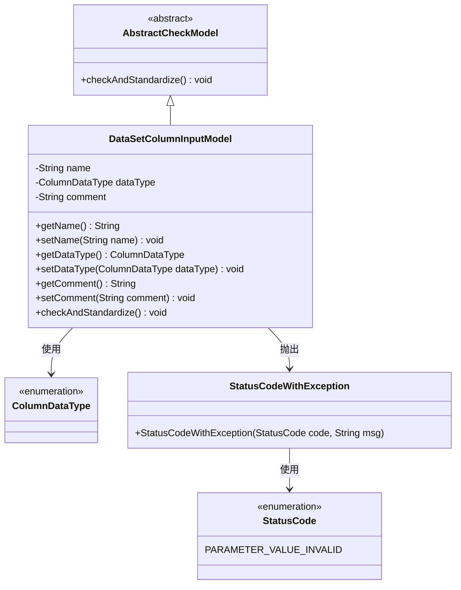
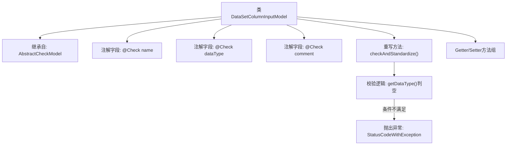

# 基础信息

|      |      |
|------|------|
| 名称 | DataSetColumnInputModel |
| 编码语言 | .java |
| 代码路径 | WeFe/board/board-service/src/main/java/com/welab/wefe/board/service/dto/entity/data_set/DataSetColumnInputModel.java |
| 包名 | com.welab.wefe.board.service.dto.entity.data_set |
| 依赖项 | ['com.welab.wefe.common.StatusCode', 'com.welab.wefe.common.exception.StatusCodeWithException', 'com.welab.wefe.common.fieldvalidate.AbstractCheckModel', 'com.welab.wefe.common.fieldvalidate.annotation.Check', 'com.welab.wefe.common.wefe.enums.ColumnDataType'] |
| 概述说明 | 数据集列输入模型类，包含名称、数据类型和注释字段，注释长度限制250字符，数据类型必填校验。 |

# 说明

DataSetColumnInputModel类继承AbstractCheckModel，包含三个字段：name（字段名称，必填）、dataType（数据类型，必填且不可为空）、comment（注释，长度限制250字符）。类中实现了checkAndStandardize方法，校验dataType非空，否则抛出异常。提供各字段的getter和setter方法。

# 类列表 Class Summary

| 名称   | 类型  | 说明 |
|-------|------|-------------|
| DataSetColumnInputModel | class | 数据集列输入模型类，包含名称、数据类型和注释字段，提供校验逻辑确保数据类型非空，注释长度不超过250字符。 |

## 类 DataSetColumnInputModel

|      |      |
|------|------|
| 访问范围 | public |
| 类型 | class |
| 名称 | DataSetColumnInputModel |
| 说明 | 数据集列输入模型类，包含名称、数据类型和注释字段，提供校验逻辑确保数据类型非空，注释长度不超过250字符。 |

### UML类图

这段代码展示了一个数据集列输入模型`DataSetColumnInputModel`，它继承自抽象类`AbstractCheckModel`，包含字段名称、数据类型和注释三个属性，并通过`@Check`注解进行参数校验。类图清晰地呈现了继承关系（`AbstractCheckModel`为父类）、枚举依赖（`ColumnDataType`和`StatusCode`）以及异常处理（`StatusCodeWithException`）。该模型的核心方法是`checkAndStandardize()`，用于执行参数校验逻辑，当数据类型为空时会抛出带状态码的异常。整体设计符合JavaBean规范，通过getter/setter方法暴露私有属性。

### 内部方法调用关系图

该流程图展示了DataSetColumnInputModel类的核心结构，它继承自AbstractCheckModel并包含三个带校验注解的字段。重点描述了重写的checkAndStandardize()方法流程，该方法先调用父类校验，然后检查dataType字段是否为空，若为空则抛出参数无效异常。类还包含标准的getter/setter方法组，用于访问和修改字段值。整个设计体现了参数校验和标准化的处理逻辑。

### 字段列表 Field List

| 名称  | 类型  | 说明 |
|-------|-------|------|
| comment | String | 代码注解：限制注释长度不超过250字符，超长提示"注释太长啦~"。 |
| dataType | ColumnDataType | 定义数据类型检查的私有字段。 |
| name | String | 代码定义了一个私有字符串字段"name"，并使用了@Check注解标注该字段，注解参数指定字段名称为"字段名称"。 |

### 方法列表

| 名称  | 类型  | 说明 |
|-------|-------|------|
| getName | String | 方法返回字符串类型的name变量值。 |
| setName | void | 设置对象名称的方法，将参数name赋值给对象的name属性。 |
| getComment | String | 获取comment字段值的公共方法。 |
| checkAndStandardize | void | 方法检查并标准化数据，若未设置数据类型则抛出异常。 |
| setDataType | void | 这是一个Java方法，用于设置列的数据类型。方法名为setDataType，接收ColumnDataType类型的参数dataType，并将其赋值给当前对象的同名属性。 |
| getDataType | ColumnDataType | 方法返回列的数据类型。 |
| setComment | void | 这是一个Java方法，用于设置对象的comment属性值。方法接收一个字符串参数comment，并将其赋值给当前对象的comment成员变量。 |

