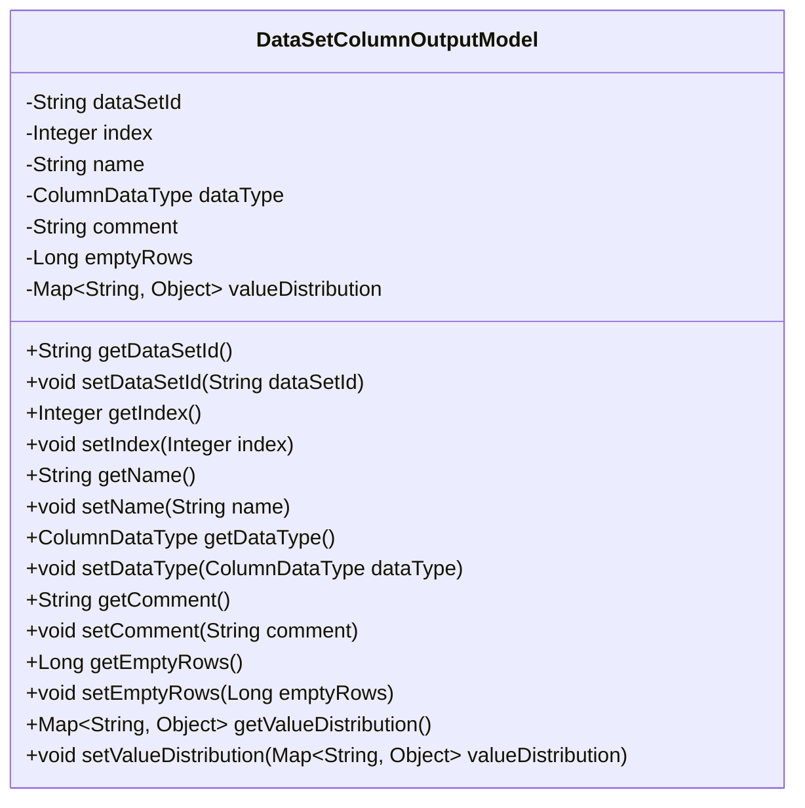

# 基础信息

|      |      |
|------|------|
| 名称 | DataSetColumnOutputModel |
| 编码语言 | .java |
| 代码路径 | WeFe/board/board-service/src/main/java/com/welab/wefe/board/service/dto/entity/data_set/DataSetColumnOutputModel.java |
| 包名 | com.welab.wefe.board.service.dto.entity.data_set |
| 依赖项 | ['com.welab.wefe.common.fieldvalidate.annotation.Check', 'com.welab.wefe.common.wefe.enums.ColumnDataType', 'java.util.Map'] |
| 概述说明 | 数据集列输出模型类，包含数据集ID、字段序号、名称、数据类型、注释、空值行数和数值分布等属性及其getter/setter方法。 |

# 说明

DataSetColumnOutputModel是一个用于描述数据集列的Java类，包含数据集ID、字段序号、字段名称、数据类型、注释、空值数据行数和数值分布等属性。每个属性都有对应的getter和setter方法，部分属性通过@Check注解标注了名称。数值分布使用Map类型存储键值对。该类主要用于处理和存储数据集列的相关信息。

# 类列表 Class Summary

| 名称   | 类型  | 说明 |
|-------|------|-------------|
| DataSetColumnOutputModel | class | 数据集列输出模型类，包含数据集ID、字段序号、名称、数据类型、注释、空值行数和数值分布等属性及对应getter/setter方法。 |

## 类 DataSetColumnOutputModel

|      |      |
|------|------|
| 访问范围 | public |
| 类型 | class |
| 名称 | DataSetColumnOutputModel |
| 说明 | 数据集列输出模型类，包含数据集ID、字段序号、名称、数据类型、注释、空值行数和数值分布等属性及对应getter/setter方法。 |

### UML类图

这段代码定义了一个名为DataSetColumnOutputModel的Java类，用于表示数据集列的输出模型。该类包含多个私有字段，如dataSetId、index、name等，每个字段都带有@Check注解用于验证。类中提供了所有字段的getter和setter方法，用于访问和修改这些私有字段的值。这个类主要用于封装数据集列的相关信息，包括数据类型、注释、空值行数以及值的分布情况等。

### 内部方法调用关系图

```mermaid
graph TD
    A["类DataSetColumnOutputModel"]
    B["属性: String dataSetId '@Check'"]
    C["属性: Integer index '@Check'"]
    D["属性: String name '@Check'"]
    E["属性: ColumnDataType dataType '@Check'"]
    F["属性: String comment '@Check'"]
    G["属性: Long emptyRows '@Check'"]
    H["属性: Map<String,Object> valueDistribution '@Check'"]
    I["getter/setter: getDataSetId()/setDataSetId()"]
    J["getter/setter: getIndex()/setIndex()"]
    K["getter/setter: getName()/setName()"]
    L["getter/setter: getDataType()/setDataType()"]
    M["getter/setter: getComment()/setComment()"]
    N["getter/setter: getEmptyRows()/setEmptyRows()"]
    O["getter/setter: getValueDistribution()/setValueDistribution()"]

    A --> B
    A --> C
    A --> D
    A --> E
    A --> F
    A --> G
    A --> H
    A --> I
    A --> J
    A --> K
    A --> L
    A --> M
    A --> N
    A --> O
```

这段代码定义了一个名为DataSetColumnOutputModel的Java类，用于表示数据集列的输出模型。该类包含7个带有@Check注解的属性，分别对应数据集ID、字段序号、字段名称、数据类型、注释、空值数据行数和数值分布。每个属性都有对应的getter和setter方法，用于属性的读取和设置。该模型主要用于数据集的列信息输出和验证，通过注解确保属性的有效性检查。

### 字段列表 Field List

| 名称  | 类型  | 说明 |
|-------|-------|------|
| name | String | Java字段校验注解：使用@Check标注字段"name"，类型为String。 |
| emptyRows | Long | 检查空值数据行数的字段emptyRows。 |
| dataType | ColumnDataType | 定义名为dataType的私有变量，使用@Check注解校验数据类型，标注为"数据类型"。 |
| index | Integer | 字段序号检查注解，私有整型变量index。 |
| valueDistribution | Map<String, Object> | 数值分布检查的Map类型字段。 |
| comment | String | 类私有字段comment，使用@Check注解标记为"注释"。 |
| dataSetId | String | 字段dataSetId，用@Check注解标记，用于数据集ID校验。 |

### 方法列表

| 名称  | 类型  | 说明 |
|-------|-------|------|
| setName | void | 这是一个Java方法，用于设置对象的名称属性。方法接受一个字符串参数name，并将其赋值给当前对象的name字段。 |
| getDataSetId | String | 获取数据集ID的方法，返回dataSetId字符串。 |
| getName | String | 方法返回字符串类型的name变量值。 |
| getIndex | Integer | 这是一个Java方法，返回名为index的整型变量值。 |
| setDataType | void | 定义方法setDataType，用于设置类的dataType属性，参数为ColumnDataType类型。 |
| setEmptyRows | void | 设置空行数的方法，参数为emptyRows。 |
| getComment | String | 方法返回字符串类型的comment变量值。 |
| getEmptyRows | Long | 方法返回空行数。 |
| getDataType | ColumnDataType | 获取列数据类型的方法，返回dataType字段值。 |
| setComment | void | 设置对象评论属性的方法，将输入字符串赋值给内部变量comment。 |
| setIndex | void | 设置整型索引值的方法。 |
| getValueDistribution | Map<String, Object> | 获取值分布的方法，返回类型为Map<String, Object>，直接返回valueDistribution变量。 |
| setDataSetId | void | 设置数据集ID的方法，将输入参数赋值给类的dataSetId成员变量。 |
| setValueDistribution | void | 这是一个Java方法，用于设置对象的valueDistribution属性，参数为Map类型，键为String，值为Object。 |

