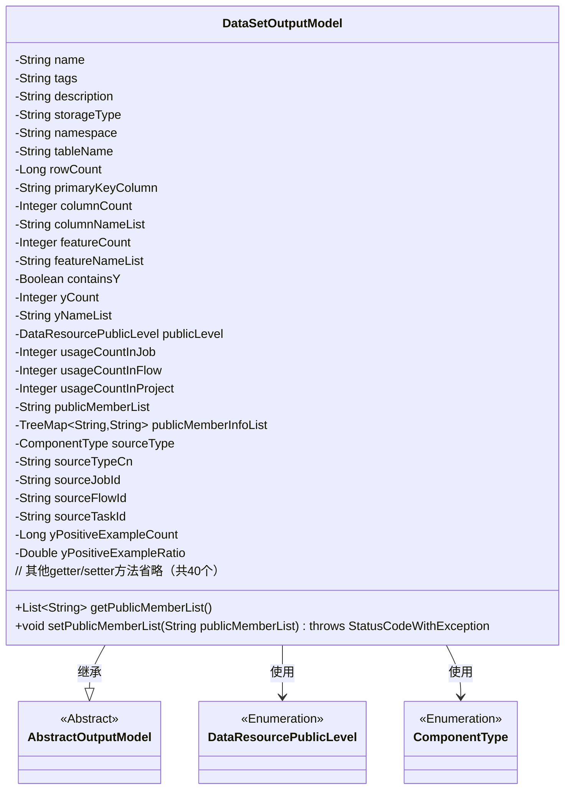

# 基础信息

|      |      |
|------|------|
| 名称 | DataSetOutputModel |
| 编码语言 | .java |
| 代码路径 | WeFe/board/board-service/src/main/java/com/welab/wefe/board/service/dto/entity/data_set/DataSetOutputModel.java |
| 包名 | com.welab.wefe.board.service.dto.entity.data_set |
| 依赖项 | ['java.util.List', 'java.util.TreeMap', 'com.welab.wefe.board.service.dto.entity.AbstractOutputModel', 'com.welab.wefe.board.service.service.CacheObjects', 'com.welab.wefe.common.exception.StatusCodeWithException', 'com.welab.wefe.common.util.StringUtil', 'com.welab.wefe.common.wefe.enums.ComponentType', 'com.welab.wefe.common.wefe.enums.DataResourcePublicLevel'] |
| 概述说明 | 数据集输出模型类，包含名称、标签、描述、存储类型、命名空间、表名、行列数、主键、特征、Y值、可见性、使用次数、来源任务及成员列表等属性。 |

# 说明

DataSetOutputModel类是一个数据集输出模型，继承自AbstractOutputModel。它包含数据集的基本信息如名称、标签、描述、存储类型、命名空间、表名、数据行数、主键字段、列数和字段列表。还包括特征数量、特征列表、是否包含Y值、Y列数量和名称列表。数据集的可见性由publicLevel控制，并记录在作业、流程和项目中的使用次数。可见成员列表和相关信息通过publicMemberList和publicMemberInfoList管理。数据集来源类型分为原始、对齐和分箱，并记录来源任务、流程和子任务ID。此外还包含正例样本数量和比例统计。类中提供了所有属性的getter和setter方法，并实现了publicMemberList的特殊处理逻辑。

# 类列表 Class Summary

| 名称   | 类型  | 说明 |
|-------|------|-------------|
| DataSetOutputModel | class | 数据集输出模型类，包含名称、标签、描述、存储类型、命名空间、表名、行列数、主键、特征、Y值、可见性、使用次数、来源类型及任务ID等属性。 |

## 类 DataSetOutputModel

|      |      |
|------|------|
| 访问范围 | public |
| 类型 | class |
| 名称 | DataSetOutputModel |
| 说明 | 数据集输出模型类，包含名称、标签、描述、存储类型、命名空间、表名、行列数、主键、特征、Y值、可见性、使用次数、来源类型及任务ID等属性。 |

### UML类图

类图描述：DataSetOutputModel类继承自抽象类AbstractOutputModel，包含数据集相关的元数据信息（如名称、标签、存储类型等）和统计信息（如行数、列数、特征数量等）。该类使用两个枚举类型DataResourcePublicLevel和ComponentType，并通过TreeMap管理公开成员信息。提供了40余个getter/setter方法，其中setPublicMemberList方法包含特殊逻辑处理通配符"*"的情况。

### 内部方法调用关系图

该流程图展示了DataSetOutputModel类的完整结构，包含其继承关系、25个属性字段和3类主要方法。特别突出了getPublicMemberList()和setPublicMemberList()这两个核心方法，以及38个标准getter/setter方法。类主要描述数据集输出模型的元数据信息，包括基础属性、统计特征、访问控制和来源追踪等维度，通过TreeMap维护成员可见性信息，并提供了对特殊格式成员列表的解析处理能力。

### 字段列表 Field List

| 名称  | 类型  | 说明 |
|-------|-------|------|
| description | String | 私有字符串类型变量description。 |
| name | String | 私有字符串变量name |
| publicLevel | DataResourcePublicLevel | 私有数据资源公开级别变量publicLevel。 |
| containsY | Boolean | 私有布尔变量，用于判断是否包含Y。 |
| usageCountInJob = 0 | Integer | 变量usageCountInJob记录任务中的使用次数，初始值为0，类型为Integer。 |
| storageType | String | 私有字符串变量storageType，用于存储类型信息。 |
| tableName | String | 私有字符串变量tableName，用于存储表名。 |
| featureCount | Integer | 私有整型变量，用于记录特征数量。 |
| featureNameList | String | 私有字符串变量featureNameList，用于存储特征名称列表。 |
| primaryKeyColumn | String | 主键列字段声明 |
| sourceType | ComponentType | 私有成员变量sourceType，类型为ComponentType。 |
| yPositiveExampleCount = 0L | Long | 私有长整型变量yPositiveExampleCount，初始值为0。 |
| sourceJobId | String | 声明一个私有字符串变量sourceJobId。 |
| rowCount | Long | 私有长整型变量，记录行数。 |
| sourceTaskId | String | 声明一个私有字符串变量sourceTaskId。 |
| yPositiveExampleRatio = 0D | Double | 变量yPositiveExampleRatio初始化为0.0，类型为Double。 |
| sourceTypeCn | String | 私有字符串变量，表示源类型的中文名称。 |
| usageCountInFlow = 0 | Integer | 变量usageCountInFlow记录流程使用次数，初始值为0。 |
| publicMemberInfoList = new TreeMap<>() | TreeMap<String, String> | 定义了一个TreeMap类型的私有变量publicMemberInfoList，用于存储键值对形式的公共成员信息，键和值均为字符串类型。 |
| columnNameList | String | 私有字符串变量columnNameList，用于存储列名列表。 |
| yCount | Integer | 私有整型变量yCount。 |
| tags | String | 私有字符串变量tags |
| publicMemberList | String | 私有字符串变量publicMemberList |
| namespace | String | 私有字符串变量命名空间。 |
| columnCount | Integer | 私有整型变量，表示列数。 |
| sourceFlowId | String | 私有字符串变量sourceFlowId，用于存储来源流程ID。 |
| usageCountInProject = 0 | Integer | 项目内使用次数计数器，初始值为0。 |
| yNameList | String | 私有字符串变量yNameList，用于存储名称列表。 |

### 方法列表

| 名称  | 类型  | 说明 |
|-------|-------|------|
| setPublicMemberInfoList | void | 设置公共成员信息列表，参数为TreeMap类型，键值均为字符串。 |
| setColumnCount | void | 设置列数的方法，将参数columnCount赋值给类的同名属性。 |
| setFeatureCount | void | 设置特征数量方法，将输入参数赋给类成员变量featureCount。 |
| getPublicMemberInfoList | TreeMap<String, String> | 获取公共成员信息列表，返回类型为TreeMap<String, String>。 |
| getSourceJobId | String | 获取源任务ID的方法，返回字符串类型的sourceJobId。 |
| getColumnCount | Integer | 获取列数的方法，返回整型值columnCount。 |
| getContainsY | Boolean | 这是一个Java方法，返回布尔值containsY，用于检查是否包含Y。 |
| setUsageCountInProject | void | 设置项目内使用次数的方法，参数为整型数值。 |
| setPrimaryKeyColumn | void | 设置主键列方法，将输入参数赋值给类的成员变量primaryKeyColumn。 |
| getDescription | String | 获取描述信息的方法，返回字符串类型的description值。 |
| getRowCount | Long | 获取行数的方法，返回rowCount值。 |
| setTags | void | 设置标签方法：将输入字符串赋值给对象的tags属性。 |
| setTableName | void | 设置表名的方法，将输入参数tableName赋值给当前对象的tableName属性。 |
| setUsageCountInJob | void | 这是一个Java方法，用于设置作业中的使用次数。方法接受一个整数参数，并将其赋值给类的成员变量usageCountInJob。 |
| getUsageCountInJob | Integer | 获取作业中的使用次数。 |
| setRowCount | void | 设置行数的方法，将参数rowCount赋值给类的rowCount属性。 |
| getTableName | String | 获取表名的方法，返回字符串类型的tableName。 |
| getUsageCountInFlow | Integer | 获取流程中的使用次数。 |
| setNamespace | void | 设置命名空间的方法，将输入参数赋值给类的namespace属性。 |
| getPublicLevel | DataResourcePublicLevel | 获取数据资源的公开级别。 |
| getPublicMemberList | List<String> | 方法getPublicMemberList检查publicMemberList是否为"[\"*\"]"或"*"，是则返回null，否则按逗号分割并返回非空项列表。 |
| getNamespace | String | 方法返回命名空间字符串。 |
| setyNameList | void | 设置yNameList属性的方法，将输入参数赋值给类的成员变量yNameList。 |
| setSourceTypeCn | void | 这是一个Java方法，用于设置sourceTypeCn属性的值。方法接受一个字符串参数，并将其赋值给类的成员变量sourceTypeCn。 |
| getyNameList | String | 方法返回字符串变量yNameList的值。 |
| setStorageType | void | 设置存储类型的方法，将输入参数赋值给类成员变量storageType。 |
| getPrimaryKeyColumn | String | 获取主键列名的方法，返回字符串类型的primaryKeyColumn值。 |
| setyCount | void | 这是一个Java方法，用于设置yCount属性的值。方法接收一个Integer参数，并将其赋值给类的yCount成员变量。 |
| getStorageType | String | 获取存储类型的方法，返回字符串类型的storageType值。 |
| setPublicLevel | void | 设置数据资源的公开级别方法，参数为publicLevel。 |
| setDescription | void | 设置描述信息的方法，将输入参数赋值给对象的description属性。 |
| setUsageCountInFlow | void | 设置流程内使用次数的方法，参数为整型usageCountInFlow。 |
| setContainsY | void | Java方法：设置布尔属性containsY的值。 |
| getName | String | 获取名称的方法，返回变量name的值。 |
| getTags | String | 获取tags字符串的方法。 |
| setPublicMemberList | void | 设置公开成员列表，处理逗号分隔的ID。跳过特殊字符"*"或"[\"*\"]"。通过缓存获取成员名，若不存在则刷新缓存。将ID与成员名存入publicMemberInfoList。 |
| setSourceFlowId | void | 设置源流程ID的方法，将输入参数赋值给类的sourceFlowId成员变量。 |
| getSourceTaskId | String | 获取源任务ID的方法，直接返回sourceTaskId字段值。 |
| setSourceTaskId | void | 设置源任务ID的方法，将输入参数赋值给类的成员变量sourceTaskId。 |
| getyPositiveExampleCount | Long | 获取yPositiveExampleCount值的方法。 |
| setyPositiveExampleCount | void | 设置正例数量的方法，参数为长整型。 |
| getyPositiveExampleRatio | Double | 获取正例比例的方法，返回双精度数值yPositiveExampleRatio。 |
| setyPositiveExampleRatio | void | 设置正例比例方法，接收双精度参数并赋值给类成员变量yPositiveExampleRatio。 |
| getyCount | Integer | 获取yCount值的公共方法，返回Integer类型。 |
| getUsageCountInProject | Integer | 获取项目内使用次数的整数值方法。 |
| getFeatureCount | Integer | 获取特征数量方法，返回整型值featureCount。 |
| setFeatureNameList | void | 这是一个Java方法，用于设置featureNameList属性的值。方法接受一个字符串参数，并将其赋值给类的成员变量。 |
| setSourceType | void | 方法setSourceType用于设置sourceType属性，参数类型为ComponentType。 |
| setColumnNameList | void | 设置列名列表的方法，将输入字符串赋值给类的成员变量columnNameList。 |
| getSourceType | ComponentType | 获取组件源类型的方法，返回sourceType变量值。 |
| getColumnNameList | String | 获取列名列表的方法，返回字符串类型的列名列表。 |
| getSourceTypeCn | String | 获取中文源类型的方法，返回sourceTypeCn变量值。 |
| getSourceFlowId | String | 获取sourceFlowId的字符串值方法。 |
| setName | void | 设置对象名称的方法，将参数name赋值给对象的name属性。 |
| setSourceJobId | void | 设置源任务ID的方法，将输入参数赋值给类的sourceJobId成员变量。 |
| getFeatureNameList | String | 获取特性名称列表的方法，返回字符串类型的featureNameList。 |

