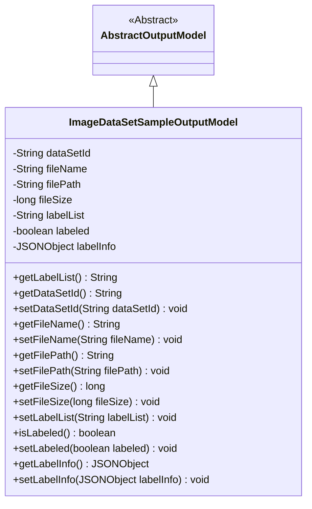

# 基础信息

|      |      |
|------|------|
| 名称 | ImageDataSetSampleOutputModel |
| 编码语言 | .java |
| 代码路径 | WeFe/board/board-service/src/main/java/com/welab/wefe/board/service/dto/entity/data_set/ImageDataSetSampleOutputModel.java |
| 包名 | com.welab.wefe.board.service.dto.entity.data_set |
| 依赖项 | ['com.alibaba.fastjson.JSONObject', 'com.welab.wefe.board.service.dto.entity.AbstractOutputModel', 'com.welab.wefe.common.fieldvalidate.annotation.Check', 'com.welab.wefe.common.util.StringUtil'] |
| 概述说明 | ImageDataSetSampleOutputModel类继承AbstractOutputModel，包含数据集ID、文件名、路径、大小、标签列表、标注状态及JSON标注信息等字段，提供getter/setter方法。 |

# 说明

ImageDataSetSampleOutputModel类继承自AbstractOutputModel，用于处理图像数据集样本的输出信息。包含以下字段：数据集ID、文件名、文件路径、文件大小、标签列表、是否已标注标志以及JSON格式的标注信息。每个字段均通过@Check注解进行校验，并提供对应的getter和setter方法。特别地，getLabelList方法会移除标签列表前后的逗号以避免前端错误。该类封装了图像样本的基本属性和标注状态，便于数据管理和传输。

# 类列表 Class Summary

| 名称   | 类型  | 说明 |
|-------|------|-------------|
| ImageDataSetSampleOutputModel | class | ImageDataSetSampleOutputModel类继承AbstractOutputModel，包含数据集ID、文件名、路径、大小、标签列表、标注状态及JSON标注信息等字段，提供getter/setter方法。 |

## 类 ImageDataSetSampleOutputModel

|      |      |
|------|------|
| 访问范围 | public |
| 类型 | class |
| 名称 | ImageDataSetSampleOutputModel |
| 说明 | ImageDataSetSampleOutputModel类继承AbstractOutputModel，包含数据集ID、文件名、路径、大小、标签列表、标注状态及JSON标注信息等字段，提供getter/setter方法。 |

### UML类图

这段代码展示了一个图像数据集样本输出模型类`ImageDataSetSampleOutputModel`，它继承自抽象类`AbstractOutputModel`。该类包含数据集ID、文件名、文件路径、文件大小、标签列表、标注状态和标注信息等私有字段，并提供了相应的getter和setter方法。其中`getLabelList()`方法会对标签列表进行特殊处理，移除前后的逗号以避免前端报错。类图清晰地展示了继承关系和所有成员方法，体现了该模型对图像数据集样本输出信息的封装能力。

### 内部方法调用关系图

```mermaid
graph TD
    A["类ImageDataSetSampleOutputModel"]
    B["继承自: AbstractOutputModel"]
    C["属性: String dataSetId"]
    D["属性: String fileName"]
    E["属性: String filePath"]
    F["属性: long fileSize"]
    G["属性: String labelList"]
    H["属性: boolean labeled"]
    I["属性: JSONObject labelInfo"]
    J["方法: getLabelList()"]
    K["方法: getDataSetId()"]
    L["方法: setDataSetId(String)"]
    M["方法: getFileName()"]
    N["方法: setFileName(String)"]
    O["方法: getFilePath()"]
    P["方法: setFilePath(String)"]
    Q["方法: getFileSize()"]
    R["方法: setFileSize(long)"]
    S["方法: setLabelList(String)"]
    T["方法: isLabeled()"]
    U["方法: setLabeled(boolean)"]
    V["方法: getLabelInfo()"]
    W["方法: setLabelInfo(JSONObject)"]

    A --> B
    A --> C
    A --> D
    A --> E
    A --> F
    A --> G
    A --> H
    A --> I
    A --> J
    A --> K
    A --> L
    A --> M
    A --> N
    A --> O
    A --> P
    A --> Q
    A --> R
    A --> S
    A --> T
    A --> U
    A --> V
    A --> W
```

这段代码定义了一个名为`ImageDataSetSampleOutputModel`的类，继承自`AbstractOutputModel`。该类包含多个属性，如`dataSetId`、`fileName`、`filePath`等，每个属性都有对应的getter和setter方法。特别地，`getLabelList()`方法会对`labelList`属性进行特殊处理，移除前后的逗号以避免前端报错。所有属性都使用了`@Check`注解进行标注，表明这些属性在某种上下文中需要进行检查。

### 字段列表 Field List

| 名称  | 类型  | 说明 |
|-------|-------|------|
| labelInfo | JSONObject | 私有变量labelInfo，使用@Check注解标注，存储JSON格式的标注信息。 |
| fileName | String | 定义私有字符串变量fileName，使用@Check注解校验文件名。 |
| labelList | String | 代码定义了一个私有字符串变量labelList，使用了@Check注解并设置name属性为"label"。 |
| dataSetId | String | 字段dataSetId用@Check注解标记，表示需校验数据集ID。 |
| fileSize | long | 定义私有长整型变量fileSize，使用@Check注解标记为"文件大小"检查项。 |
| filePath | String | 定义私有字符串变量filePath，使用@Check注解校验文件路径。 |
| labeled | boolean | 私有布尔变量labeled，用于检查是否已标注。 |

### 方法列表

| 名称  | 类型  | 说明 |
|-------|-------|------|
| getFilePath | String | 这是一个Java方法，返回文件路径字符串filePath。 |
| getFileName | String | 获取文件名的公共方法，返回字符串类型的fileName变量值。 |
| getLabelList | String | 该方法用于移除字符串labelList前后的逗号，避免前端报错，处理后返回结果。 |
| setFileName | void | 设置文件名方法，将输入字符串赋值给类的fileName变量。 |
| setFilePath | void | 这是一个Java方法，用于设置文件路径属性。方法接受一个字符串参数filePath，并将其赋值给类的成员变量filePath。 |
| setFileSize | void | 这是一个Java方法，用于设置文件大小属性，接受一个长整型参数fileSize并将其赋值给类的成员变量fileSize。 |
| getDataSetId | String | 这是一个Java方法，返回名为dataSetId的字符串变量值。 |
| setLabeled | void | 设置对象标签状态的方法，参数为布尔值，用于标记是否已标注。 |
| setLabelList | void | 这是一个Java方法，用于设置类的labelList属性值。方法接收一个字符串参数labelList，并将其赋值给类的同名成员变量。 |
| getLabelInfo | JSONObject | 获取标签信息的JSON对象方法。 |
| isLabeled | boolean | 方法isLabeled返回布尔值labeled的状态。 |
| getFileSize | long | 获取文件大小的方法，返回fileSize值。 |
| setDataSetId | void | 设置数据集ID的方法，将输入参数赋值给类的dataSetId成员变量。 |
| setLabelInfo | void | 设置标签信息方法，接收JSONObject参数并赋值给成员变量labelInfo。 |

