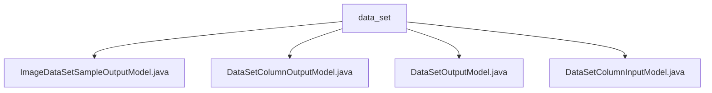

# 基础信息

|      |      |
|------|------|
| 名称 | data_set |
| 编码语言 | .java |
| 代码路径 | WeFe/board/board-service/src/main/java/com/welab/wefe/board/service/dto/entity/data_set |
| 包名 | docs.board.board-service.src.main.java.com.welab.wefe.board.service.dto.entity.data_set |
| 概述说明 | ImageDataSetSampleOutputModel处理图像样本输出，含ID、文件名、标签等字段，提供校验和getter/setter。DataSetColumnOutputModel描述数据集列，含字段名、类型、分布等属性。DataSetOutputModel包含数据集基本信息、特征、可见性等，管理使用次数和来源。DataSetColumnInputModel校验字段名、类型和注释，提供标准方法。 |

# 说明

## 概述  
该模块核心职责是管理数据集元信息及样本数据，提供标准化的输入输出模型。接口规范统一采用Java Bean模式，通过@Check注解校验字段，并严格遵循Getter/Setter规范。关键数据结构包括图像样本模型(含标注信息)、数据集列模型(含数值分布)和数据集模型(含特征统计)。外部依赖仅为基础校验框架。例如ImageDataSetSampleOutputModel自动清理标签格式，DataSetOutputModel跟踪数据集使用情况。

## 主要业务场景  
模块支持完整的数据集生命周期管理，类似数据中台模式。典型流程包括：列定义校验(如DataSetColumnInputModel强制类型检查)、数据集特征分析(如DataSetOutputModel统计Y值分布)、样本标注处理(如ImageDataSetSampleOutputModel标准化标签)。交互模式通过分层模型实现，基础属性由AbstractOutputModel继承。例如数值分布采用Map存储，正例比例通过DataSetOutputModel动态计算。

### 包内部结构视图

该流程图展示了data_set目录下的四个Java文件之间的层级关系。所有文件都直接隶属于data_set目录，没有更深层的嵌套结构。图中包含一个父节点data_set和四个子节点文件，清晰地呈现了这个DTO实体包中的模型类文件组织方式。

# 文件列表

| 名称   | 类型  | 说明 |
|-------|------|-------------|
| [ImageDataSetSampleOutputModel.java](ImageDataSetSampleOutputModel.md) | file | ImageDataSetSampleOutputModel类继承AbstractOutputModel，包含数据集ID、文件名、路径、大小、标签列表、标注状态及JSON标注信息等字段，提供getter/setter方法。 |
| [DataSetColumnOutputModel.java](DataSetColumnOutputModel.md) | file | 数据集列输出模型类，包含数据集ID、字段序号、名称、数据类型、注释、空值行数和数值分布等属性及其getter/setter方法。 |
| [DataSetOutputModel.java](DataSetOutputModel.md) | file | 数据集输出模型类，包含名称、标签、描述、存储类型、命名空间、表名、行列数、主键、特征、Y值、可见性、使用次数、来源任务及成员列表等属性。 |
| [DataSetColumnInputModel.java](DataSetColumnInputModel.md) | file | 数据集列输入模型类，包含名称、数据类型和注释字段，注释长度限制250字符，数据类型必填校验。 |

