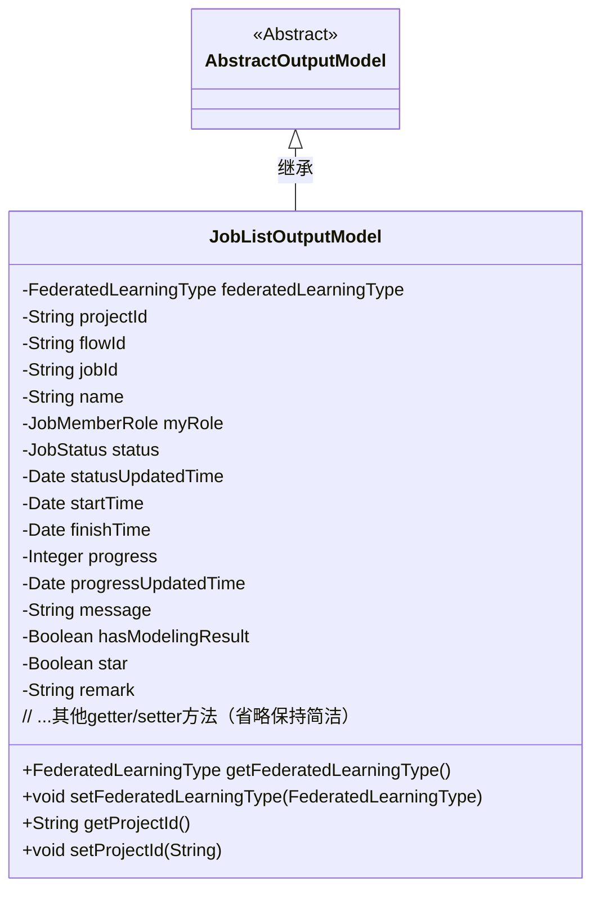

# 基础信息

|      |      |
|------|------|
| 名称 | JobListOutputModel |
| 编码语言 | .java |
| 代码路径 | WeFe/board/board-service/src/main/java/com/welab/wefe/board/service/dto/entity/job/JobListOutputModel.java |
| 包名 | com.welab.wefe.board.service.dto.entity.job |
| 依赖项 | ['com.welab.wefe.board.service.dto.entity.AbstractOutputModel', 'com.welab.wefe.common.fieldvalidate.annotation.Check', 'com.welab.wefe.common.wefe.enums.FederatedLearningType', 'com.welab.wefe.common.wefe.enums.JobMemberRole', 'com.welab.wefe.common.wefe.enums.JobStatus', 'java.util.Date'] |
| 概述说明 | JobListOutputModel类包含联邦任务类型、项目ID、流程ID、任务ID、名称、身份、状态、时间、进度、消息、结果、标记和备注等字段及其getter/setter方法。 |

# 说明

JobListOutputModel类继承自AbstractOutputModel，包含联邦学习任务相关属性。主要字段包括任务类型、项目ID、流程ID、任务ID、名称、身份角色、状态及更新时间、开始结束时间、进度及更新时间、消息备注、是否包含建模结果、收藏标记和备注。每个字段均有对应的getter和setter方法，用于属性访问和修改。

# 类列表 Class Summary

| 名称   | 类型  | 说明 |
|-------|------|-------------|
| JobListOutputModel | class | JobListOutputModel类包含联邦任务类型、项目ID、流程ID、任务ID、名称、身份角色、状态、时间信息、进度、消息备注、建模结果标志、收藏标记和备注等属性及其getter/setter方法。 |

## 类 JobListOutputModel

|      |      |
|------|------|
| 访问范围 | public |
| 类型 | class |
| 名称 | JobListOutputModel |
| 说明 | JobListOutputModel类包含联邦任务类型、项目ID、流程ID、任务ID、名称、身份角色、状态、时间信息、进度、消息备注、建模结果标志、收藏标记和备注等属性及其getter/setter方法。 |

### UML类图

类图描述：
JobListOutputModel类继承自AbstractOutputModel抽象类，是一个包含联邦学习任务详细信息的输出模型类。该类包含15个私有字段，分别记录任务类型、项目ID、流程ID、任务状态、时间信息、进度等核心属性，并通过公开的getter/setter方法提供对这些字段的访问和修改。所有字段均使用@Check注解进行校验，体现了对任务数据的完整性保护。该模型主要用于联邦学习任务列表的数据封装和传输。

### 内部方法调用关系图

```mermaid
graph TD
    A["类JobListOutputModel"]
    B["继承自: AbstractOutputModel"]
    C["属性: FederatedLearningType federatedLearningType"]
    D["属性: String projectId"]
    E["属性: String flowId"]
    F["属性: String jobId"]
    G["属性: String name"]
    H["属性: JobMemberRole myRole"]
    I["属性: JobStatus status"]
    J["属性: Date statusUpdatedTime"]
    K["属性: Date startTime"]
    L["属性: Date finishTime"]
    M["属性: Integer progress"]
    N["属性: Date progressUpdatedTime"]
    O["属性: String message"]
    P["属性: Boolean hasModelingResult"]
    Q["属性: Boolean star"]
    R["属性: String remark"]
    S["Getter/Setter方法组"]

    A --> B
    A --> C
    A --> D
    A --> E
    A --> F
    A --> G
    A --> H
    A --> I
    A --> J
    A --> K
    A --> L
    A --> M
    A --> N
    A --> O
    A --> P
    A --> Q
    A --> R
    A --> S
```

这段代码定义了一个JobListOutputModel类，继承自AbstractOutputModel，包含15个带@Check注解的属性和对应的getter/setter方法。该类用于表示联邦学习任务列表的输出模型，包含任务类型、项目ID、流程ID、任务ID、名称、角色、状态、时间信息、进度、消息、建模结果标志、收藏标记和备注等字段。所有属性都通过标准getter/setter方法进行访问和修改，形成一个完整的数据封装结构。

### 字段列表 Field List

| 名称  | 类型  | 说明 |
|-------|-------|------|
| jobId | String | 代码定义了一个私有字符串变量jobId，并用@Check注解标记，注解参数name为"任务ID"。 |
| finishTime | Date | 结束时间校验字段，类型为Date。 |
| statusUpdatedTime | Date | 字段statusUpdatedTime用于记录状态更新时间，标注为检查项。 |
| progressUpdatedTime | Date | 进度更新时间字段，使用@Check注解标记，类型为Date。 |
| status | JobStatus | 状态检查枚举字段JobStatus。 |
| remark | String | 字段remark用于备注，使用@Check注解标记。 |
| progress | Integer | 进度检查字段，类型为整型。 |
| message | String | 类字段message使用@Check注解标注，用于存储消息备注或失败原因。 |
| name | String | 代码定义了一个私有字符串变量name，并使用了@Check注解标注其名称为"名称"。 |
| federatedLearningType | FederatedLearningType | 检查联邦任务类型（横向/纵向），私有变量federatedLearningType。 |
| projectId | String | 定义私有字符串变量projectId，使用@Check注解校验项目ID。 |
| startTime | Date | 定义私有日期类型变量startTime，使用@Check注解标记为"开始时间"。 |
| flowId | String | 定义流程ID字段，使用@Check注解进行校验。 |
| myRole | JobMemberRole | 代码定义了一个私有枚举变量myRole，用于标识我方身份（promoter/provider/arbiter），并通过@Check注解进行校验。 |
| hasModelingResult | Boolean | 类成员变量hasModelingResult，用@Check注解标记，用于检查是否包含建模结果。 |
| star | Boolean | 字段star用于标记收藏/置顶/状态，类型为布尔值。 |

### 方法列表

| 名称  | 类型  | 说明 |
|-------|-------|------|
| getMyRole | JobMemberRole | 获取当前用户的角色信息。 |
| setProjectId | void | 这是一个Java方法，用于设置类的projectId属性值。方法接收一个字符串参数projectId，并将其赋值给类的同名成员变量。 |
| getFederatedLearningType | FederatedLearningType | 获取联邦学习类型的方法，返回federatedLearningType值。 |
| setHasModelingResult | void | 设置建模结果状态的布尔值方法。 |
| setStartTime | void | 设置起始时间的方法，参数为Date类型。 |
| setStatus | void | 设置任务状态的方法，将传入的状态参数赋值给当前对象的状态属性。 |
| setMyRole | void | Java方法：设置当前用户的角色属性。参数为JobMemberRole类型，赋值给成员变量myRole。 |
| setProgress | void | 设置进度值的方法，将输入参数progress赋值给类成员变量progress。 |
| getProgress | Integer | 获取进度值的方法，返回整数类型的progress变量。 |
| getStartTime | Date | 获取开始时间的方法，返回startTime对象。 |
| getHasModelingResult | Boolean | 方法返回布尔值hasModelingResult，表示是否具有建模结果。 |
| setFederatedLearningType | void | 设置联邦学习类型的方法，参数为FederatedLearningType类型，赋值给成员变量federatedLearningType。 |
| setProgressUpdatedTime | void | 设置进度更新时间的方法，将参数progressUpdatedTime赋值给类的同名成员变量。 |
| setMessage | void | 设置类成员变量message的值。 |
| getProgressUpdatedTime | Date | 获取进度更新时间的方法，返回progressUpdatedTime变量。 |
| setFinishTime | void | Java方法：设置完成时间，参数为Date类型，赋值给类成员变量finishTime。 |
| setStatusUpdatedTime | void | 设置状态更新时间的方法，将输入参数赋值给类的成员变量statusUpdatedTime。 |
| getStatusUpdatedTime | Date | 获取状态更新时间的方法，返回statusUpdatedTime值。 |
| getStatus | JobStatus | 方法返回当前任务状态。 |
| setFlowId | void | 设置流程ID的方法，将输入参数flowId赋值给当前对象的flowId属性。 |
| getFlowId | String | 获取flowId的方法，直接返回成员变量flowId的值。 |
| getJobId | String | 获取当前任务的唯一标识符jobId。 |
| setJobId | void | 设置任务ID的方法，将输入参数jobId赋值给当前对象的jobId属性。 |
| setName | void | 这是一个Java方法，用于设置对象的名称属性，将传入的name参数赋值给当前对象的name字段。 |
| getProjectId | String | 获取项目ID的方法，返回字符串类型的projectId。 |
| getName | String | 方法返回字符串类型的name变量值。 |
| getFinishTime | Date | 获取完成时间的方法，返回finishTime日期对象。 |
| getStar | Boolean | 获取star布尔值的公共方法。 |
| setStar | void | 设置对象星标状态的公共方法，参数为布尔值star。 |
| getRemark | String | 获取备注信息的公共方法，返回字符串类型的备注内容。 |
| setRemark | void | 设置备注信息的方法，将输入字符串赋值给类的remark属性。 |
| getMessage | String | 获取message字符串的方法。 |

