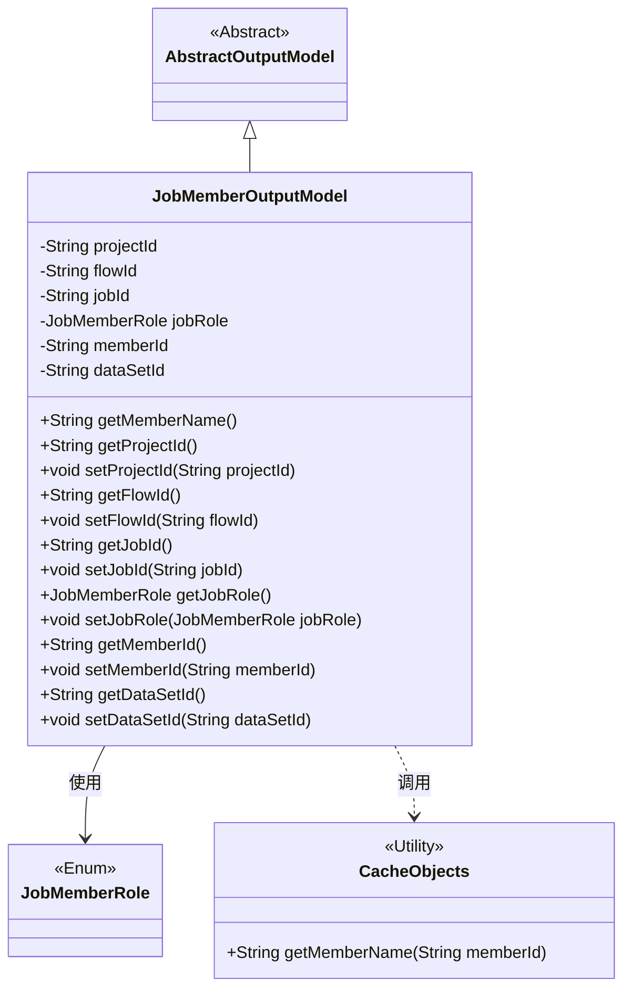
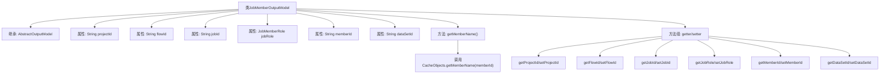

# 基础信息

|      |      |
|------|------|
| 名称 | JobMemberOutputModel |
| 编码语言 | .java |
| 代码路径 | WeFe/board/board-service/src/main/java/com/welab/wefe/board/service/dto/entity/job/JobMemberOutputModel.java |
| 包名 | com.welab.wefe.board.service.dto.entity.job |
| 依赖项 | ['com.welab.wefe.board.service.dto.entity.AbstractOutputModel', 'com.welab.wefe.board.service.service.CacheObjects', 'com.welab.wefe.common.fieldvalidate.annotation.Check', 'com.welab.wefe.common.wefe.enums.JobMemberRole'] |
| 概述说明 | JobMemberOutputModel类包含项目、流程、任务ID，成员角色、ID及数据集ID，提供各字段的getter/setter方法。 |

# 说明

JobMemberOutputModel类继承自AbstractOutputModel，用于表示任务成员相关信息。包含项目Id、流程Id、任务Id、成员角色（枚举值promoter/provider/arbiter）、成员Id和数据集Id等字段。每个字段都有对应的getter和setter方法。额外提供了getMemberName方法，通过成员Id从缓存中获取成员名称。所有字段均使用@Check注解进行校验。

# 类列表 Class Summary

| 名称   | 类型  | 说明 |
|-------|------|-------------|
| JobMemberOutputModel | class | JobMemberOutputModel类继承AbstractOutputModel，包含项目、流程、任务ID，成员角色、ID及数据集ID，提供各字段的getter/setter方法。 |

## 类 JobMemberOutputModel

|      |      |
|------|------|
| 访问范围 | public |
| 类型 | class |
| 名称 | JobMemberOutputModel |
| 说明 | JobMemberOutputModel类继承AbstractOutputModel，包含项目、流程、任务ID，成员角色、ID及数据集ID，提供各字段的getter/setter方法。 |

### UML类图

该类图展示了JobMemberOutputModel继承自AbstractOutputModel，包含多个带@Check注解的私有字段及其getter/setter方法。其中jobRole字段使用JobMemberRole枚举类型，并通过CacheObjects工具类获取成员名称。类结构体现了数据模型的基本特征，包含项目/流程/任务ID等核心属性，并通过继承实现代码复用。

### 内部方法调用关系图

该流程图展示了JobMemberOutputModel类的结构，它继承自AbstractOutputModel类，包含6个带@Check注解的属性和一个获取成员名称的方法。类中定义了完整的getter/setter方法组，其中getMemberName()方法通过调用CacheObjects.getMemberName()实现功能。所有属性均为私有字段，通过公共方法暴露访问接口，体现了良好的封装性。流程图中清晰呈现了类继承关系、属性声明和方法调用链。

### 字段列表 Field List

| 名称  | 类型  | 说明 |
|-------|-------|------|
| memberId | String | 成员Id字段，使用@Check注解进行校验。 |
| jobId | String | 类成员变量jobId，使用@Check注解校验任务Id。 |
| flowId | String | 定义私有字符串变量flowId，使用@Check注解校验流程Id。 |
| projectId | String | 定义私有字符串变量projectId，使用@Check注解校验项目Id。 |
| jobRole | JobMemberRole | 检查任务角色枚举（promoter/provider/arbiter）的私有变量jobRole。 |
| dataSetId | String | 数据集ID字段，使用@Check注解进行校验。 |

### 方法列表

| 名称  | 类型  | 说明 |
|-------|-------|------|
| getJobRole | JobMemberRole | 获取当前对象的jobRole属性值。 |
| getProjectId | String | 获取项目ID的方法，返回字符串类型的projectId。 |
| setJobId | void | 设置当前对象的jobId属性值为传入的jobId参数值。 |
| getMemberName | String | 获取会员名称方法：通过会员ID从缓存中查询并返回会员名称。 |
| setFlowId | void | 设置流程ID的方法，将参数flowId赋值给当前对象的flowId属性。 |
| setJobRole | void | 方法setJobRole用于设置jobRole属性，参数为JobMemberRole类型。 |
| getMemberId | String | 方法返回成员ID字符串。 |
| setMemberId | void | 设置成员ID的方法，将传入的字符串参数赋值给类的成员变量memberId。 |
| getDataSetId | String | 获取数据集ID的方法，返回dataSetId字符串。 |
| setDataSetId | void | 设置数据集ID的方法，将输入参数赋值给类的成员变量dataSetId。 |
| setProjectId | void | 这是一个Java方法，用于设置类的projectId属性值。方法接收一个字符串参数projectId，并将其赋值给当前对象的同名成员变量。 |
| getJobId | String | 获取当前任务的ID。 |
| getFlowId | String | 获取当前流程ID的方法，返回字符串类型的flowId。 |

