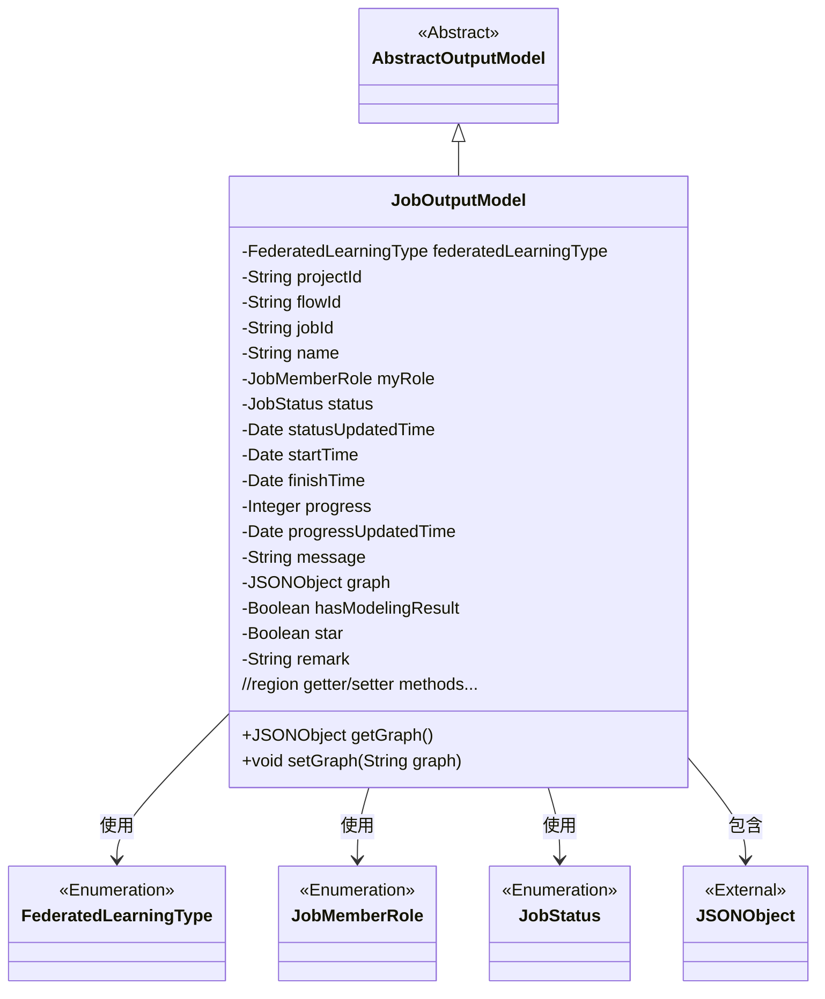

# 基础信息

|      |      |
|------|------|
| 名称 | JobOutputModel |
| 编码语言 | .java |
| 代码路径 | WeFe/board/board-service/src/main/java/com/welab/wefe/board/service/dto/entity/job/JobOutputModel.java |
| 包名 | com.welab.wefe.board.service.dto.entity.job |
| 依赖项 | ['com.alibaba.fastjson.JSON', 'com.alibaba.fastjson.JSONObject', 'com.welab.wefe.board.service.dto.entity.AbstractOutputModel', 'com.welab.wefe.common.fieldvalidate.annotation.Check', 'com.welab.wefe.common.wefe.enums.FederatedLearningType', 'com.welab.wefe.common.wefe.enums.JobMemberRole', 'com.welab.wefe.common.wefe.enums.JobStatus', 'java.util.Date'] |
| 概述说明 | JobOutputModel类定义了联邦学习任务输出模型，包含任务类型、ID、状态、时间、进度、角色、备注等属性及对应getter/setter方法。 |

# 说明

JobOutputModel类继承自AbstractOutputModel，包含联邦学习任务相关属性。主要字段包括任务类型、项目ID、流程ID、任务ID、名称、身份角色、状态及更新时间、开始结束时间、进度及更新时间、消息备注、有向无环图、是否包含建模结果、收藏标记和备注。每个字段都有对应的getter和setter方法，其中graph字段的setter方法支持字符串到JSON对象的转换。

# 类列表 Class Summary

| 名称   | 类型  | 说明 |
|-------|------|-------------|
| JobOutputModel | class | JobOutputModel类继承AbstractOutputModel，包含联邦学习任务类型、项目ID、流程ID、任务ID、名称、身份角色、状态、时间、进度、消息、有向无环图、建模结果、收藏标记等属性及对应getter/setter方法。 |

## 类 JobOutputModel

|      |      |
|------|------|
| 访问范围 | public |
| 类型 | class |
| 名称 | JobOutputModel |
| 说明 | JobOutputModel类继承AbstractOutputModel，包含联邦学习任务类型、项目ID、流程ID、任务ID、名称、身份角色、状态、时间、进度、消息、有向无环图、建模结果、收藏标记等属性及对应getter/setter方法。 |

### UML类图

这段类图展示了JobOutputModel继承自AbstractOutputModel，并包含多个私有字段和对应的getter/setter方法。该类主要描述联邦学习任务的输出模型，包含任务类型、项目信息、状态跟踪、时间戳、进度和备注等属性。通过枚举类型定义特定字段的取值范围，并使用JSONObject存储有向无环图数据。类图中清晰地展示了继承关系和对外部类型的依赖。

### 内部方法调用关系图

```mermaid
graph TD
    A["类JobOutputModel"]
    B["继承: AbstractOutputModel"]
    C["属性: FederatedLearningType federatedLearningType"]
    D["属性: String projectId"]
    E["属性: String flowId"]
    F["属性: String jobId"]
    G["属性: String name"]
    H["属性: JobMemberRole myRole"]
    I["属性: JobStatus status"]
    J["属性: Date statusUpdatedTime"]
    K["属性: Date startTime"]
    L["属性: Date finishTime"]
    M["属性: Integer progress"]
    N["属性: Date progressUpdatedTime"]
    O["属性: String message"]
    P["属性: JSONObject graph"]
    Q["属性: Boolean hasModelingResult"]
    R["属性: Boolean star"]
    S["属性: String remark"]
    T["方法: JSONObject getGraph()"]
    U["方法: void setGraph(String graph)"]
    V["方法组: getter/setter"]

    A --> B
    A --> C
    A --> D
    A --> E
    A --> F
    A --> G
    A --> H
    A --> I
    A --> J
    A --> K
    A --> L
    A --> M
    A --> N
    A --> O
    A --> P
    A --> Q
    A --> R
    A --> S
    A --> T
    A --> U
    A -.-> V
    U --> P["JSON.parseObject(graph)"]
```

这段代码展示了一个联邦学习任务输出模型类JobOutputModel，继承自AbstractOutputModel。该类包含15个带校验注解的私有属性，涵盖任务类型、项目信息、状态时间、进度和标记等核心字段。通过getter/setter方法管理属性访问，其中setGraph()方法实现了字符串到JSON对象的转换逻辑。流程图清晰展示了类继承关系、属性结构和方法调用链，特别是JSON解析的特殊处理流程。

### 字段列表 Field List

| 名称  | 类型  | 说明 |
|-------|-------|------|
| status | JobStatus | 代码片段定义了一个私有枚举类型字段status，使用@Check注解标记其名称为"状态 枚举"。 |
| projectId | String | 代码定义了一个私有字符串变量projectId，并用@Check注解标记其名称为"项目ID"。 |
| progress | Integer | 进度检查字段，类型为整型。 |
| star | Boolean | 类成员变量star用于标记收藏/置顶状态，通过@Check注解标识。 |
| finishTime | Date | 结束时间检查字段，类型为Date。 |
| jobId | String | 定义私有字符串变量jobId，使用@Check注解校验任务ID。 |
| remark | String | 字段remark带有备注校验注解。 |
| progressUpdatedTime | Date | 字段progressUpdatedTime用于记录进度更新时间，标注为需检查项。 |
| startTime | Date | 类私有字段startTime，使用@Check注解标记为"开始时间"，类型为Date。 |
| myRole | JobMemberRole | 字段myRole标记为检查注解，限定为我方身份枚举值（promoter/provider/arbiter）。 |
| graph | JSONObject | 私有JSONObject变量graph，用@Check注解标记为有向无环图。 |
| message | String | 类私有字段message，用于存储消息备注或失败原因，标注为@Check校验。 |
| federatedLearningType | FederatedLearningType | 检查联邦任务类型（横向/纵向），私有变量federatedLearningType。 |
| hasModelingResult | Boolean | 检查是否包含建模结果的布尔类型私有变量。 |
| statusUpdatedTime | Date | 字段statusUpdatedTime用于记录状态更新时间，标注为需检查项。 |
| name | String | 定义私有字符串变量name，使用@Check注解校验名称。 |
| flowId | String | 定义流程ID字段，使用@Check注解进行校验。 |

### 方法列表

| 名称  | 类型  | 说明 |
|-------|-------|------|
| setStatus | void | 设置任务状态的方法，将传入的状态参数赋值给当前对象的状态属性。 |
| getStartTime | Date | 获取开始时间的方法，返回Date类型的startTime。 |
| getStatus | JobStatus | 获取当前任务状态的方法，返回JobStatus对象。 |
| getGraph | JSONObject | 获取图形数据的JSON对象方法。 |
| getName | String | 获取名称的方法，返回字符串类型的name变量值。 |
| getFederatedLearningType | FederatedLearningType | 这是一个Java方法，返回名为federatedLearningType的枚举类型对象。 |
| setProgressUpdatedTime | void | 设置进度更新时间的方法，将参数赋值给成员变量progressUpdatedTime。 |
| getFinishTime | Date | 获取完成时间的方法，返回finishTime对象。 |
| getMyRole | JobMemberRole | 获取当前用户的角色信息。 |
| setFederatedLearningType | void | 设置联邦学习类型的方法，参数为FederatedLearningType类型，赋值给成员变量federatedLearningType。 |
| getMessage | String | 获取message字符串的方法。 |
| getStatusUpdatedTime | Date | 获取状态更新时间的方法，返回statusUpdatedTime变量。 |
| getProgressUpdatedTime | Date | 获取进度更新时间的方法，返回progressUpdatedTime日期对象。 |
| getJobId | String | 获取当前任务的唯一标识符jobId。 |
| getProgress | Integer | 获取进度值的方法，返回整数类型的progress变量。 |
| setProjectId | void | 定义了一个公共方法setProjectId，用于设置类成员变量projectId的值。参数为字符串类型projectId。 |
| setProgress | void | 设置进度值的方法，将传入的整数值赋给类的progress属性。 |
| setFlowId | void | 设置流程ID的方法，将输入参数flowId赋值给类的同名成员变量。 |
| setFinishTime | void | 设置完成时间的方法，参数为Date类型finishTime，赋值给当前对象的finishTime属性。 |
| setName | void | 设置对象名称的方法，将参数name赋值给对象的name属性。 |
| setJobId | void | 设置任务ID的方法，将输入参数jobId赋值给当前对象的jobId属性。 |
| getProjectId | String | 获取项目ID的方法，返回字符串类型的projectId。 |
| setStartTime | void | 设置开始时间的方法，参数为Date类型。 |
| setStatusUpdatedTime | void | 设置状态更新时间的方法，将参数赋值给类的成员变量。 |
| setMyRole | void | 这是一个Java方法，用于设置对象的myRole属性，参数为JobMemberRole类型。方法将传入的myRole赋值给当前对象的同名属性。 |
| getFlowId | String | 这是一个Java方法，返回字符串类型的flowId变量值。 |
| setGraph | void | 方法将输入的字符串序列化为JSON对象并赋值给成员变量graph，前提是输入不为空。 |
| setMessage | void | 设置message属性的方法，将传入的字符串赋值给当前对象的message成员变量。 |
| getHasModelingResult | Boolean | 获取建模结果状态的布尔值方法。 |
| setHasModelingResult | void | 设置模型结果标志的方法，用于更新hasModelingResult布尔值。 |
| getStar | Boolean | 获取star布尔值的方法，返回star变量。 |
| setStar | void | 设置对象星标属性的方法，参数为布尔值。 |
| getRemark | String | 获取备注信息的公共方法，返回字符串类型的remark值。 |
| setRemark | void | 这是一个Java方法，用于设置对象的remark属性值。方法接收一个字符串参数，并将其赋值给对象的remark字段。 |

