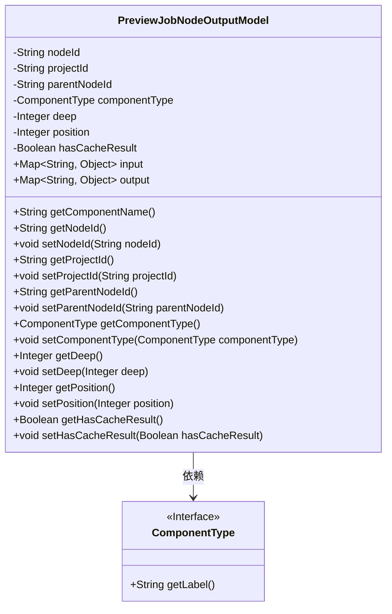

# 基础信息

|      |      |
|------|------|
| 名称 | PreviewJobNodeOutputModel |
| 编码语言 | .java |
| 代码路径 | WeFe/board/board-service/src/main/java/com/welab/wefe/board/service/dto/entity/job/PreviewJobNodeOutputModel.java |
| 包名 | com.welab.wefe.board.service.dto.entity.job |
| 依赖项 | ['com.welab.wefe.common.fieldvalidate.annotation.Check', 'com.welab.wefe.common.wefe.enums.ComponentType', 'java.util.Map'] |
| 概述说明 | PreviewJobNodeOutputModel类定义了前端画布节点的输出模型，包含节点ID、项目ID、父节点、组件类型、深度、执行序号、缓存结果标志及输入输出映射，提供各属性的getter/setter方法。 |

# 说明

PreviewJobNodeOutputModel类定义了预览任务节点输出的数据结构。包含节点ID、项目ID、父节点ID、组件类型、深度、执行序号、缓存结果标志等核心属性，以及输入输出映射表。通过getComponentName方法获取组件名称，并提供所有属性的getter/setter方法。其中position为null表示节点不执行，componentType决定组件名称。

# 类列表 Class Summary

| 名称   | 类型  | 说明 |
|-------|------|-------------|
| PreviewJobNodeOutputModel | class | 预览任务节点输出模型类，包含节点ID、项目ID、父节点ID、组件类型、深度、执行序号、缓存结果标志及输入输出映射等字段，提供各字段的getter/setter方法。 |

## 类 PreviewJobNodeOutputModel

|      |      |
|------|------|
| 访问范围 | public |
| 类型 | class |
| 名称 | PreviewJobNodeOutputModel |
| 说明 | 预览任务节点输出模型类，包含节点ID、项目ID、父节点ID、组件类型、深度、执行序号、缓存结果标志及输入输出映射等字段，提供各字段的getter/setter方法。 |

### UML类图

这段代码定义了一个名为PreviewJobNodeOutputModel的类，用于表示预览作业节点输出的数据模型。该类包含多个私有字段（如nodeId、projectId等）和对应的getter/setter方法，以及两个公共的Map类型字段input和output。其中componentType字段是一个ComponentType接口类型，通过getComponentName()方法获取组件标签。类图清晰地展示了类结构及其与ComponentType接口的依赖关系，体现了数据封装和组件化设计思想。

### 内部方法调用关系图

```mermaid
graph TD
    A["类PreviewJobNodeOutputModel"]
    B["属性: String nodeId"]
    C["属性: String projectId"]
    D["属性: String parentNodeId"]
    E["属性: ComponentType componentType"]
    F["属性: Integer deep"]
    G["属性: Integer position"]
    H["属性: Boolean hasCacheResult"]
    I["属性: Map<String, Object> input"]
    J["属性: Map<String, Object> output"]
    K["方法: getComponentName()"]
    L["方法: getNodeId()/setNodeId()"]
    M["方法: getProjectId()/setProjectId()"]
    N["方法: getParentNodeId()/setParentNodeId()"]
    O["方法: getComponentType()/setComponentType()"]
    P["方法: getDeep()/setDeep()"]
    Q["方法: getPosition()/setPosition()"]
    R["方法: getHasCacheResult()/setHasCacheResult()"]

    A --> B
    A --> C
    A --> D
    A --> E
    A --> F
    A --> G
    A --> H
    A --> I
    A --> J
    A --> K
    A --> L
    A --> M
    A --> N
    A --> O
    A --> P
    A --> Q
    A --> R
    K -->|调用| E
```

这段代码定义了一个名为PreviewJobNodeOutputModel的类，用于表示预览作业节点输出的数据模型。该类包含多个属性，如节点ID、项目ID、父节点ID、组件类型、深度、位置、是否有缓存结果等，并提供了相应的getter和setter方法。特别地，getComponentName方法会根据componentType返回对应的标签。类中的属性大多带有@Check注解，可能用于验证或文档说明。整体结构清晰，主要用于管理和操作预览作业节点的输出数据。

### 字段列表 Field List

| 名称  | 类型  | 说明 |
|-------|-------|------|
| nodeId | String | 前端画布节点ID，由前端生成。 |
| parentNodeId | String | 代码定义了一个私有字符串变量parentNodeId，并用@Check注解标记其名称为"父节点"。 |
| deep | Integer | 类成员变量deep，使用@Check注解标记为"深度"，类型为Integer。 |
| hasCacheResult | Boolean | 检查是否存在可用的历史缓存结果。 |
| input | Map<String, Object> | Java方法参数：键为字符串、值为任意对象的Map类型输入变量。 |
| position | Integer | 任务节点序号，null表示不执行。 |
| projectId | String | 定义私有字符串变量projectId，使用@Check注解校验项目ID。 |
| componentType | ComponentType | 私有变量componentType，使用@Check注解检查组件类型。 |
| output | Map<String, Object> | 定义了一个名为output的公共Map变量，键为String类型，值为Object类型。 |

### 方法列表

| 名称  | 类型  | 说明 |
|-------|-------|------|
| getComponentType | ComponentType | 获取组件类型的方法，返回componentType变量值。 |
| getParentNodeId | String | 获取父节点ID的方法，返回parentNodeId字符串。 |
| setDeep | void | 设置深度值的方法，将参数deep赋值给类成员变量deep。 |
| setComponentType | void | 方法设置组件类型，参数为ComponentType对象，赋值给成员变量componentType。 |
| setParentNodeId | void | 设置父节点ID的方法，将传入的parentNodeId赋值给当前对象的parentNodeId属性。 |
| getNodeId | String | 获取节点ID的方法，返回nodeId。 |
| setNodeId | void | 这是一个Java方法，用于设置类的nodeId属性值。方法接收一个字符串参数nodeId，并将其赋值给当前对象的同名成员变量。 |
| getDeep | Integer | 获取深度值的方法，返回整数类型。 |
| getComponentName | String | 该方法检查组件类型是否为空，若为空则返回null，否则返回组件类型的标签。 |
| setProjectId | void | 设置项目ID的方法，将输入参数projectId赋值给当前对象的projectId属性。 |
| getProjectId | String | 获取项目ID的方法，返回字符串类型的projectId。 |
| getPosition | Integer | 获取当前position的整数值。 |
| setPosition | void | 这是一个Java方法，用于设置对象的position属性值。方法接收一个Integer参数，并将其赋值给对象的position字段。 |
| getHasCacheResult | Boolean | 获取缓存结果状态的方法，返回布尔值hasCacheResult。 |
| setHasCacheResult | void | 设置缓存结果状态的方法，参数为布尔值。 |

