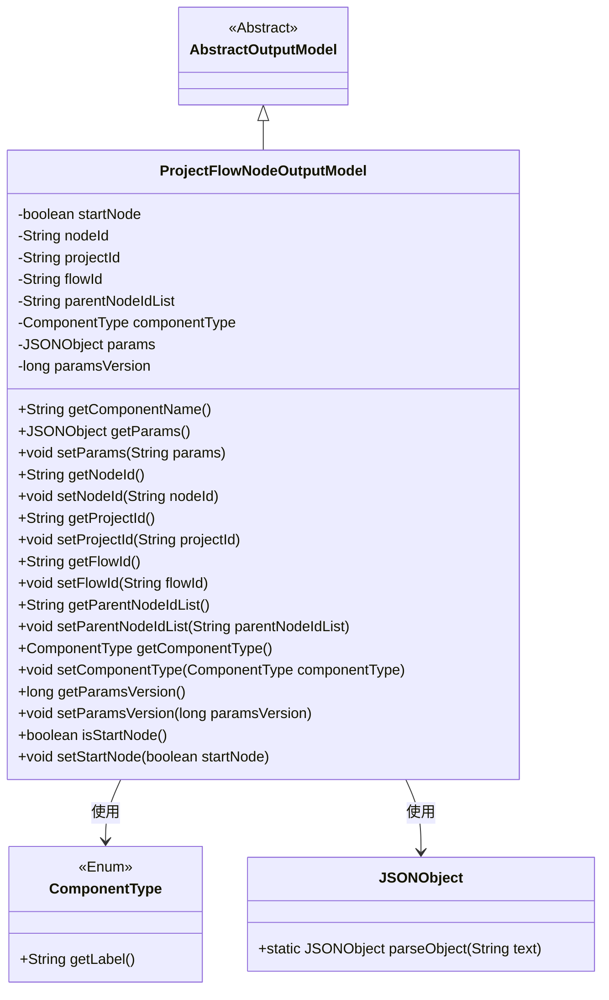
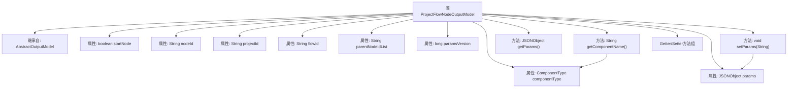

# 基础信息

|      |      |
|------|------|
| 名称 | ProjectFlowNodeOutputModel |
| 编码语言 | .java |
| 代码路径 | WeFe/board/board-service/src/main/java/com/welab/wefe/board/service/dto/entity/job/ProjectFlowNodeOutputModel.java |
| 包名 | com.welab.wefe.board.service.dto.entity.job |
| 依赖项 | ['com.alibaba.fastjson.JSONObject', 'com.welab.wefe.board.service.dto.entity.AbstractOutputModel', 'com.welab.wefe.common.fieldvalidate.annotation.Check', 'com.welab.wefe.common.wefe.enums.ComponentType'] |
| 概述说明 | ProjectFlowNodeOutputModel类继承AbstractOutputModel，包含节点ID、项目ID、流程ID、父节点列表、组件类型、参数JSON及版本号等属性，提供getter/setter方法。 |

# 说明

ProjectFlowNodeOutputModel类继承AbstractOutputModel，包含多个属性：startNode标识起始节点，nodeId为前端生成的节点ID，projectId和flowId分别表示项目和流程ID，parentNodeIdList记录父节点列表，componentType定义组件类型，params存储组件参数的JSON对象，paramsVersion标记参数版本号。提供getComponentName方法返回组件类型标签，以及各属性的getter和setter方法。

# 类列表 Class Summary

| 名称   | 类型  | 说明 |
|-------|------|-------------|
| ProjectFlowNodeOutputModel | class | ProjectFlowNodeOutputModel类继承AbstractOutputModel，包含节点ID、项目ID、流程ID、父节点列表、组件类型、参数及版本号等属性，提供getter/setter方法。 |

## 类 ProjectFlowNodeOutputModel

|      |      |
|------|------|
| 访问范围 | public |
| 类型 | class |
| 名称 | ProjectFlowNodeOutputModel |
| 说明 | ProjectFlowNodeOutputModel类继承AbstractOutputModel，包含节点ID、项目ID、流程ID、父节点列表、组件类型、参数及版本号等属性，提供getter/setter方法。 |

### UML类图

这段代码展示了一个项目流程节点输出模型类(ProjectFlowNodeOutputModel)，它继承自抽象输出模型类(AbstractOutputModel)。该类包含多个私有字段，如节点ID、项目ID、流程ID等，并提供了相应的getter和setter方法。特别值得注意的是，它通过ComponentType枚举类获取组件名称，并使用JSONObject处理参数数据。该类主要用于管理项目流程节点的输出数据，包括节点属性、关联关系和组件配置等信息。

### 内部方法调用关系图

该流程图展示了ProjectFlowNodeOutputModel类的完整结构，包含8个带@Check注解的属性字段、3个核心方法和一组标准Getter/Setter。特别值得注意的是getComponentName()方法通过componentType对象获取标签值，setParams()方法实现了JSON字符串到JSONObject的转换逻辑。所有属性都通过标准访问器方法进行封装，体现了良好的面向对象设计原则。

### 字段列表 Field List

| 名称  | 类型  | 说明 |
|-------|-------|------|
| paramsVersion | long | 参数版本号检查注解的私有长整型变量。 |
| projectId | String | 定义私有字符串变量projectId，使用@Check注解校验项目ID。 |
| nodeId | String | 前端画布节点ID，由前端生成。 |
| flowId | String | 定义私有字符串变量flowId，使用@Check注解校验流程ID。 |
| componentType | ComponentType | 定义组件类型检查的私有变量。 |
| params | JSONObject | 类成员变量params，类型为JSONObject，使用@Check注解标记为"组件参数"。 |
| startNode | boolean | 检查是否为起始节点的布尔变量startNode。 |
| parentNodeIdList | String | 代码定义私有字符串变量parentNodeIdList，并用@Check注解标记父节点检查。 |

### 方法列表

| 名称  | 类型  | 说明 |
|-------|-------|------|
| getFlowId | String | 获取当前流程ID的方法，返回字符串类型的flowId。 |
| getParentNodeIdList | String | 获取父节点ID列表的方法。 |
| setParentNodeIdList | void | 设置父节点ID列表的方法，将输入字符串赋值给类的parentNodeIdList成员变量。 |
| setParams | void | 方法setParams接收字符串参数params，若为空则设为null，否则解析为JSONObject并赋值给成员变量params。 |
| setNodeId | void | 设置节点ID的方法，将参数nodeId赋值给当前对象的nodeId属性。 |
| getComponentName | String | 该方法检查组件类型是否为空，为空则返回null，否则返回组件类型的标签名称。 |
| getNodeId | String | 获取节点ID的方法，返回字符串类型的nodeId。 |
| getComponentType | ComponentType | 该方法返回当前对象的组件类型。 |
| setProjectId | void | 定义公共方法setProjectId，接收字符串参数projectId，将其赋值给当前对象的projectId属性。 |
| setFlowId | void | 设置流程ID的方法，将输入参数赋值给类的flowId成员变量。 |
| getParams | JSONObject | 获取JSON对象参数的方法，返回params变量。 |
| getProjectId | String | 获取项目ID的方法，返回字符串类型的projectId。 |
| setComponentType | void | 设置组件类型的方法，将传入的componentType赋值给当前对象的componentType属性。 |
| getParamsVersion | long | 获取参数版本号的方法，返回paramsVersion值。 |
| setParamsVersion | void | 方法setParamsVersion用于设置参数版本号，将传入的paramsVersion赋值给当前对象的同名属性。 |
| isStartNode | boolean | 方法isStartNode返回布尔值startNode，判断是否为起始节点。 |
| setStartNode | void | 设置当前节点是否为起始节点的方法。 |

