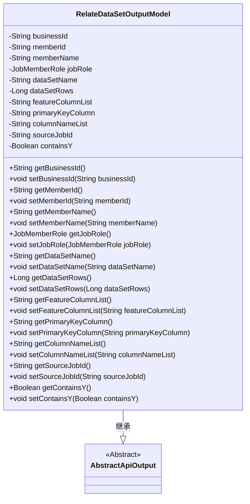

# 基础信息

|      |      |
|------|------|
| 名称 | RelateDataSetOutputModel |
| 编码语言 | .java |
| 代码路径 | WeFe/board/board-service/src/main/java/com/welab/wefe/board/service/dto/entity/job/RelateDataSetOutputModel.java |
| 包名 | com.welab.wefe.board.service.dto.entity.job |
| 依赖项 | ['com.welab.wefe.common.fieldvalidate.annotation.Check', 'com.welab.wefe.common.web.dto.AbstractApiOutput', 'com.welab.wefe.common.wefe.enums.JobMemberRole'] |
| 概述说明 | RelateDataSetOutputModel类包含任务ID、成员信息、数据集名称、数据量、特征列、主键列、字段列表、来源数据集ID及是否含Y值等属性。 |

# 说明

RelateDataSetOutputModel类继承自AbstractApiOutput，用于表示关联数据集的输出模型。包含以下字段：任务Id（businessId）、成员Id（memberId）、成员名称（memberName）、任务角色（jobRole，枚举值为promoter/provider/arbiter）、数据集名称（dataSetName）、数据量（dataSetRows）、特征列（featureColumnList）、主键列（primaryKeyColumn）、字段列表（columnNameList）、来源数据集Id（sourceJobId）以及是否包含Y值（containsY）。每个字段均有对应的getter和setter方法。

# 类列表 Class Summary

| 名称   | 类型  | 说明 |
|-------|------|-------------|
| RelateDataSetOutputModel | class | RelateDataSetOutputModel类包含任务ID、成员信息、数据集名称、数据量、特征列、主键列、字段列表、来源数据集ID及是否含Y值等属性。 |

## 类 RelateDataSetOutputModel

|      |      |
|------|------|
| 访问范围 | public |
| 类型 | class |
| 名称 | RelateDataSetOutputModel |
| 说明 | RelateDataSetOutputModel类包含任务ID、成员信息、数据集名称、数据量、特征列、主键列、字段列表、来源数据集ID及是否含Y值等属性。 |

### UML类图

类图描述：RelateDataSetOutputModel类继承自AbstractApiOutput抽象类，包含多个私有字段用于存储任务相关数据（如业务ID、成员信息、数据集特征等），并为每个字段提供标准的getter/setter方法。该类主要用于封装任务关联数据集的输出模型，通过继承实现基础API输出功能，字段通过@Check注解进行校验标记。

### 内部方法调用关系图

```mermaid
graph TD
    A["类RelateDataSetOutputModel"]
    B["继承: AbstractApiOutput"]
    C["属性: String businessId"]
    D["属性: String memberId"]
    E["属性: String memberName"]
    F["属性: JobMemberRole jobRole"]
    G["属性: String dataSetName"]
    H["属性: Long dataSetRows"]
    I["属性: String featureColumnList"]
    J["属性: String primaryKeyColumn"]
    K["属性: String columnNameList"]
    L["属性: String sourceJobId"]
    M["属性: Boolean containsY"]
    N["方法: get/set businessId"]
    O["方法: get/set memberId"]
    P["方法: get/set memberName"]
    Q["方法: get/set jobRole"]
    R["方法: get/set dataSetName"]
    S["方法: get/set dataSetRows"]
    T["方法: get/set featureColumnList"]
    U["方法: get/set primaryKeyColumn"]
    V["方法: get/set columnNameList"]
    W["方法: get/set sourceJobId"]
    X["方法: get/set containsY"]

    A --> B
    A --> C
    A --> D
    A --> E
    A --> F
    A --> G
    A --> H
    A --> I
    A --> J
    A --> K
    A --> L
    A --> M
    A --> N
    A --> O
    A --> P
    A --> Q
    A --> R
    A --> S
    A --> T
    A --> U
    A --> V
    A --> W
    A --> X
```

这段代码定义了一个名为RelateDataSetOutputModel的类，继承自AbstractApiOutput，主要用于封装与数据集相关的输出信息。类中包含多个属性，如businessId、memberId、dataSetName等，每个属性都有对应的getter和setter方法。这些属性通过@Check注解进行校验，用于描述任务ID、成员信息、数据集特征等元数据。该模型适用于联邦学习等场景中数据集关系的结构化输出。

### 字段列表 Field List

| 名称  | 类型  | 说明 |
|-------|-------|------|
| jobRole | JobMemberRole | 定义任务成员角色枚举字段，可选值为promoter/provider/arbiter，分别表示任务中的不同角色。 |
| columnNameList | String | 字段校验注解，标记字段列表名称为columnNameList。 |
| sourceJobId | String | 字段sourceJobId用于标识来源数据集ID，通过@Check注解进行校验。 |
| containsY | Boolean | 类成员变量containsY，用@Check注解标记，检查是否包含Y值。 |
| memberName | String | Java注解@Check用于校验成员名称，变量名为memberName。 |
| dataSetRows | Long | 定义私有长整型变量dataSetRows，使用@Check注解标记为"数据量"检查项。 |
| memberId | String | 成员ID校验注解 |
| featureColumnList | String | 代码定义了一个私有字符串变量featureColumnList，并用@Check注解标记为"特征列"。 |
| dataSetName | String | 定义私有字符串变量dataSetName，使用@Check注解校验数据集名称。 |
| primaryKeyColumn | String | 代码定义了一个私有字符串变量primaryKeyColumn，并用@Check注解标记为主键列。 |
| businessId | String | 私有字符串变量businessId，使用@Check注解标记为"任务Id"。 |

### 方法列表

| 名称  | 类型  | 说明 |
|-------|-------|------|
| setDataSetName | void | 这是一个Java方法，用于设置数据集名称。方法接收一个字符串参数dataSetName，并将其赋值给类的成员变量this.dataSetName。 |
| getMemberName | String | 获取成员名称的方法，返回成员变量memberName的值。 |
| getMemberId | String | 这是一个Java方法，返回成员ID字符串。 |
| getPrimaryKeyColumn | String | 获取主键列名的方法，返回字符串类型的primaryKeyColumn。 |
| setMemberName | void | 设置成员变量memberName的方法，参数为String类型。 |
| setBusinessId | void | 这是一个Java方法，用于设置类的businessId属性值。方法接收一个字符串参数businessId，并将其赋值给类的同名成员变量。 |
| setFeatureColumnList | void | 设置特征列列表的方法，将输入字符串赋值给类成员变量featureColumnList。 |
| getJobRole | JobMemberRole | 获取当前对象的jobRole属性值。 |
| setJobRole | void | 这是一个Java方法，用于设置对象的jobRole属性，参数类型为JobMemberRole。 |
| setMemberId | void | 设置成员ID的方法，将输入字符串赋值给成员变量memberId。 |
| getBusinessId | String | 这是一个Java方法，返回字符串类型的businessId变量值。 |
| setPrimaryKeyColumn | void | 设置主键列的方法，将输入参数赋值给类的成员变量primaryKeyColumn。 |
| getDataSetRows | Long | 获取数据集行数的方法，返回值为长整型。 |
| getFeatureColumnList | String | 这是一个Java方法，返回名为featureColumnList的字符串变量。 |
| getDataSetName | String | 获取数据集名称的方法，返回字符串类型的数据集名称变量。 |
| setDataSetRows | void | 设置数据集行数的方法，参数为长整型dataSetRows，赋值给成员变量this.dataSetRows。 |
| getColumnNameList | String | 该方法返回列名列表字符串。 |
| setColumnNameList | void | 设置列名列表的方法，将参数赋值给成员变量columnNameList。 |
| getSourceJobId | String | 获取sourceJobId的字符串值方法。 |
| setSourceJobId | void | 设置源任务ID的方法，将输入参数赋值给类的成员变量sourceJobId。 |
| getContainsY | Boolean | 这是一个Java方法，返回布尔类型变量containsY的值。 |
| setContainsY | void | 定义方法setContainsY，用于设置布尔类型成员变量containsY的值。 |

