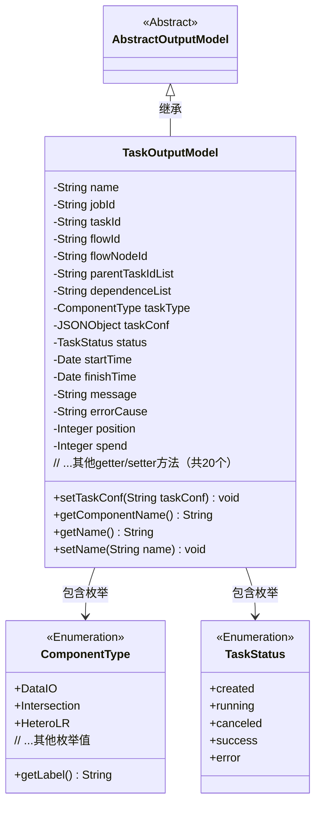
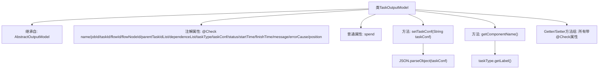

# 基础信息

|      |      |
|------|------|
| 名称 | TaskOutputModel |
| 编码语言 | .java |
| 代码路径 | WeFe/board/board-service/src/main/java/com/welab/wefe/board/service/dto/entity/job/TaskOutputModel.java |
| 包名 | com.welab.wefe.board.service.dto.entity.job |
| 依赖项 | ['com.alibaba.fastjson.JSON', 'com.alibaba.fastjson.JSONObject', 'com.welab.wefe.board.service.dto.entity.AbstractOutputModel', 'com.welab.wefe.common.fieldvalidate.annotation.Check', 'com.welab.wefe.common.wefe.enums.ComponentType', 'com.welab.wefe.common.wefe.enums.TaskStatus', 'java.util.Date'] |
| 概述说明 | TaskOutputModel类包含任务名称、ID、流程信息、状态、时间及错误信息等字段，用于管理任务输出数据。 |

# 说明

TaskOutputModel类继承AbstractOutputModel，包含任务相关属性：名称、任务ID、业务ID、流程号、流程节点ID、父任务ID列表、子任务依赖、任务类型枚举、任务配置JSON、状态枚举、开始结束时间、消息备注、错误原因、执行顺序和耗时。提供各属性的getter和setter方法，其中taskConf支持字符串转JSON，taskType可获取组件名称标签。

# 类列表 Class Summary

| 名称   | 类型  | 说明 |
|-------|------|-------------|
| TaskOutputModel | class | TaskOutputModel类包含任务名称、ID、流程信息、状态、时间、配置及错误信息等字段，用于管理任务执行数据。 |

## 类 TaskOutputModel

|      |      |
|------|------|
| 访问范围 | public |
| 类型 | class |
| 名称 | TaskOutputModel |
| 说明 | TaskOutputModel类包含任务名称、ID、流程信息、状态、时间、配置及错误信息等字段，用于管理任务执行数据。 |

### UML类图

这段代码展示了一个任务输出模型类(TaskOutputModel)，它继承自抽象类AbstractOutputModel，包含任务相关的各种属性和状态信息。该类主要特点包括：1) 使用@Check注解标记字段的校验信息；2) 包含任务配置(JSONObject)、类型(ComponentType枚举)和状态(TaskStatus枚举)等复杂类型；3) 提供完整的getter/setter方法；4) 包含特殊方法如setTaskConf()用于JSON解析和getComponentName()获取组件标签。类结构反映了任务管理系统中的核心数据模型，通过枚举类型确保字段取值规范性。

### 内部方法调用关系图

这段代码展示了一个任务输出模型类TaskOutputModel，它继承自AbstractOutputModel。类中包含15个带@Check注解的属性和1个普通属性，主要功能包括：通过setTaskConf方法将字符串转换为JSON对象，通过getComponentName获取任务类型标签，以及为所有属性提供标准的getter/setter方法。该模型用于封装任务执行过程中的各种状态和元数据信息。

### 字段列表 Field List

| 名称  | 类型  | 说明 |
|-------|-------|------|
| taskId | String | 业务ID字段taskId，多方唯一标识。 |
| jobId | String | 字段jobId带有@Check注解，参数name为"任务Id"。 |
| name | String | 代码定义了一个私有字符串变量name，并用@Check注解标记其名称为"名称"。 |
| parentTaskIdList | String | 字段parentTaskIdList用于存储子任务的父节点ID列表，通过@Check注解标记验证。 |
| flowNodeId | String | 检查任务所在流程节点ID的私有字符串变量。 |
| dependenceList | String | 类字段dependenceList用于检查子任务依赖关系，注解@Check标记其名称为"子任务依赖"。 |
| flowId | String | 定义流程号字段flowId，使用@Check注解校验。 |
| errorCause | String | 定义私有字符串变量errorCause，用于存储错误堆栈信息，通过@Check注解标记需校验。 |
| taskConf | JSONObject | 代码定义了一个私有JSONObject变量taskConf，并标注了检查注解"任务conf_json"。 |
| spend | Integer | 私有整型变量spend，用于存储数值。 |
| message | String | 类字段message用于存储消息备注或失败原因，通过@Check注解标记。 |
| position | Integer | 任务执行顺序的序号标记 |
| taskType | ComponentType | 子任务类型枚举字段，包括DataIO、Intersection、HeteroLR等。 |
| finishTime | Date | 私有日期类型变量finishTime，使用@Check注解标记为"结束时间"。 |
| startTime | Date | 定义私有日期类型变量startTime，并标注检查名称为"开始时间"。 |
| status | TaskStatus | 状态检查，枚举值包括created、running、canceled、success、error。 |

### 方法列表

| 名称  | 类型  | 说明 |
|-------|-------|------|
| setDependenceList | void | 这是一个Java方法，用于设置dependenceList属性的值。方法接受一个字符串参数，并将其赋值给类的成员变量dependenceList。 |
| getFlowId | String | 获取flowId的公共方法，返回字符串类型的flowId值。 |
| getName | String | 方法getName返回字符串类型的name变量值。 |
| setStatus | void | 方法设置任务状态，将输入参数赋值给对象的status属性。 |
| getFlowNodeId | String | 该方法返回字符串类型的flowNodeId值。 |
| getDependenceList | String | 获取依赖列表的方法，返回字符串类型的依赖列表。 |
| setTaskType | void | 设置任务类型的方法，将参数taskType赋值给当前对象的taskType属性。 |
| setFlowId | void | Java方法：设置流程ID，将输入参数flowId赋值给类的成员变量this.flowId。 |
| setParentTaskIdList | void | 设置父任务ID列表的方法，将输入字符串赋值给类的成员变量parentTaskIdList。 |
| getErrorCause | String | 获取错误原因的方法，返回字符串类型变量errorCause。 |
| setTaskId | void | 设置任务ID的方法，将传入的taskId赋值给当前对象的taskId属性。 |
| getJobId | String | 获取jobId的公共方法，返回字符串类型的jobId值。 |
| getStatus | TaskStatus | 获取当前任务状态的方法，返回TaskStatus类型的状态值。 |
| setFlowNodeId | void | 设置流程节点ID的方法，将参数flowNodeId赋值给当前对象的同名属性。 |
| getMessage | String | 获取message字符串的方法。 |
| getTaskType | ComponentType | 获取任务类型的公共方法，返回ComponentType类型的taskType。 |
| getTaskId | String | 获取任务ID的方法，返回字符串类型的taskId。 |
| getComponentName | String | 获取任务类型的标签名称。 |
| getTaskConf | JSONObject | 获取任务配置的JSON对象。 |
| setFinishTime | void | 设置完成时间的方法，将参数finishTime赋值给对象的finishTime属性。 |
| setJobId | void | 设置当前对象的jobId属性值为传入的jobId参数值。 |
| setTaskConf | void | 方法setTaskConf接收字符串taskConf，非空时将其解析为JSON对象并赋值给成员变量taskConf。 |
| getParentTaskIdList | String | 获取父任务ID列表的方法，返回字符串类型的parentTaskIdList。 |
| setErrorCause | void | 设置错误原因的方法，将输入字符串赋值给类的errorCause变量。 |
| getPosition | Integer | 获取position值的公共方法，返回Integer类型。 |
| setPosition | void | 设置对象的位置属性。 |
| getSpend | Integer | 获取spend整数值的方法。 |
| setSpend | void | 设置消费金额的方法，参数为整数类型。 |
| setMessage | void | 设置消息内容的方法，将输入字符串赋值给类成员变量message。 |
| getStartTime | Date | 方法getStartTime返回startTime日期对象。 |
| setStartTime | void | 设置开始时间的方法，将参数startTime赋值给类的成员变量startTime。 |
| getFinishTime | Date | 获取完成时间的方法，返回finishTime日期对象。 |
| setName | void | 设置对象名称的方法，将参数name赋值给对象的name属性。 |

