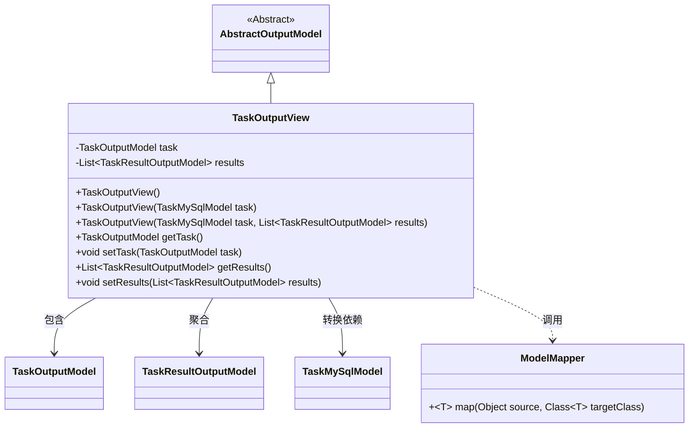
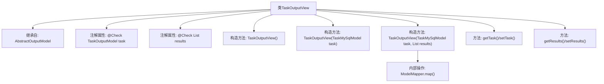

# 基础信息

|      |      |
|------|------|
| 名称 | TaskOutputView |
| 编码语言 | .java |
| 代码路径 | WeFe/board/board-service/src/main/java/com/welab/wefe/board/service/dto/entity/job/TaskOutputView.java |
| 包名 | com.welab.wefe.board.service.dto.entity.job |
| 依赖项 | ['com.welab.wefe.board.service.database.entity.job.TaskMySqlModel', 'com.welab.wefe.board.service.dto.entity.AbstractOutputModel', 'com.welab.wefe.common.fieldvalidate.annotation.Check', 'com.welab.wefe.common.web.util.ModelMapper', 'java.util.List'] |
| 概述说明 | TaskOutputView类继承AbstractOutputModel，包含TaskOutputModel任务和TaskResultOutputModel结果列表，提供构造方法和getter/setter。 |

# 说明

TaskOutputView类继承自AbstractOutputModel，包含两个主要字段：task和results。task字段标注为组件创建的task，类型为TaskOutputModel；results字段标注为task输出的结果，类型为TaskResultOutputModel的列表。类提供了三个构造函数：默认构造函数、接收TaskMySqlModel参数的构造函数，以及接收TaskMySqlModel和TaskResultOutputModel列表参数的构造函数。后者使用ModelMapper将TaskMySqlModel映射为TaskOutputModel。类还提供了task和results字段的getter和setter方法。

# 类列表 Class Summary

| 名称   | 类型  | 说明 |
|-------|------|-------------|
| TaskOutputView | class | TaskOutputView类继承AbstractOutputModel，包含task和results属性，提供构造方法和getter/setter。task映射自TaskMySqlModel，results为TaskResultOutputModel列表。 |

## 类 TaskOutputView

|      |      |
|------|------|
| 访问范围 | public |
| 类型 | class |
| 名称 | TaskOutputView |
| 说明 | TaskOutputView类继承AbstractOutputModel，包含task和results属性，提供构造方法和getter/setter。task映射自TaskMySqlModel，results为TaskResultOutputModel列表。 |

### UML类图

类图描述：TaskOutputView继承自抽象类AbstractOutputModel，包含私有成员TaskOutputModel和TaskResultOutputModel列表。通过构造函数从TaskMySqlModel转换数据，依赖ModelMapper进行对象映射。该类提供标准的getter/setter方法，与多个模型类存在关联关系，实现了任务输出数据的封装和转换功能。

### 内部方法调用关系图

该流程图展示了TaskOutputView类的完整结构，包括继承关系、注解属性、三个重载构造函数和getter/setter方法。核心构造流程通过ModelMapper实现模型转换，将TaskMySqlModel映射为TaskOutputModel。类设计遵循了数据封装原则，通过注解进行校验标记，支持灵活的结果集注入方式。

### 字段列表 Field List

| 名称  | 类型  | 说明 |
|-------|-------|------|
| task | TaskOutputModel | 组件创建的task任务输出模型 |
| results | List<TaskResultOutputModel> | 类成员变量results，类型为TaskResultOutputModel列表，用@Check注解标记名称为"task 输出的结果"。 |

### 方法列表

| 名称  | 类型  | 说明 |
|-------|-------|------|
| setResults | void | 设置任务结果列表的方法。 |
| getTask | TaskOutputModel | 方法getTask返回TaskOutputModel类型的task对象。 |
| getResults | List<TaskResultOutputModel> | 获取任务结果列表的方法，返回TaskResultOutputModel类型的集合。 |
| setTask | void | 设置任务对象。 |

