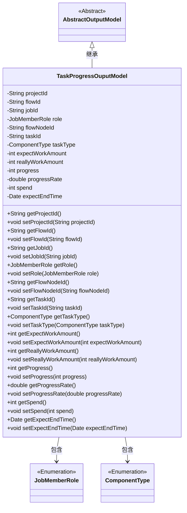

# 基础信息

|      |      |
|------|------|
| 名称 | TaskProgressOuputModel |
| 编码语言 | .java |
| 代码路径 | WeFe/board/board-service/src/main/java/com/welab/wefe/board/service/dto/entity/job/TaskProgressOuputModel.java |
| 包名 | com.welab.wefe.board.service.dto.entity.job |
| 依赖项 | ['com.welab.wefe.board.service.dto.entity.AbstractOutputModel', 'com.welab.wefe.common.fieldvalidate.annotation.Check', 'com.welab.wefe.common.wefe.enums.ComponentType', 'com.welab.wefe.common.wefe.enums.JobMemberRole', 'javax.persistence.EnumType', 'javax.persistence.Enumerated', 'java.util.Date'] |
| 概述说明 | 任务进度输出模型类，包含项目ID、流程号、任务ID、角色、流程节点ID、子任务类型、预计和实际工程量、进度及百分比、耗时和预计结束时间等字段。 |

# 说明

TaskProgressOuputModel类继承AbstractOutputModel，包含任务进度相关属性：项目id、流程号、任务id、角色、流程节点id、子任务类型枚举、预计和实际工程量、进度值及百分比、耗时毫秒数、预计结束时间。所有字段均有getter和setter方法，部分字段通过注解进行校验或枚举类型映射。

# 类列表 Class Summary

| 名称   | 类型  | 说明 |
|-------|------|-------------|
| TaskProgressOuputModel | class | 任务进度输出模型类，包含项目ID、流程号、任务ID、角色、流程节点ID、子任务类型、预计和实际工程量、进度及百分比、耗时和预计结束时间等字段。 |

## 类 TaskProgressOuputModel

|      |      |
|------|------|
| 访问范围 | public |
| 类型 | class |
| 名称 | TaskProgressOuputModel |
| 说明 | 任务进度输出模型类，包含项目ID、流程号、任务ID、角色、流程节点ID、子任务类型、预计和实际工程量、进度及百分比、耗时和预计结束时间等字段。 |

### UML类图

类图描述：TaskProgressOuputModel继承自抽象类AbstractOutputModel，用于跟踪任务进度信息。包含项目ID、流程ID、任务ID等核心标识字段，以及工程量、进度百分比、预计结束时间等统计指标。通过JobMemberRole和ComponentType两个枚举类定义角色和任务类型，所有字段均通过getter/setter方法访问，符合JavaBean规范。

### 内部方法调用关系图

这段代码定义了一个名为TaskProgressOuputModel的类，继承自AbstractOutputModel，用于跟踪和管理任务进度相关的数据。类中包含多个属性，如项目ID、流程ID、任务ID等，以及对应的getter和setter方法。这些属性用于存储任务的详细信息，包括预计和实际工程量、进度百分比、预计结束时间等。通过枚举类型JobMemberRole和ComponentType，可以明确角色和任务类型的取值范围，确保数据的准确性和一致性。

### 字段列表 Field List

| 名称  | 类型  | 说明 |
|-------|-------|------|
| taskType | ComponentType | 定义枚举类型字段taskType，使用字符串形式存储枚举值。 |
| flowId | String | 定义流程号字段，使用@Check注解校验。 |
| expectEndTime | Date | 代码定义了一个私有日期类型变量expectEndTime，并用@Check注解标记其名称为"预计结束时间"。 |
| taskId | String | 定义私有字符串变量taskId，使用@Check注解校验任务id。 |
| flowNodeId | String | 定义私有字符串变量flowNodeId，使用@Check注解校验流程节点id。 |
| progress | int | 进度检查的私有整型变量progress。 |
| spend | int | 字段spend存储updated_time与created_time的时间差，单位为毫秒。 |
| reallyWorkAmount | int | 字段reallyWorkAmount标注为实际总工程量检查项。 |
| role | JobMemberRole | 定义枚举类型字段role，使用字符串值存储枚举常量。 |
| jobId | String | 定义私有字符串变量jobId，使用@Check注解标记任务id。 |
| projectId | String | 定义私有字符串变量projectId，使用@Check注解校验项目id。 |
| expectWorkAmount | int | 定义私有整型变量expectWorkAmount，使用@Check注解标记为"预计总工程量"。 |
| progressRate | double | 进度百分比检查项，私有双精度变量progressRate。 |

### 方法列表

| 名称  | 类型  | 说明 |
|-------|-------|------|
| getFlowNodeId | String | 方法返回flowNodeId字符串。 |
| setFlowId | void | 设置流程ID的方法，将参数flowId赋值给当前对象的flowId属性。 |
| setProjectId | void | 这是一个Java方法，用于设置类的projectId属性。方法接收一个字符串参数projectId，并将其赋值给类的同名成员变量。 |
| setExpectWorkAmount | void | 这是一个Java方法，用于设置期望工作量的整数值。方法接受一个整数参数expectWorkAmount，并将其赋值给类的同名成员变量。 |
| setReallyWorkAmount | void | 设置实际工作量的方法，将参数赋值给成员变量reallyWorkAmount。 |
| getFlowId | String | 获取flowId的公共方法，返回字符串类型的flowId值。 |
| getProjectId | String | 获取项目ID的方法，返回字符串类型的projectId。 |
| getReallyWorkAmount | int | 获取实际工作量的整数值方法。 |
| getJobId | String | 获取当前任务的唯一标识符jobId。 |
| getProgress | int | 获取当前进度值的方法，返回整数类型变量progress的值。 |
| setRole | void | 方法setRole用于设置成员角色，参数为JobMemberRole类型，赋值给当前对象的role属性。 |
| getRole | JobMemberRole | 这是一个Java方法，返回JobMemberRole类型的role字段值。 |
| setProgressRate | void | 设置进度率方法，接收双精度参数并赋值给成员变量progressRate。 |
| setTaskId | void | 设置任务ID的方法，将参数taskId赋值给当前对象的taskId属性。 |
| setFlowNodeId | void | 设置流程节点ID的方法，将传入的字符串参数赋值给类的成员变量flowNodeId。 |
| setProgress | void | 设置进度值的方法，参数为整型progress，直接赋值给类成员变量progress。 |
| setJobId | void | 设置任务ID的方法，将输入参数jobId赋值给当前对象的jobId属性。 |
| getExpectWorkAmount | int | 这是一个Java方法，返回名为expectWorkAmount的整型变量值。 |
| getProgressRate | double | 获取进度率的方法，返回double类型的progressRate值。 |
| getSpend | int | 获取spend变量的整型值。 |
| setSpend | void | 这是一个Java方法，用于设置类成员变量spend的值。方法接受一个整数参数，并将其赋值给当前对象的spend属性。 |
| getExpectEndTime | Date | 获取预期结束时间的方法，返回Date类型值expectEndTime。 |
| setExpectEndTime | void | 设置预期结束时间的方法，参数为Date类型，赋值给类成员变量expectEndTime。 |
| setTaskType | void | 设置任务类型的方法，将参数taskType赋值给当前对象的taskType属性。 |
| getTaskType | ComponentType | 方法返回任务类型ComponentType。 |
| getTaskId | String | 获取任务ID的方法，返回字符串类型的taskId。 |

