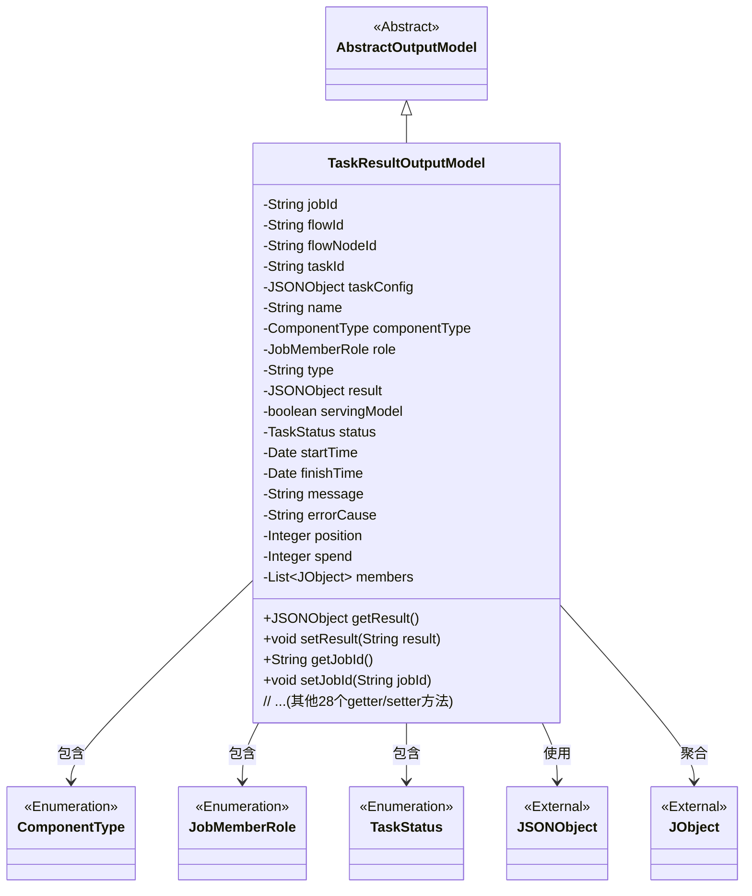

# 基础信息

|      |      |
|------|------|
| 名称 | TaskResultOutputModel |
| 编码语言 | .java |
| 代码路径 | WeFe/board/board-service/src/main/java/com/welab/wefe/board/service/dto/entity/job/TaskResultOutputModel.java |
| 包名 | com.welab.wefe.board.service.dto.entity.job |
| 依赖项 | ['com.alibaba.fastjson.JSON', 'com.alibaba.fastjson.JSONObject', 'com.welab.wefe.board.service.dto.entity.AbstractOutputModel', 'com.welab.wefe.common.fieldvalidate.annotation.Check', 'com.welab.wefe.common.util.JObject', 'com.welab.wefe.common.wefe.enums.ComponentType', 'com.welab.wefe.common.wefe.enums.JobMemberRole', 'com.welab.wefe.common.wefe.enums.TaskStatus', 'java.util.Date', 'java.util.List'] |
| 概述说明 | TaskResultOutputModel类包含任务ID、流程ID、节点ID、任务参数、状态、时间、结果等字段，用于记录任务执行详情和结果。 |

# 说明

TaskResultOutputModel是一个继承自AbstractOutputModel的Java类，用于封装任务执行结果的输出数据。该类包含多个字段，如任务ID、流程ID、流程节点ID、子任务ID、任务参数、任务名称、组件类型、成员角色、结果类型、执行结果JSON对象、是否可导出为服务模型标志等。此外还包含任务状态、开始时间、结束时间、消息备注、错误原因、执行顺序、耗时和参与方列表等字段。每个字段都有对应的getter和setter方法，便于访问和修改属性值。该类主要用于管理和传递任务执行过程中的各种状态和结果信息。

# 类列表 Class Summary

| 名称   | 类型  | 说明 |
|-------|------|-------------|
| TaskResultOutputModel | class | TaskResultOutputModel类包含任务ID、流程ID、节点ID、任务参数、执行结果、状态、时间、错误信息等字段，用于管理任务输出数据。 |

## 类 TaskResultOutputModel

|      |      |
|------|------|
| 访问范围 | public |
| 类型 | class |
| 名称 | TaskResultOutputModel |
| 说明 | TaskResultOutputModel类包含任务ID、流程ID、节点ID、任务参数、执行结果、状态、时间、错误信息等字段，用于管理任务输出数据。 |

### UML类图

这段代码描述了一个任务结果输出模型类`TaskResultOutputModel`，它继承自抽象类`AbstractOutputModel`。该类包含任务执行相关的各种属性，如任务ID、流程ID、任务配置、执行结果、状态、时间信息等，并使用枚举类型定义组件类型、成员角色和任务状态。类中通过大量getter/setter方法管理这些属性，其中`result`属性支持JSON字符串转换。该类还聚合了`JObject`类型的成员列表，并与外部`JSONObject`类存在依赖关系。整体设计体现了任务执行结果的完整数据建模，包含状态跟踪、时间记录和错误处理等功能。

### 内部方法调用关系图

```mermaid
graph TD
    A["类TaskResultOutputModel"]
    B["继承: AbstractOutputModel"]
    C["属性: String jobId"]
    D["属性: String flowId"]
    E["属性: String flowNodeId"]
    F["属性: String taskId"]
    G["属性: JSONObject taskConfig"]
    H["属性: String name"]
    I["属性: ComponentType componentType"]
    J["属性: JobMemberRole role"]
    K["属性: String type"]
    L["属性: JSONObject result"]
    M["属性: boolean servingModel"]
    N["属性: TaskStatus status"]
    O["属性: Date startTime"]
    P["属性: Date finishTime"]
    Q["属性: String message"]
    R["属性: String errorCause"]
    S["属性: Integer position"]
    T["属性: Integer spend"]
    U["属性: List<JObject> members"]
    V["方法: JSONObject getResult()"]
    W["方法: void setResult(String result)"]
    X["Getter/Setter方法组"]

    A --> B
    A --> C
    A --> D
    A --> E
    A --> F
    A --> G
    A --> H
    A --> I
    A --> J
    A --> K
    A --> L
    A --> M
    A --> N
    A --> O
    A --> P
    A --> Q
    A --> R
    A --> S
    A --> T
    A --> U
    A --> V
    A --> W
    A -.-> X
```

这段代码定义了一个名为TaskResultOutputModel的类，继承自AbstractOutputModel，主要用于封装任务执行结果的输出数据模型。类中包含20个私有属性，涵盖了任务ID、流程信息、组件类型、执行状态、时间戳等关键字段，每个属性都配有@Check注解进行校验标识。类中提供了完整的getter/setter方法，特别对result字段提供了JSON格式的转换处理。该模型设计用于分布式任务系统中记录任务执行的详细状态和结果数据。

### 字段列表 Field List

| 名称  | 类型  | 说明 |
|-------|-------|------|
| role | JobMemberRole | 成员角色字段，使用@Check注解校验。 |
| type | String | 代码定义了一个私有字符串变量type，用于标识task的多行result类型，通过@Check注解进行校验。 |
| taskConfig | JSONObject | 任务参数配置，使用JSONObject类型存储。 |
| members | List<JObject> | 声明一个私有成员变量，类型为JObject对象的列表。 |
| spend | Integer | 私有整型变量spend，用于存储支出数值。 |
| status | TaskStatus | 检查任务状态的私有变量，类型为TaskStatus。 |
| startTime | Date | 定义私有日期类型变量startTime，使用@Check注解标记为"开始时间"。 |
| position | Integer | 任务执行顺序的检查标记，私有整型变量position。 |
| componentType | ComponentType | 定义组件类型的私有变量，使用@Check注解校验组件id。 |
| name | String | 代码定义了一个私有字符串变量name，用于存储任务名称，并通过@Check注解进行校验。 |
| finishTime | Date | 结束时间检查字段，类型为Date。 |
| flowId | String | 定义私有字符串变量flowId，使用@Check注解校验流程Id。 |
| jobId | String | 任务ID字段，使用@Check注解校验。 |
| taskId | String | 定义私有字符串变量taskId，使用@Check注解校验子任务Id。 |
| message | String | 字段message用于存储消息备注或失败原因，通过@Check注解标记。 |
| flowNodeId | String | 定义流程节点ID的私有字符串变量，使用Check注解进行校验。 |
| errorCause | String | 定义私有字符串变量errorCause，用于存储错误堆栈信息，通过@Check注解标注。 |
| result | JSONObject | 代码定义了一个私有JSONObject变量result，并标注了检查名称为"执行结果"。 |
| servingModel | boolean | 检查模型是否可导出至serving的布尔变量servingModel。 |

### 方法列表

| 名称  | 类型  | 说明 |
|-------|-------|------|
| setJobId | void | 方法setJobId用于设置jobId属性值，参数为String类型。 |
| getMessage | String | 获取message字符串的方法。 |
| setPosition | void | 设置对象的位置属性。参数为整数类型。 |
| getSpend | Integer | 获取消费金额的方法，返回整型数值。 |
| setServingModel | void | 设置服务模型的布尔值方法，用于控制当前服务状态。 |
| setTaskId | void | 设置任务ID的方法，将传入的taskId赋值给当前对象的taskId属性。 |
| setResult | void | 该方法将输入的字符串参数解析为JSON对象并赋值给成员变量result。 |
| setType | void | 这是一个Java方法，用于设置对象的类型属性。方法接受一个字符串参数type，并将其赋值给当前对象的type字段。 |
| setFlowId | void | 设置流程ID的方法，将参数flowId赋值给当前对象的flowId属性。 |
| getErrorCause | String | 获取错误原因的方法，返回字符串类型的errorCause。 |
| setFlowNodeId | void | 设置流程节点ID的方法，将参数flowNodeId赋值给当前对象的同名属性。 |
| getMembers | List<JObject> | 这是一个Java方法，返回名为members的JObject列表。 |
| setErrorCause | void | 这是一个Java方法，用于设置错误原因字符串。方法接受一个字符串参数errorCause，并将其赋值给当前对象的同名成员变量。 |
| getFlowNodeId | String | 方法返回flowNodeId字符串。 |
| getPosition | Integer | 获取位置值的方法，返回整数类型的位置信息。 |
| setFinishTime | void | 设置完成时间的方法，将参数finishTime赋值给类的finishTime属性。 |
| getFinishTime | Date | 获取完成时间的方法，返回finishTime日期对象。 |
| setStatus | void | 方法setStatus用于设置任务状态，将传入的status参数赋值给当前对象的status属性。 |
| setName | void | 设置对象名称的方法，将参数name赋值给对象的name属性。 |
| getFlowId | String | 获取flowId的公共方法，返回字符串类型的flowId。 |
| getStartTime | Date | 获取开始时间的方法，返回Date类型的startTime。 |
| getJobId | String | 获取当前任务的唯一标识符jobId。 |
| setSpend | void | Java方法：设置整数类型变量spend的值。 |
| setComponentType | void | 这是一个Java方法，用于设置组件类型属性。方法接受一个ComponentType参数，并将其赋值给当前对象的componentType字段。 |
| isServingModel | boolean | 这是一个Java方法，用于返回布尔类型的servingModel状态。 |
| getComponentType | ComponentType | 获取组件类型的方法，返回componentType变量。 |
| getName | String | 这是一个Java方法，返回私有变量name的值。 |
| setStartTime | void | 这是一个Java方法，用于设置类的startTime属性，接受一个Date类型参数。 |
| setRole | void | 方法setRole用于设置成员角色，参数为JobMemberRole类型，赋值给当前对象的role属性。 |
| getStatus | TaskStatus | 获取当前任务状态的方法，返回TaskStatus对象。 |
| getResult | JSONObject | 方法返回JSONObject类型的结果对象。 |
| getType | String | 获取对象类型的方法，返回字符串类型的type值。 |
| getRole | JobMemberRole | 获取当前对象的角色信息。 |
| getTaskId | String | 获取任务ID的方法，返回字符串类型的taskId。 |
| setMessage | void | 这是一个Java方法，用于设置类的message属性值。方法接收一个字符串参数message，并将其赋值给类的成员变量this.message。 |
| setMembers | void | 这是一个Java方法，用于设置成员变量members的值，参数为JObject类型的列表。 |
| getTaskConfig | JSONObject | 获取任务配置的JSON对象。 |
| setTaskConfig | void | 这是一个Java方法，用于设置任务配置，接收JSONObject类型的参数taskConfig并将其赋值给类的成员变量taskConfig。 |

