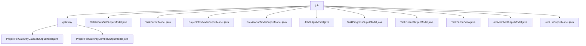

# 基础信息

|      |      |
|------|------|
| 名称 | job |
| 编码语言 | .java |
| 代码路径 | WeFe/board/board-service/src/main/java/com/welab/wefe/board/service/dto/entity/job |
| 包名 | docs.board.board-service.src.main.java.com.welab.wefe.board.service.dto.entity.job |
| 概述说明 | 该模块管理联邦学习网关项目的数据集和成员信息，包含结构化数据定义和状态追踪。关键数据结构包括数据集元信息、成员角色和审核状态枚举。支持成员角色审核和数据集特征校验等业务场景，通过数据实体类实现联合状态管理。 |

# 说明

## 概述  
该模块核心职责是统一管理联邦学习项目中的任务流、数据集和成员协作信息，类似工作流引擎模式。接口规范采用标准Getter/Setter方法配合注解校验，例如通过@Check约束成员角色枚举（Promoter/Provider/Arbiter）和数据集特征列。关键数据结构包括任务DAG图（如JobOutputModel）、节点参数JSON（如ProjectFlowNodeOutputModel）和进度追踪模型（如TaskProgressOuputModel）。外部依赖仅为Java基础库和ModelMapper。例如TaskOutputView通过ModelMapper实现MySql模型到输出模型的转换。

## 主要业务场景  
模块支撑联邦学习全生命周期管理，核心流程包括：1）任务流编排（如ProjectFlowNodeOutputModel定义父子节点关系）；2）执行状态联动（如TaskProgressOuputModel同步子任务进度）；3）结果聚合（如TaskOutputView组合任务与结果集）。功能完整性体现在多模型协同，例如JobMemberOutputModel通过成员ID缓存动态获取名称。典型集成场景包括网关推送任务拓扑（使用JobOutputModel）和预览节点执行顺序（通过PreviewJobNodeOutputModel的position字段控制）。

### 包内部结构视图

该流程图展示了job目录下的层级结构，包含1个子目录gateway和10个文件节点。gateway子目录下又包含2个文件节点。整体结构清晰展现了DTO实体类在job模块中的组织方式，符合Java项目典型的分层规范。

# 文件列表

| 名称   | 类型  | 说明 |
|-------|------|-------------|
| [RelateDataSetOutputModel.java](RelateDataSetOutputModel.md) | file | RelateDataSetOutputModel类包含任务ID、成员信息、数据集名称、数据量、特征列、主键列、字段列表、来源数据集ID及是否含Y值等属性。 |
| [TaskOutputModel.java](TaskOutputModel.md) | file | TaskOutputModel类包含任务名称、ID、流程信息、状态、时间及错误信息等字段，用于管理任务输出数据。 |
| [ProjectFlowNodeOutputModel.java](ProjectFlowNodeOutputModel.md) | file | ProjectFlowNodeOutputModel类继承AbstractOutputModel，包含节点ID、项目ID、流程ID、父节点列表、组件类型、参数JSON及版本号等属性，提供getter/setter方法。 |
| [PreviewJobNodeOutputModel.java](PreviewJobNodeOutputModel.md) | file | PreviewJobNodeOutputModel类定义了前端画布节点的输出模型，包含节点ID、项目ID、父节点、组件类型、深度、执行序号、缓存结果标志及输入输出映射，提供各属性的getter/setter方法。 |
| [JobOutputModel.java](JobOutputModel.md) | file | JobOutputModel类定义了联邦学习任务输出模型，包含任务类型、ID、状态、时间、进度、角色、备注等属性及对应getter/setter方法。 |
| [TaskProgressOuputModel.java](TaskProgressOuputModel.md) | file | 任务进度输出模型类，包含项目ID、流程号、任务ID、角色、流程节点ID、子任务类型、预计和实际工程量、进度及百分比、耗时和预计结束时间等字段。 |
| [TaskResultOutputModel.java](TaskResultOutputModel.md) | file | TaskResultOutputModel类包含任务ID、流程ID、节点ID、任务参数、状态、时间、结果等字段，用于记录任务执行详情和结果。 |
| [TaskOutputView.java](TaskOutputView.md) | file | TaskOutputView类继承AbstractOutputModel，包含TaskOutputModel任务和TaskResultOutputModel结果列表，提供构造方法和getter/setter。 |
| [JobMemberOutputModel.java](JobMemberOutputModel.md) | file | JobMemberOutputModel类包含项目、流程、任务ID，成员角色、ID及数据集ID，提供各字段的getter/setter方法。 |
| [JobListOutputModel.java](JobListOutputModel.md) | file | JobListOutputModel类包含联邦任务类型、项目ID、流程ID、任务ID、名称、身份、状态、时间、进度、消息、结果、标记和备注等字段及其getter/setter方法。 |
| [gateway](gateway/_module.md) | package | 该模型类用于网关数据集输出，包含成员信息、数据集详情及状态。成员模型含ID、名称、角色枚举和审核结果。均提供校验注解和getter/setter方法。 |

