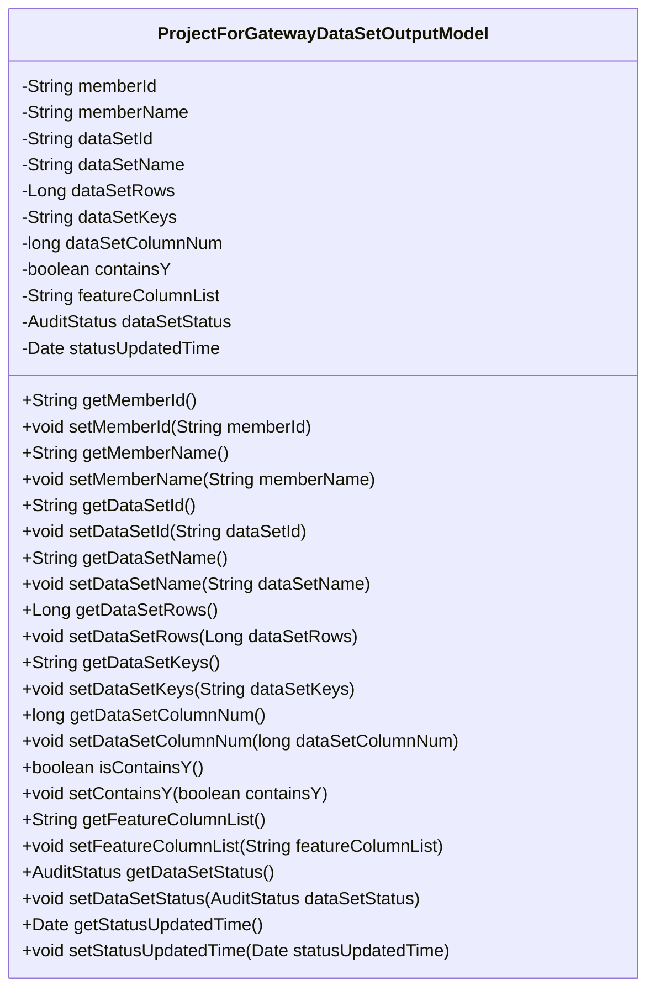
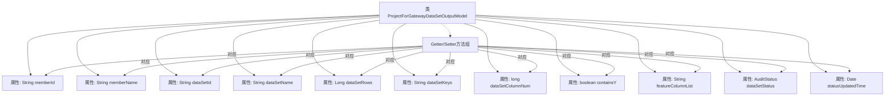

# 基础信息

|      |      |
|------|------|
| 名称 | ProjectForGatewayDataSetOutputModel |
| 编码语言 | .java |
| 代码路径 | WeFe/board/board-service/src/main/java/com/welab/wefe/board/service/dto/entity/job/gateway/ProjectForGatewayDataSetOutputModel.java |
| 包名 | com.welab.wefe.board.service.dto.entity.job.gateway |
| 依赖项 | ['com.welab.wefe.common.fieldvalidate.annotation.Check', 'com.welab.wefe.common.wefe.enums.AuditStatus', 'javax.persistence.EnumType', 'javax.persistence.Enumerated', 'java.util.Date'] |
| 概述说明 | 项目网关数据集输出模型类，包含成员ID、名称，数据集ID、名称、行数、列数、关键字、特征列、是否含Y值及状态信息。 |

# 说明

该模型是一个用于网关数据集输出的项目类，包含成员信息（ID和名称）、数据集信息（ID、名称、数据量、关键字、列数、是否包含Y值、特征列列表）、数据集状态（枚举类型）及状态更新时间。所有字段均通过注解进行校验，并提供对应的getter和setter方法。

# 类列表 Class Summary

| 名称   | 类型  | 说明 |
|-------|------|-------------|
| ProjectForGatewayDataSetOutputModel | class | 项目网关数据集输出模型类，包含成员ID、名称，数据集ID、名称、行数、列数、关键字、特征列、是否含Y值、状态及更新时间等属性及对应getter/setter方法。 |

## 类 ProjectForGatewayDataSetOutputModel

|      |      |
|------|------|
| 访问范围 | public |
| 类型 | class |
| 名称 | ProjectForGatewayDataSetOutputModel |
| 说明 | 项目网关数据集输出模型类，包含成员ID、名称，数据集ID、名称、行数、列数、关键字、特征列、是否含Y值、状态及更新时间等属性及对应getter/setter方法。 |

### UML类图

这段代码定义了一个名为ProjectForGatewayDataSetOutputModel的类，主要用于表示网关数据集输出的模型。该类包含多个私有字段，如成员ID、成员名称、数据集ID、数据集名称、数据量、关键字等，每个字段都配有相应的getter和setter方法。通过注解@Check和@Enumerated对字段进行校验和枚举类型处理，确保数据的有效性和一致性。该类的主要功能是封装数据集的相关信息，并提供对这些信息的访问和修改方法。

### 内部方法调用关系图

该流程图展示了ProjectForGatewayDataSetOutputModel类的完整结构，包含12个带注解的属性和对应的Getter/Setter方法组。所有属性均通过@Check或@Enumerated注解进行校验或枚举类型标记，特别是dataSetStatus属性使用枚举类型AuditStatus。方法组采用聚合方式表示，通过虚线连接类主体，清晰展现了Java Bean的标准设计模式。

### 字段列表 Field List

| 名称  | 类型  | 说明 |
|-------|-------|------|
| dataSetId | String | 字段dataSetId用于存储数据集ID，带有名称检查注解。 |
| statusUpdatedTime | Date | 状态更新时间字段，类型为Date。 |
| dataSetRows | Long | 定义名为"数据量"的检查项，对应私有长整型变量dataSetRows。 |
| dataSetName | String | 定义私有字符串变量dataSetName，使用@Check注解校验数据集名称。 |
| memberId | String | 成员ID字段，使用@Check注解进行校验。 |
| dataSetKeys | String | 定义私有字符串变量dataSetKeys，使用@Check注解标记为"关键字"。 |
| featureColumnList | String | 代码定义了一个私有字符串变量featureColumnList，并标注了@Check注解，参数name为"特征列"。 |
| containsY | boolean | 类成员变量containsY，使用@Check注解标记为检查是否包含Y值，类型为布尔型。 |
| dataSetStatus | AuditStatus | 实体类字段dataSetStatus使用字符串枚举类型AuditStatus进行映射。 |
| dataSetColumnNum | long | 检查数据集列数的私有长整型变量。 |
| memberName | String | 成员id校验的成员名称字段。 |

### 方法列表

| 名称  | 类型  | 说明 |
|-------|-------|------|
| setDataSetColumnNum | void | 设置数据集列数的方法，将输入参数赋值给类的成员变量dataSetColumnNum。 |
| setDataSetId | void | 设置数据集ID的方法，将输入参数赋值给类的dataSetId成员变量。 |
| setMemberId | void | 设置成员ID的方法，将输入参数赋值给类的成员变量memberId。 |
| setDataSetKeys | void | 方法setDataSetKeys用于设置dataSetKeys属性的值，参数为字符串类型。 |
| setDataSetRows | void | 这是一个Java方法，用于设置数据集行数属性。方法名为setDataSetRows，接受一个Long类型参数dataSetRows，并将其赋值给类的同名成员变量。 |
| getDataSetColumnNum | long | 获取数据集列数的方法，返回长整型数值dataSetColumnNum。 |
| getDataSetId | String | 获取数据集ID的方法，返回dataSetId字段值。 |
| setMemberName | void | 设置成员名称的方法，将输入参数赋值给类的成员变量。 |
| getMemberName | String | 获取成员名称的方法，返回成员变量memberName的值。 |
| getDataSetKeys | String | 获取数据集键值的方法。 |
| getDataSetRows | Long | 获取数据集行数的方法，返回值为长整型。 |
| getMemberId | String | 方法返回成员ID字符串。 |
| setDataSetName | void | 设置数据集名称的方法，将输入参数赋值给类的成员变量dataSetName。 |
| isContainsY | boolean | 方法isContainsY返回布尔值containsY的状态。 |
| setContainsY | void | 这是一个Java方法，用于设置布尔类型成员变量containsY的值。 |
| getDataSetName | String | 获取数据集名称的方法，返回变量dataSetName的值。 |
| getFeatureColumnList | String | 获取特征列列表的方法，返回字符串类型的featureColumnList。 |
| setFeatureColumnList | void | 设置特征列列表的方法，将输入字符串赋值给类的成员变量featureColumnList。 |
| getDataSetStatus | AuditStatus | 获取数据集状态的公共方法，返回AuditStatus类型的dataSetStatus值。 |
| setDataSetStatus | void | 该方法用于设置数据集状态，参数为AuditStatus类型，赋值给类的dataSetStatus属性。 |
| getStatusUpdatedTime | Date | 获取状态更新时间的方法，返回statusUpdatedTime变量值。 |
| setStatusUpdatedTime | void | 设置状态更新时间的方法，将参数赋值给对象的statusUpdatedTime属性。 |

