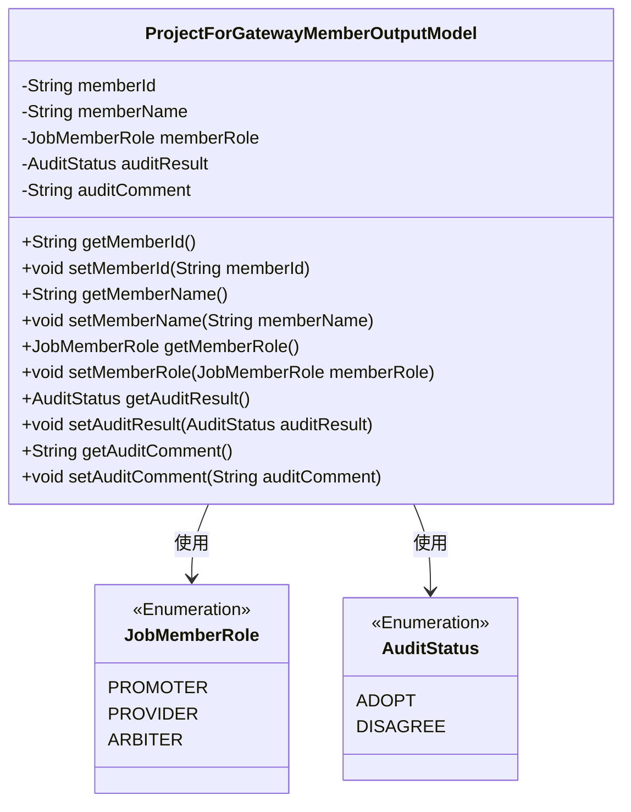

# 基础信息

|      |      |
|------|------|
| 名称 | ProjectForGatewayMemberOutputModel |
| 编码语言 | .java |
| 代码路径 | WeFe/board/board-service/src/main/java/com/welab/wefe/board/service/dto/entity/job/gateway/ProjectForGatewayMemberOutputModel.java |
| 包名 | com.welab.wefe.board.service.dto.entity.job.gateway |
| 依赖项 | ['com.welab.wefe.common.fieldvalidate.annotation.Check', 'com.welab.wefe.common.wefe.enums.AuditStatus', 'com.welab.wefe.common.wefe.enums.JobMemberRole', 'javax.persistence.EnumType', 'javax.persistence.Enumerated'] |
| 概述说明 | 项目成员网关输出模型，包含成员ID、名称、角色（发起者/提供者/仲裁者）、审核结果（通过/拒绝）及审核意见。 |

# 说明

ProjectForGatewayMemberOutputModel类定义了网关成员项目输出模型，包含成员ID和名称字段，使用注解进行校验。成员角色枚举包括promoter/provider/arbiter三种类型。审核结果枚举值为adopt/disagree，同时包含审核意见字段。类中为每个字段提供了标准的getter和setter方法。

# 类列表 Class Summary

| 名称   | 类型  | 说明 |
|-------|------|-------------|
| ProjectForGatewayMemberOutputModel | class | 网关成员项目输出模型，包含成员ID、名称、角色（发起者/提供者/仲裁者）、审核结果（通过/拒绝）及审核意见。 |

## 类 ProjectForGatewayMemberOutputModel

|      |      |
|------|------|
| 访问范围 | public |
| 类型 | class |
| 名称 | ProjectForGatewayMemberOutputModel |
| 说明 | 网关成员项目输出模型，包含成员ID、名称、角色（发起者/提供者/仲裁者）、审核结果（通过/拒绝）及审核意见。 |

### UML类图

该代码定义了一个网关成员输出模型类，包含成员ID、名称、角色（枚举类型）、审核结果（枚举类型）和审核意见等字段，并提供了相应的getter和setter方法。类中使用了两个枚举类型JobMemberRole和AuditStatus分别表示成员角色和审核状态。整体结构清晰，通过注解对字段进行校验和枚举类型映射。

### 内部方法调用关系图

```mermaid
graph TD
    A["类ProjectForGatewayMemberOutputModel"]
    B["属性: @Check String memberId"]
    C["属性: @Check String memberName"]
    D["属性: @Enumerated JobMemberRole memberRole"]
    E["属性: @Enumerated AuditStatus auditResult"]
    F["属性: @Check String auditComment"]
    G["方法: getMemberId()"]
    H["方法: setMemberId(String)"]
    I["方法: getMemberName()"]
    J["方法: setMemberName(String)"]
    K["方法: getMemberRole()"]
    L["方法: setMemberRole(JobMemberRole)"]
    M["方法: getAuditResult()"]
    N["方法: setAuditResult(AuditStatus)"]
    O["方法: getAuditComment()"]
    P["方法: setAuditComment(String)"]

    A --> B
    A --> C
    A --> D
    A --> E
    A --> F
    A --> G
    A --> H
    A --> I
    A --> J
    A --> K
    A --> L
    A --> M
    A --> N
    A --> O
    A --> P
```

该流程图展示了ProjectForGatewayMemberOutputModel类的完整结构，包含5个带注解的私有属性和对应的getter/setter方法。属性包括成员ID、名称、角色枚举、审核状态枚举和审核意见，其中memberRole和auditResult使用@Enumerated标注实现枚举类型映射，其他字段通过@Check进行校验。每个属性都配有标准的访问方法，形成典型的Java Bean模式，适用于网关成员项目信息的标准化输出。

### 字段列表 Field List

| 名称  | 类型  | 说明 |
|-------|-------|------|
| auditResult | AuditStatus | 枚举类型字段auditResult，使用字符串形式存储审计状态。 |
| auditComment | String | 定义私有字符串变量auditComment，用于存储审核意见，通过@Check注解标记。 |
| memberName | String | Java注解@Check标记成员变量memberName，用于校验成员名称。 |
| memberRole | JobMemberRole | 定义枚举类型字段memberRole，使用字符串形式存储枚举值。 |
| memberId | String | 成员ID字段，使用@Check注解进行校验。 |

### 方法列表

| 名称  | 类型  | 说明 |
|-------|-------|------|
| getMemberId | String | 获取成员ID的方法，返回字符串类型的memberId。 |
| setMemberId | void | 设置成员ID的方法，将参数memberId赋值给类的成员变量memberId。 |
| getMemberRole | JobMemberRole | 获取成员角色方法，返回成员角色对象。 |
| setMemberName | void | 设置成员变量memberName的方法，参数为字符串memberName。 |
| getAuditResult | AuditStatus | 获取审核结果的方法，返回auditResult状态。 |
| setAuditResult | void | 方法setAuditResult用于设置auditResult属性，参数类型为AuditStatus。 |
| setMemberRole | void | 设置成员角色方法，参数为JobMemberRole类型，赋值给成员变量memberRole。 |
| getMemberName | String | 获取成员名称的方法，返回成员变量memberName的值。 |
| getAuditComment | String | 获取审计评语的方法，返回auditComment字符串。 |
| setAuditComment | void | 设置审核评语的方法，将输入参数赋值给类的auditComment成员变量。 |

