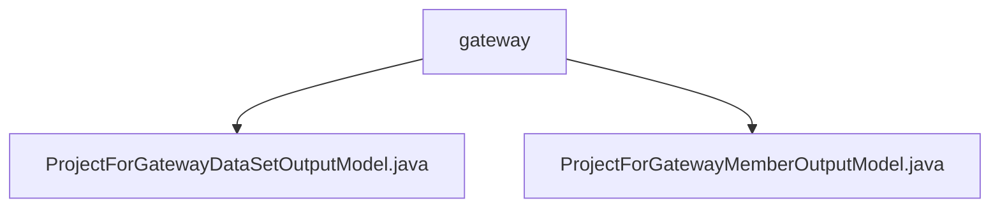

# 基础信息

|      |      |
|------|------|
| 名称 | gateway |
| 编码语言 | .java |
| 代码路径 | WeFe/board/board-service/src/main/java/com/welab/wefe/board/service/dto/entity/job/gateway |
| 包名 | docs.board.board-service.src.main.java.com.welab.wefe.board.service.dto.entity.job.gateway |
| 概述说明 | 该模型类用于网关数据集输出，包含成员信息、数据集详情及状态。成员模型含ID、名称、角色枚举和审核结果。均提供校验注解和getter/setter方法。 |

# 说明

## 概述  
该模块核心职责是管理联邦学习网关项目的数据集和成员信息输出，包含结构化数据定义和状态追踪。接口规范统一采用注解校验字段，提供标准Getter/Setter方法，例如数据集模型校验数据量范围，成员模型校验角色枚举。关键数据结构包括数据集元信息（如特征列列表）、成员角色枚举（Promoter/Provider/Arbiter）和审核状态枚举（Adopt/Disagree）。外部依赖仅为Java基础注解库。例如通过ProjectForGatewayDataSetOutputModel记录数据集是否包含Y值。

## 主要业务场景  
模块支撑联邦学习项目网关交互，类似注册中心模式管理多方协作信息。典型流程包括：成员角色审核（如Provider提交数据集后触发状态变更）、数据集特征校验（如检查列数匹配）。功能完整性体现在联合状态管理，例如成员审核意见与数据集状态联动更新。API类型均为数据实体类，集成案例包括网关推送项目数据集元信息时实例化ProjectForGatewayDataSetOutputModel。

### 包内部结构视图

该流程图展示了在gateway目录下的两个Java文件结构关系。路径起点是gateway文件夹，它包含两个输出模型类文件：ProjectForGatewayDataSetOutputModel和ProjectForGatewayMemberOutputModel，这两个文件都直接隶属于gateway目录层级，没有更深层的嵌套结构。

# 文件列表

| 名称   | 类型  | 说明 |
|-------|------|-------------|
| [ProjectForGatewayDataSetOutputModel.java](ProjectForGatewayDataSetOutputModel.md) | file | 项目网关数据集输出模型类，包含成员ID、名称，数据集ID、名称、行数、列数、关键字、特征列、是否含Y值及状态信息。 |
| [ProjectForGatewayMemberOutputModel.java](ProjectForGatewayMemberOutputModel.md) | file | 项目成员网关输出模型，包含成员ID、名称、角色（发起者/提供者/仲裁者）、审核结果（通过/拒绝）及审核意见。 |

