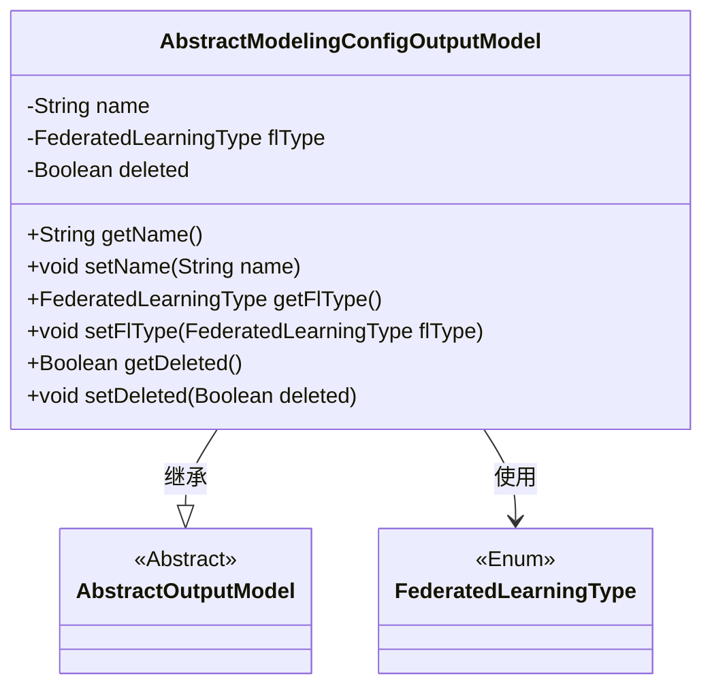
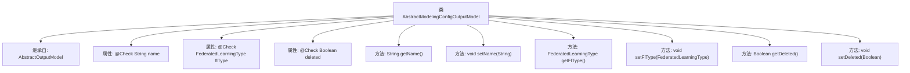

# 基础信息

|      |      |
|------|------|
| 名称 | AbstractModelingConfigOutputModel |
| 编码语言 | .java |
| 代码路径 | WeFe/board/board-service/src/main/java/com/welab/wefe/board/service/dto/entity/modeling_config/AbstractModelingConfigOutputModel.java |
| 包名 | com.welab.wefe.board.service.dto.entity.modeling_config |
| 依赖项 | ['com.welab.wefe.board.service.dto.entity.AbstractOutputModel', 'com.welab.wefe.common.fieldvalidate.annotation.Check', 'com.welab.wefe.common.wefe.enums.FederatedLearningType'] |
| 概述说明 | 抽象建模配置输出模型类，包含名称、联邦学习类型和删除状态字段及对应getter/setter方法。 |

# 说明

AbstractModelingConfigOutputModel继承自AbstractOutputModel，包含三个主要字段：name（配置名称）、flType（联邦学习模式）、deleted（是否已删除，默认false）。每个字段都有对应的getter和setter方法，用于访问和修改字段值。name和flType字段有检查注解标注其用途。

# 类列表 Class Summary

| 名称   | 类型  | 说明 |
|-------|------|-------------|
| AbstractModelingConfigOutputModel | class | AbstractModelingConfigOutputModel类继承AbstractOutputModel，包含配置名称、联邦学习模式和是否删除三个属性，均有getter/setter方法。 |

## 类 AbstractModelingConfigOutputModel

|      |      |
|------|------|
| 访问范围 | public |
| 类型 | class |
| 名称 | AbstractModelingConfigOutputModel |
| 说明 | AbstractModelingConfigOutputModel类继承AbstractOutputModel，包含配置名称、联邦学习模式和是否删除三个属性，均有getter/setter方法。 |

### UML类图

这段类图展示了AbstractModelingConfigOutputModel继承自抽象类AbstractOutputModel，并包含三个私有字段(name、flType、deleted)及其对应的getter/setter方法。其中flType字段使用了枚举类型FederatedLearningType。该类通过继承获得了AbstractOutputModel的特性，同时通过组合方式使用了FederatedLearningType枚举类，整体结构清晰地表现了类之间的继承和依赖关系。

### 内部方法调用关系图

这段代码展示了一个名为AbstractModelingConfigOutputModel的类，它继承自AbstractOutputModel。该类包含三个带有@Check注解的属性：name（配置名称）、flType（联邦学习模式）和deleted（是否已删除）。每个属性都有对应的getter和setter方法，用于获取和设置属性值。流程图清晰地展示了类的继承关系、属性定义以及方法结构，突出了注解标注的字段和标准的JavaBean方法模式。

### 字段列表 Field List

| 名称  | 类型  | 说明 |
|-------|-------|------|
| flType | FederatedLearningType | 定义联邦学习模式变量flType，使用@Check注解校验。 |
| deleted = false | Boolean | 检查删除状态的布尔字段，默认值false。 |
| name | String | 代码定义了一个私有字符串变量name，使用@Check注解标记配置名称。 |

### 方法列表

| 名称  | 类型  | 说明 |
|-------|-------|------|
| setFlType | void | 设置联邦学习类型的方法，参数为FederatedLearningType类型，赋值给成员变量flType。 |
| getFlType | FederatedLearningType | 这是一个Java方法，返回名为flType的FederatedLearningType类型对象。 |
| getName | String | 方法返回字符串类型的name变量值。 |
| setName | void | 设置对象名称的方法，将参数name赋值给对象的name属性。 |
| getDeleted | Boolean | 获取deleted布尔值的公共方法。 |
| setDeleted | void | 设置对象删除状态的布尔值方法。 |

