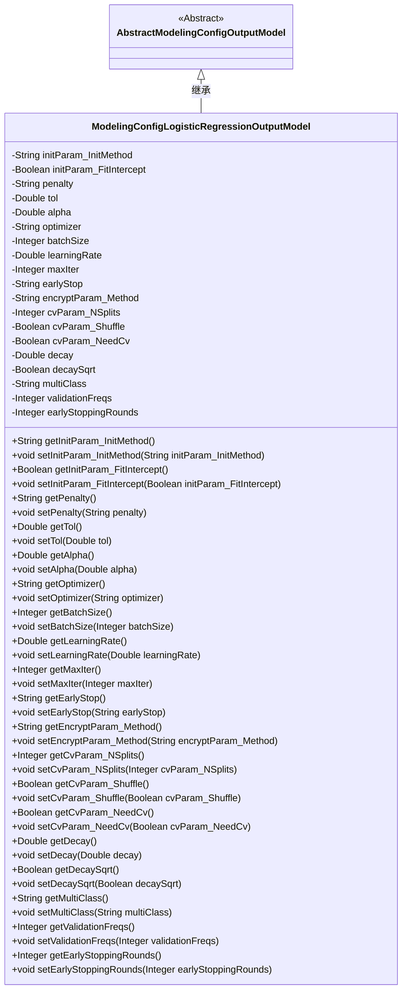

# 基础信息

|      |      |
|------|------|
| 名称 | ModelingConfigLogisticRegressionOutputModel |
| 编码语言 | .java |
| 代码路径 | WeFe/board/board-service/src/main/java/com/welab/wefe/board/service/dto/entity/modeling_config/ModelingConfigLogisticRegressionOutputModel.java |
| 包名 | com.welab.wefe.board.service.dto.entity.modeling_config |
| 依赖项 | ['com.welab.wefe.common.fieldvalidate.annotation.Check'] |
| 概述说明 | 逻辑回归模型配置类，包含初始化方法、偏置系数、惩罚方式、收敛容忍度、优化算法、批量大小、学习率、最大迭代次数、提前停止、交叉验证、多分类策略等参数。 |

# 说明

该Java类定义了逻辑回归模型的配置参数，包含模型初始化方式、偏置系数、惩罚方式、收敛容忍度、惩罚项系数、优化算法、批量大小、学习率、最大迭代次数、收敛判断方法、同态加密方法、KFold分割参数、学习率衰减设置、多分类策略、验证频次和提前停止轮次等属性。每个属性都有对应的getter和setter方法，用于参数值的获取和设置。

# 类列表 Class Summary

| 名称   | 类型  | 说明 |
|-------|------|-------------|
| ModelingConfigLogisticRegressionOutputModel | class | 逻辑回归模型配置类，包含初始化方式、偏置系数、惩罚项、优化算法、学习率、加密方法、交叉验证等参数。 |

## 类 ModelingConfigLogisticRegressionOutputModel

|      |      |
|------|------|
| 访问范围 | public |
| 类型 | class |
| 名称 | ModelingConfigLogisticRegressionOutputModel |
| 说明 | 逻辑回归模型配置类，包含初始化方式、偏置系数、惩罚项、优化算法、学习率、加密方法、交叉验证等参数。 |

### UML类图

类图描述：该图展示了一个逻辑回归模型配置类`ModelingConfigLogisticRegressionOutputModel`继承自抽象基类`AbstractModelingConfigOutputModel`的结构。子类包含20个私有配置参数（如初始化方法、惩罚系数、学习率等）及其对应的getter/setter方法，所有字段均通过`@Check`注解进行校验。类图清晰地体现了配置参数的分类（如initParam、cvParam等命名分组）和完整的封装性，适用于机器学习模型的参数管理场景。

### 内部方法调用关系图

```mermaid
graph TD
    A["类ModelingConfigLogisticRegressionOutputModel"]
    B["继承自: AbstractModelingConfigOutputModel"]
    C["属性: String initParam_InitMethod"]
    D["属性: Boolean initParam_FitIntercept"]
    E["属性: String penalty"]
    F["属性: Double tol"]
    G["属性: Double alpha"]
    H["属性: String optimizer"]
    I["属性: Integer batchSize"]
    J["属性: Double learningRate"]
    K["属性: Integer maxIter"]
    L["属性: String earlyStop"]
    M["属性: String encryptParam_Method"]
    N["属性: Integer cvParam_NSplits"]
    O["属性: Boolean cvParam_Shuffle"]
    P["属性: Boolean cvParam_NeedCv"]
    Q["属性: Double decay"]
    R["属性: Boolean decaySqrt"]
    S["属性: String multiClass"]
    T["属性: Integer validationFreqs"]
    U["属性: Integer earlyStoppingRounds"]
    V["方法: getter/setter for all attributes"]

    A --> B
    A --> C
    A --> D
    A --> E
    A --> F
    A --> G
    A --> H
    A --> I
    A --> J
    A --> K
    A --> L
    A --> M
    A --> N
    A --> O
    A --> P
    A --> Q
    A --> R
    A --> S
    A --> T
    A --> U
    A --> V
```

这段代码定义了一个逻辑回归模型的配置类，继承自抽象基类AbstractModelingConfigOutputModel。该类包含20个配置参数，涵盖了模型初始化、优化算法、交叉验证、学习率衰减等多个方面的设置。每个参数都有对应的getter和setter方法，用于获取和设置参数值。这些参数通过@Check注解进行校验，确保配置的正确性。该配置类为逻辑回归模型提供了全面的参数控制能力。

### 字段列表 Field List

| 名称  | 类型  | 说明 |
|-------|-------|------|
| cvParam_NeedCv | Boolean | 私有布尔变量cvParam_NeedCv，用于检查是否需执行此模块，带@Check注解。 |
| learningRate | Double | 类私有变量learningRate，使用@Check注解标记为"学习率"。 |
| validationFreqs | Integer | 类属性validationFreqs用于控制验证频次，通过@Check注解标记。 |
| cvParam_NSplits | Integer | KFold分割参数cvParam_NSplits，用于设置交叉验证的分割数量。 |
| decaySqrt | Boolean | 私有布尔变量decaySqrt，用于检查衰减率是否开平方。 |
| cvParam_Shuffle | Boolean | KFold前是否洗牌的布尔参数cvParam_Shuffle。 |
| earlyStop | String | 代码定义了一个私有字符串变量earlyStop，用于判断收敛性，标注为检查方法。 |
| decay | Double | 类私有变量decay，用于控制学习速率的衰减率，标注为待检查项。 |
| encryptParam_Method | String | 同态加密方法参数检查。 |
| maxIter | Integer | 定义私有整型变量maxIter，使用@Check注解标记为"最大迭代次数"。 |
| batchSize | Integer | 批量大小检查的整型变量batchSize。 |
| earlyStoppingRounds | Integer | 定义私有整型变量earlyStoppingRounds，用于记录提前结束的迭代次数，通过@Check注解进行校验。 |
| initParam_InitMethod | String | 模型初始化方式参数initParam_InitMethod，用于配置初始化方法。 |
| penalty | String | 代码定义了一个私有字符串变量penalty，用于存储惩罚方式，并通过@Check注解进行校验。 |
| optimizer | String | 代码定义了一个私有字符串变量optimizer，并标注了优化算法的检查注解。 |
| tol | Double | 收敛容忍度参数tol，类型为Double。 |
| initParam_FitIntercept | Boolean | 检查是否需要偏置系数，布尔类型变量initParam_FitIntercept。 |
| multiClass | String | 多分类策略配置项，可选枚举值ovr或ovo。 |
| alpha | Double | 惩罚项系数变量alpha |

### 方法列表

| 名称  | 类型  | 说明 |
|-------|-------|------|
| getInitParam_FitIntercept | Boolean | 获取初始化参数FitIntercept的布尔值。 |
| getOptimizer | String | 获取优化器名称的方法。 |
| setMultiClass | void | Java方法：设置multiClass属性值。 |
| getCvParam_NeedCv | Boolean | 获取是否需要CV参数的布尔值方法。 |
| setCvParam_NeedCv | void | 设置是否需要CV参数的布尔值方法。 |
| getCvParam_NSplits | Integer | 获取cvParam_NSplits整数值的方法。 |
| setOptimizer | void | 这是一个Java方法，用于设置优化器属性的值。方法名为setOptimizer，接受一个字符串参数optimizer，并将其赋值给当前对象的optimizer成员变量。 |
| getPenalty | String | 获取罚金值的方法，返回字符串类型的罚金变量。 |
| getCvParam_Shuffle | Boolean | 获取cvParam_Shuffle布尔值的公共方法。 |
| getEarlyStop | String | 获取earlyStop值的公共方法。 |
| getBatchSize | Integer | 获取批量大小的整数值。 |
| setAlpha | void | 设置alpha值的公共方法，参数为Double类型。 |
| getTol | Double | 获取tol值的公共方法，返回Double类型。 |
| getMultiClass | String | 这是一个Java方法，返回字符串类型的multiClass变量值。 |
| setLearningRate | void | 定义了一个公共方法setLearningRate，用于设置学习率参数。方法接收一个Double类型参数learningRate，并将其赋值给类的同名成员变量。 |
| setPenalty | void | 设置罚金方法，将输入字符串赋值给类成员变量penalty。 |
| getValidationFreqs | Integer | 这是一个Java方法，返回整型变量validationFreqs的值。 |
| getMaxIter | Integer | 获取最大迭代次数的方法，返回整数maxIter。 |
| getInitParam_InitMethod | String | 这是一个Java方法，返回字符串类型的initParam_InitMethod变量值。 |
| setTol | void | 设置容差值方法，将输入的双精度数值赋给类的tol成员变量。 |
| setCvParam_Shuffle | void | Java方法：设置cvParam_Shuffle布尔值参数。 |
| getLearningRate | Double | 获取学习率的方法，返回Double类型值learningRate。 |
| setInitParam_InitMethod | void | Java方法：设置初始化参数initParam_InitMethod的值。 |
| setCvParam_NSplits | void | 设置交叉验证参数的分割数。 |
| setEncryptParam_Method | void | 设置加密参数方法，将输入值赋给类成员变量encryptParam_Method。 |
| getDecay | Double | 获取衰减值方法，返回Double类型变量decay。 |
| setDecaySqrt | void | 设置衰减平方根标志的方法。 |
| setInitParam_FitIntercept | void | 这是一个Java方法，用于设置布尔类型的初始化参数initParam_FitIntercept的值。 |
| setDecay | void | 设置衰减值方法，将输入参数decay赋值给当前对象的decay属性。 |
| setEarlyStop | void | 定义了一个公共方法setEarlyStop，用于设置earlyStop属性的值。参数为字符串类型。 |
| getEncryptParam_Method | String | 获取加密参数的方法，返回字符串类型变量encryptParam_Method。 |
| setMaxIter | void | 设置最大迭代次数的公共方法，参数为整数maxIter，赋值给类变量this.maxIter。 |
| getDecaySqrt | Boolean | 这是一个Java方法，返回布尔类型的decaySqrt值。 |
| setBatchSize | void | 设置批量处理大小的方法，参数为整数类型。 |
| getAlpha | Double | 方法getAlpha返回Double类型的alpha值。 |
| setValidationFreqs | void | 设置验证频率的方法，参数为整型数值，用于更新内部变量validationFreqs。 |
| getEarlyStoppingRounds | Integer | 获取提前停止轮次数的方法，返回整数值。 |
| setEarlyStoppingRounds | void | 设置提前停止轮次参数的方法。 |

