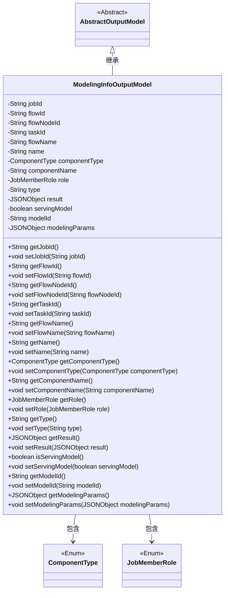

# 基础信息

|      |      |
|------|------|
| 名称 | ModelingInfoOutputModel |
| 编码语言 | .java |
| 代码路径 | WeFe/board/board-service/src/main/java/com/welab/wefe/board/service/dto/entity/modeling_config/ModelingInfoOutputModel.java |
| 包名 | com.welab.wefe.board.service.dto.entity.modeling_config |
| 依赖项 | ['com.alibaba.fastjson.JSONObject', 'com.welab.wefe.board.service.dto.entity.AbstractOutputModel', 'com.welab.wefe.common.fieldvalidate.annotation.Check', 'com.welab.wefe.common.wefe.enums.ComponentType', 'com.welab.wefe.common.wefe.enums.JobMemberRole'] |
| 概述说明 | ModelingInfoOutputModel类继承AbstractOutputModel，包含任务ID、流程ID、节点ID、任务名称、组件类型、执行结果、模型ID等字段，用于存储建模信息输出数据。 |

# 说明

该内容定义了一个名为ModelingInfoOutputModel的Java类，继承自AbstractOutputModel。该类包含多个私有字段，用于存储建模任务的相关信息，如任务ID、流程ID、流程节点ID、子任务ID、流程名称、任务名称、组件类型、组件类型中文名、成员角色、结果类型、执行结果JSON对象、是否可导出到Serving的标志、模型ID以及建模节点参数JSON对象。每个字段都有对应的getter和setter方法，用于访问和修改这些属性。

# 类列表 Class Summary

| 名称   | 类型  | 说明 |
|-------|------|-------------|
| ModelingInfoOutputModel | class | ModelingInfoOutputModel类继承AbstractOutputModel，包含任务、流程、节点、组件等ID和名称信息，以及执行结果、模型参数等属性。 |

## 类 ModelingInfoOutputModel

|      |      |
|------|------|
| 访问范围 | public |
| 类型 | class |
| 名称 | ModelingInfoOutputModel |
| 说明 | ModelingInfoOutputModel类继承AbstractOutputModel，包含任务、流程、节点、组件等ID和名称信息，以及执行结果、模型参数等属性。 |

### UML类图

这段代码定义了一个名为ModelingInfoOutputModel的类，它继承自AbstractOutputModel，用于存储建模任务的相关信息。该类包含多个私有字段，如任务ID、流程ID、组件类型、执行结果等，每个字段都有对应的getter和setter方法。ModelingInfoOutputModel依赖于ComponentType和JobMemberRole两个枚举类来表示组件类型和成员角色。这个类主要用于封装建模任务的输出数据，便于在系统中传递和处理。

### 内部方法调用关系图

这段代码定义了一个名为ModelingInfoOutputModel的类，继承自AbstractOutputModel，主要用于存储和操作建模任务的相关信息。类中包含多个带有@Check注解的属性，如任务ID、流程ID、组件类型等，以及对应的getter和setter方法。这些属性用于描述建模任务的各个维度信息，包括任务标识、流程信息、组件类型、执行结果等，并通过方法提供对这些属性的访问和修改能力。

### 字段列表 Field List

| 名称  | 类型  | 说明 |
|-------|-------|------|
| servingModel | boolean | 检查模型是否可导出至serving的布尔变量servingModel。 |
| flowName | String | 定义私有字符串变量flowName，使用@Check注解标记流程名称。 |
| name | String | 代码定义了一个私有字符串变量name，用于存储任务名称，并通过@Check注解进行校验。 |
| jobId | String | 定义私有字符串变量jobId，并标注Check校验注解，参数name为"任务Id"。 |
| componentName | String | 定义私有字符串变量componentName，使用@Check注解校验组件类型中文名。 |
| modelId | String | 模型Id字段的字符串类型私有变量，使用@Check注解进行校验。 |
| result | JSONObject | 类私有变量result，类型为JSONObject，附带@Check注解标注名称为"执行结果"。 |
| taskId | String | 定义私有字符串变量taskId，使用@Check注解校验子任务Id。 |
| componentType | ComponentType | 定义组件类型检查的私有变量。 |
| modelingParams | JSONObject | 代码定义了一个私有JSONObject变量modelingParams，用于存储建模节点参数，并通过@Check注解进行校验。 |
| flowId | String | 定义私有字符串变量flowId，使用@Check注解校验流程Id。 |
| flowNodeId | String | 定义流程节点ID的私有字符串变量，使用Check注解校验。 |
| role | JobMemberRole | 成员角色检查注解。 |
| type | String | 类成员变量type，用于标识task的多行result类型，通过@Check注解校验。 |

### 方法列表

| 名称  | 类型  | 说明 |
|-------|-------|------|
| getType | String | 获取对象类型的方法，返回字符串类型的type值。 |
| setName | void | 设置对象名称的方法，将参数name赋值给对象的name属性。 |
| setFlowNodeId | void | 设置流程节点ID的方法，将参数flowNodeId赋值给当前对象的同名属性。 |
| setFlowName | void | 设置流程名称的方法，将输入参数赋值给类变量flowName。 |
| setComponentName | void | 设置组件名称的方法，将输入参数赋值给类的成员变量componentName。 |
| getName | String | 获取名称的方法，返回字符串类型的name变量值。 |
| getRole | JobMemberRole | 获取当前对象的角色信息。 |
| setFlowId | void | 设置流程ID的方法，将传入的flowId赋值给当前对象的flowId属性。 |
| getFlowId | String | 获取flowId的公共方法，返回字符串类型的flowId值。 |
| getFlowName | String | 获取流程名称的方法，返回变量flowName的值。 |
| getTaskId | String | 获取任务ID的方法，返回字符串类型的taskId。 |
| getComponentName | String | 获取组件名称的方法，返回字符串类型的componentName。 |
| getFlowNodeId | String | 方法返回flowNodeId字符串值。 |
| getResult | JSONObject | 获取返回的JSON对象。 |
| setRole | void | 设置成员角色方法，将传入的role参数赋值给当前对象的role属性。 |
| getComponentType | ComponentType | 获取组件类型的方法，返回componentType字段值。 |
| setType | void | 方法setType用于设置对象的type属性，参数为字符串类型。 |
| setJobId | void | 定义了一个公共方法setJobId，用于设置jobId属性的值。 |
| setComponentType | void | 设置组件类型的方法，将参数componentType赋值给当前对象的componentType属性。 |
| getJobId | String | 获取当前任务的唯一标识符jobId。 |
| setTaskId | void | 这是一个Java方法，用于设置类的taskId属性值。方法接收一个字符串参数taskId，并将其赋值给类的成员变量this.taskId。 |
| setResult | void | 设置JSON对象结果。 |
| isServingModel | boolean | 该方法返回布尔值servingModel，表示是否正在服务模型。 |
| setServingModel | void | 设置服务模型状态的方法，参数为布尔值servingModel。 |
| getModelId | String | 方法返回modelId字符串。 |
| setModelId | void | 这是一个Java方法，用于设置modelId属性的值。方法接收一个字符串参数modelId，并将其赋值给类的成员变量this.modelId。 |
| getModelingParams | JSONObject | 获取建模参数的JSON对象。 |
| setModelingParams | void | 这是一个Java方法，用于设置modelingParams属性，参数类型为JSONObject。 |

