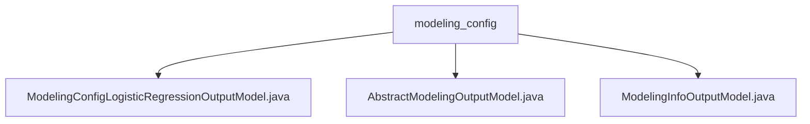

# 基础信息

|      |      |
|------|------|
| 名称 | modeling_config |
| 编码语言 | .java |
| 代码路径 | WeFe/board/board-service/src/main/java/com/welab/wefe/board/service/dto/entity/modeling_config |
| 包名 | docs.board.board-service.src.main.java.com.welab.wefe.board.service.dto.entity.modeling_config |
| 概述说明 | 逻辑回归配置类含初始化、惩罚、优化等参数，继承类含名称、模式、删除标记字段，建模信息类含任务ID、流程、组件等字段，均提供getter/setter方法。 |

# 说明

## 概述  
该模块核心职责是管理联邦学习建模任务的配置参数和任务信息，提供统一的参数配置和任务数据访问接口。接口规范包含三类模型：逻辑回归配置（如学习率/惩罚系数）、基础配置（如联邦模式/配置名称）、任务信息（如流程ID/组件类型）。关键数据结构包括逻辑回归参数组、任务元数据JSON对象和基础配置字段。外部依赖仅为Java基础库。例如逻辑回归模型支持同态加密和KFold验证设置。

## 主要业务场景  
模块支持联邦学习全流程管理，类似配置中心模式。业务流程涵盖模型初始化（如设置优化算法）、任务跟踪（通过流程节点ID关联）、结果导出（标记Serving可用性）。典型应用包括多分类任务参数配置、建模节点执行状态查询。API类型覆盖参数存取（getter/setter）和复杂对象操作（如JSON序列化）。例如通过ModelingInfoOutputModel可获取组件类型中文名等扩展属性。

### 包内部结构视图

该流程图展示了modeling_config目录下的三个Java类文件关系。顶层节点为modeling_config文件夹，包含三个输出模型类文件：逻辑回归配置输出模型、抽象模型输出配置和建模信息输出模型。所有文件均位于同一层级，没有嵌套子目录结构。

# 文件列表

| 名称   | 类型  | 说明 |
|-------|------|-------------|
| [ModelingConfigLogisticRegressionOutputModel.java](ModelingConfigLogisticRegressionOutputModel.md) | file | 逻辑回归模型配置类，包含初始化方法、偏置系数、惩罚方式、收敛容忍度、优化算法、批量大小、学习率、最大迭代次数、提前停止、交叉验证、多分类策略等参数。 |
| [AbstractModelingConfigOutputModel.java](AbstractModelingConfigOutputModel.md) | file | 抽象建模配置输出模型类，包含名称、联邦学习类型和删除状态字段及对应getter/setter方法。 |
| [ModelingInfoOutputModel.java](ModelingInfoOutputModel.md) | file | ModelingInfoOutputModel类继承AbstractOutputModel，包含任务ID、流程ID、节点ID、任务名称、组件类型、执行结果、模型ID等字段，用于存储建模信息输出数据。 |

