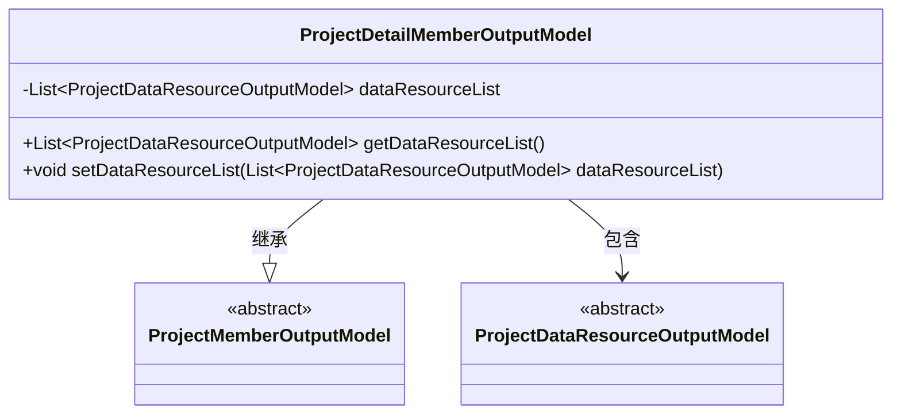
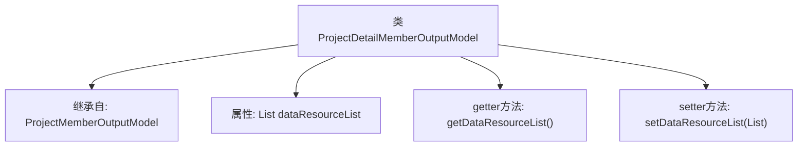

# 基础信息

|      |      |
|------|------|
| 名称 | ProjectDetailMemberOutputModel |
| 编码语言 | .java |
| 代码路径 | WeFe/board/board-service/src/main/java/com/welab/wefe/board/service/dto/entity/project/ProjectDetailMemberOutputModel.java |
| 包名 | com.welab.wefe.board.service.dto.entity.project |
| 依赖项 | ['com.welab.wefe.board.service.dto.entity.project.data_set.ProjectDataResourceOutputModel', 'java.util.List'] |
| 概述说明 | ProjectDetailMemberOutputModel继承ProjectMemberOutputModel，包含数据资源列表的getter和setter方法。 |

# 说明

该内容定义了一个名为ProjectDetailMemberOutputModel的Java类，继承自ProjectMemberOutputModel。该类包含一个私有成员变量dataResourceList，类型为ProjectDataResourceOutputModel的列表。提供了对应的getter和setter方法用于访问和修改该列表。该类主要用于扩展项目成员输出模型，增加数据资源列表的功能。

# 类列表 Class Summary

| 名称   | 类型  | 说明 |
|-------|------|-------------|
| ProjectDetailMemberOutputModel | class | ProjectDetailMemberOutputModel继承ProjectMemberOutputModel，包含数据资源列表及其getter/setter方法。 |

## 类 ProjectDetailMemberOutputModel

|      |      |
|------|------|
| 访问范围 | public |
| 类型 | class |
| 名称 | ProjectDetailMemberOutputModel |
| 说明 | ProjectDetailMemberOutputModel继承ProjectMemberOutputModel，包含数据资源列表及其getter/setter方法。 |

### UML类图

这段类图展示了ProjectDetailMemberOutputModel继承自ProjectMemberOutputModel，并包含一个ProjectDataResourceOutputModel类型的列表。ProjectDetailMemberOutputModel通过getter和setter方法管理数据资源列表，体现了面向对象设计中"组合优于继承"的原则。两个父类均为抽象类，说明这是为具体实现提供的基类结构。整体结构清晰地表现了类之间的层次关系和组合关系。

### 内部方法调用关系图

这段代码展示了一个继承自ProjectMemberOutputModel的ProjectDetailMemberOutputModel类，主要新增了一个ProjectDataResourceOutputModel类型的列表属性dataResourceList，并提供了对应的getter和setter方法。流程图清晰地呈现了类的继承关系、属性定义以及方法结构，体现了该模型类用于扩展项目成员信息并管理关联数据资源列表的设计意图。

### 字段列表 Field List

| 名称  | 类型  | 说明 |
|-------|-------|------|
| dataResourceList | List<ProjectDataResourceOutputModel> | 私有项目数据资源输出模型列表。 |

### 方法列表

| 名称  | 类型  | 说明 |
|-------|-------|------|
| getDataResourceList | List<ProjectDataResourceOutputModel> | 方法返回数据资源列表。 |
| setDataResourceList | void | 这是一个Java方法，用于设置数据资源列表。方法接收一个ProjectDataResourceOutputModel类型的列表参数，并将其赋值给类的成员变量dataResourceList。 |

