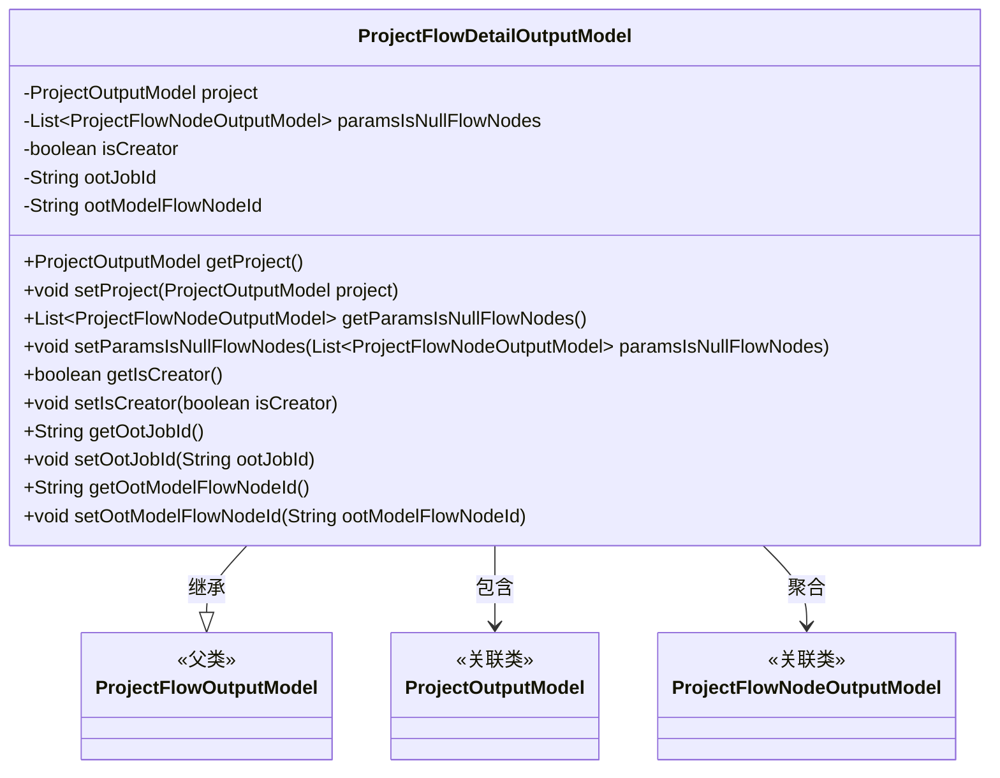

# 基础信息

|      |      |
|------|------|
| 名称 | ProjectFlowDetailOutputModel |
| 编码语言 | .java |
| 代码路径 | WeFe/board/board-service/src/main/java/com/welab/wefe/board/service/dto/entity/project/ProjectFlowDetailOutputModel.java |
| 包名 | com.welab.wefe.board.service.dto.entity.project |
| 依赖项 | ['com.welab.wefe.board.service.dto.entity.job.ProjectFlowNodeOutputModel', 'com.welab.wefe.common.fieldvalidate.annotation.Check', 'java.util.List'] |
| 概述说明 | ProjectFlowDetailOutputModel扩展ProjectFlowOutputModel，包含项目信息、空参数节点列表、创建者标识及OOT任务和模型节点ID。提供各字段的getter和setter方法。 |

# 说明

ProjectFlowDetailOutputModel类继承自ProjectFlowOutputModel，包含项目信息、参数为空的流程节点列表、创建者标识及OOT相关字段。具体属性包括project（项目模型）、paramsIsNullFlowNodes（空参数节点列表）、isCreator（是否创建者）、ootJobId（OOT任务ID）和ootModelFlowNodeId（OOT模型节点ID）。提供了各属性的getter和setter方法。

# 类列表 Class Summary

| 名称   | 类型  | 说明 |
|-------|------|-------------|
| ProjectFlowDetailOutputModel | class | ProjectFlowDetailOutputModel类继承ProjectFlowOutputModel，包含项目信息、空参数节点列表、创建者标识及OOT任务和模型节点ID。提供各字段的getter和setter方法。 |

## 类 ProjectFlowDetailOutputModel

|      |      |
|------|------|
| 访问范围 | public |
| 类型 | class |
| 名称 | ProjectFlowDetailOutputModel |
| 说明 | ProjectFlowDetailOutputModel类继承ProjectFlowOutputModel，包含项目信息、空参数节点列表、创建者标识及OOT任务和模型节点ID。提供各字段的getter和setter方法。 |

### UML类图

类图描述：ProjectFlowDetailOutputModel继承自ProjectFlowOutputModel，包含ProjectOutputModel对象和ProjectFlowNodeOutputModel列表，用于管理项目流程的详细信息。该类通过私有字段存储项目信息、空参数节点列表、创建者标识及OOT相关ID，并提供对应的getter/setter方法。与关联类的依赖关系通过聚合和组合方式体现。

### 内部方法调用关系图

```mermaid
graph TD
    A["类ProjectFlowDetailOutputModel"]
    B["继承自: ProjectFlowOutputModel"]
    C["属性: ProjectOutputModel project"]
    D["属性: List<ProjectFlowNodeOutputModel> paramsIsNullFlowNodes"]
    E["属性: boolean isCreator"]
    F["属性: @Check String ootJobId"]
    G["属性: @Check String ootModelFlowNodeId"]
    H["方法: getProject()"]
    I["方法: setProject(ProjectOutputModel)"]
    J["方法: getParamsIsNullFlowNodes()"]
    K["方法: setParamsIsNullFlowNodes(List<ProjectFlowNodeOutputModel>)"]
    L["方法: getIsCreator()"]
    M["方法: setIsCreator(boolean)"]
    N["方法: getOotJobId()"]
    O["方法: setOotJobId(String)"]
    P["方法: getOotModelFlowNodeId()"]
    Q["方法: setOotModelFlowNodeId(String)"]

    A --> B
    A --> C
    A --> D
    A --> E
    A --> F
    A --> G
    A --> H
    A --> I
    A --> J
    A --> K
    A --> L
    A --> M
    A --> N
    A --> O
    A --> P
    A --> Q
```

该流程图展示了ProjectFlowDetailOutputModel类的完整结构，包括其继承关系、属性声明和方法定义。该类继承自ProjectFlowOutputModel，包含5个核心属性（其中两个带有@Check注解），并为每个属性提供了标准的getter/setter方法。属性涉及项目模型、流程节点列表、创建者标识以及两个OOT相关ID字段，体现了对项目流程详细数据的封装能力。所有方法均以属性操作为核心，保持单一职责原则。

### 字段列表 Field List

| 名称  | 类型  | 说明 |
|-------|-------|------|
| paramsIsNullFlowNodes | List<ProjectFlowNodeOutputModel> | 私有变量paramsIsNullFlowNodes，类型为ProjectFlowNodeOutputModel的列表。 |
| project | ProjectOutputModel | 私有项目输出模型实例。 |
| ootModelFlowNodeId | String | 被检查的模型ID字段，标记为"被oot的模型id"。 |
| ootJobId | String | 被oot的任务ID字段，变量名为ootJobId。 |
| isCreator | boolean | 变量isCreator表示是否为创建者，布尔类型。 |

### 方法列表

| 名称  | 类型  | 说明 |
|-------|-------|------|
| getOotModelFlowNodeId | String | 这是一个Java方法，返回字符串类型的ootModelFlowNodeId变量值。 |
| setIsCreator | void | 设置是否为创建者的布尔值方法。 |
| setOotJobId | void | Java方法：设置ootJobId属性值。 |
| setParamsIsNullFlowNodes | void | 设置参数为空的流程节点列表。 |
| setProject | void | 设置项目对象的方法，将传入的ProjectOutputModel赋值给当前对象的project属性。 |
| getOotJobId | String | 这是一个Java方法，返回字符串类型的ootJobId值。 |
| getProject | ProjectOutputModel | 获取项目输出模型的方法。 |
| setOotModelFlowNodeId | void | 设置OOT模型流程节点ID的方法，将参数赋值给类成员变量ootModelFlowNodeId。 |
| getParamsIsNullFlowNodes | List<ProjectFlowNodeOutputModel> | 获取参数为空的流程节点列表。 |
| getIsCreator | boolean | 方法getIsCreator返回布尔值isCreator，表示是否为创建者。 |

