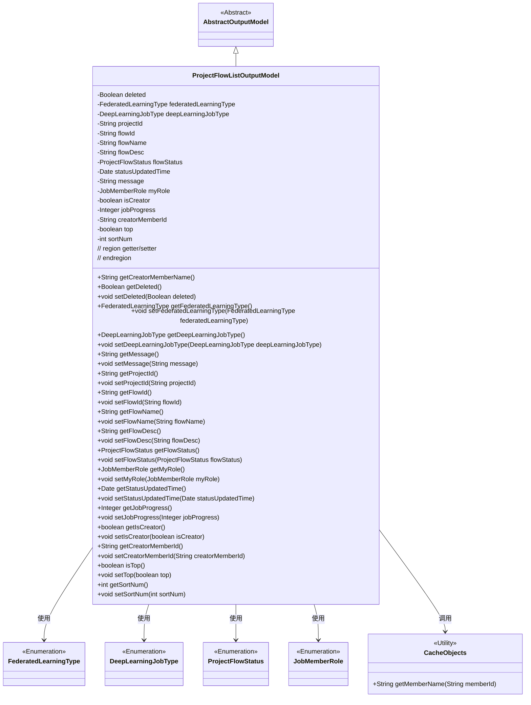

# 基础信息

|      |      |
|------|------|
| 名称 | ProjectFlowListOutputModel |
| 编码语言 | .java |
| 代码路径 | WeFe/board/board-service/src/main/java/com/welab/wefe/board/service/dto/entity/project/ProjectFlowListOutputModel.java |
| 包名 | com.welab.wefe.board.service.dto.entity.project |
| 依赖项 | ['com.welab.wefe.board.service.dto.entity.AbstractOutputModel', 'com.welab.wefe.board.service.service.CacheObjects', 'com.welab.wefe.common.fieldvalidate.annotation.Check', 'com.welab.wefe.common.wefe.enums.DeepLearningJobType', 'com.welab.wefe.common.wefe.enums.FederatedLearningType', 'com.welab.wefe.common.wefe.enums.JobMemberRole', 'com.welab.wefe.common.wefe.enums.ProjectFlowStatus', 'java.util.Date'] |
| 概述说明 | ProjectFlowListOutputModel类包含项目流程的详细信息，如ID、名称、状态、进度、创建者、角色、类型等属性及其getter/setter方法。 |

# 说明

ProjectFlowListOutputModel类是一个继承自AbstractOutputModel的输出模型，用于表示项目流程列表的相关信息。该类包含多个属性，如删除状态、联邦学习类型、深度学习任务类型、项目ID、流程ID、流程名称、流程描述、流程状态、状态更新时间、消息、我方角色、是否为创建者、任务进度、创建者成员ID、置顶状态和排序号等。每个属性都有对应的getter和setter方法，便于访问和修改。此外，还提供了一个方法getCreatorMemberName，用于获取创建者成员名称。该类主要用于封装项目流程列表的详细信息，便于在系统中进行传递和处理。

# 类列表 Class Summary

| 名称   | 类型  | 说明 |
|-------|------|-------------|
| ProjectFlowListOutputModel | class | ProjectFlowListOutputModel类包含流程ID、名称、状态、类型、进度、创建者等属性，用于管理联邦学习项目流程信息。 |

## 类 ProjectFlowListOutputModel

|      |      |
|------|------|
| 访问范围 | public |
| 类型 | class |
| 名称 | ProjectFlowListOutputModel |
| 说明 | ProjectFlowListOutputModel类包含流程ID、名称、状态、类型、进度、创建者等属性，用于管理联邦学习项目流程信息。 |

### UML类图

类图描述：ProjectFlowListOutputModel继承自AbstractOutputModel，包含多个私有字段和对应的getter/setter方法，用于表示项目流程列表的输出模型。该类使用了多个枚举类型（FederatedLearningType、DeepLearningJobType等）来定义特定字段的类型，并通过CacheObjects工具类获取成员名称。该模型主要用于封装项目流程的相关信息，包括状态、角色、进度等属性。

### 内部方法调用关系图

```mermaid
graph TD
    A["类ProjectFlowListOutputModel"]
    B["继承: AbstractOutputModel"]
    C["属性: Boolean deleted"]
    D["属性: FederatedLearningType federatedLearningType"]
    E["属性: DeepLearningJobType deepLearningJobType"]
    F["属性: String projectId"]
    G["属性: String flowId"]
    H["属性: String flowName"]
    I["属性: String flowDesc"]
    J["属性: ProjectFlowStatus flowStatus"]
    K["属性: Date statusUpdatedTime"]
    L["属性: String message"]
    M["属性: JobMemberRole myRole"]
    N["属性: boolean isCreator"]
    O["属性: Integer jobProgress"]
    P["属性: String creatorMemberId"]
    Q["属性: boolean top"]
    R["属性: int sortNum"]
    S["方法: String getCreatorMemberName()"]
    T["方法: 28个getter/setter方法"]

    A --> B
    A --> C
    A --> D
    A --> E
    A --> F
    A --> G
    A --> H
    A --> I
    A --> J
    A --> K
    A --> L
    A --> M
    A --> N
    A --> O
    A --> P
    A --> Q
    A --> R
    A --> S
    A -.-> T
```

该流程图展示了ProjectFlowListOutputModel类的完整结构，包含继承关系、15个带注解的属性字段、1个自定义方法getCreatorMemberName()以及28个自动生成的getter/setter方法。所有属性均带有@Check注解用于参数校验，涉及联邦学习类型、深度学习任务类型、流程状态等业务关键字段。类继承自AbstractOutputModel，整体结构清晰体现了联邦学习项目管理流程的数据模型设计。

### 字段列表 Field List

| 名称  | 类型  | 说明 |
|-------|-------|------|
| myRole | JobMemberRole | 定义私有变量myRole，使用@Check注解校验角色属性，限定为我方角色。 |
| top | boolean | 类成员变量top，布尔类型，用于标记是否置顶，通过@Check注解标注。 |
| flowName | String | 代码定义了一个私有字符串变量flowName，并用@Check注解标记流程名称检查。 |
| message | String | 私有字符串变量message |
| statusUpdatedTime | Date | 私有日期类型变量statusUpdatedTime，用于记录状态更新时间。 |
| flowId | String | 定义流程ID字段，使用@Check注解校验名称。 |
| sortNum | int | 类成员变量sortNum，用于排序，带@Check注解。 |
| jobProgress | Integer | 类私有整型字段jobProgress，用于标记任务进度，带@Check注解。 |
| deleted | Boolean | 字段deleted用@Check注解标记，检查是否被删除。 |
| isCreator | boolean | 字段isCreator用于检查用户是否为创建者，标注为@Check。 |
| flowStatus | ProjectFlowStatus | 检查流程状态的私有变量flowStatus，类型为ProjectFlowStatus。 |
| flowDesc | String | 类私有字段flowDesc，用于存储流程描述，带有@Check注解。 |
| deepLearningJobType | DeepLearningJobType | 深度学习任务类型字段，用于标识目标检测或图像分类等任务。 |
| federatedLearningType | FederatedLearningType | 检查联邦任务类型（横向/纵向）的私有变量federatedLearningType。 |
| creatorMemberId | String | 定义流程创建者ID的字符串类型私有变量，通过@Check注解校验。 |
| projectId | String | 定义私有字符串变量projectId，使用@Check注解校验项目ID。 |

### 方法列表

| 名称  | 类型  | 说明 |
|-------|-------|------|
| setFlowDesc | void | 设置流程描述的方法，将输入参数赋值给类变量flowDesc。 |
| getDeepLearningJobType | DeepLearningJobType | 获取当前深度学习任务类型的方法，返回值为DeepLearningJobType对象。 |
| getCreatorMemberName | String | 获取创建者成员名称的方法，通过缓存对象根据成员ID查询并返回名称。 |
| getProjectId | String | 获取项目ID的方法，返回字符串类型的projectId。 |
| setMessage | void | 这是一个Java方法，用于设置类的message属性值。方法接收一个字符串参数message，并将其赋值给类的同名成员变量。 |
| getCreatorMemberId | String | 获取创建者成员ID的方法，返回字符串类型的creatorMemberId。 |
| setProjectId | void | 定义了一个公共方法setProjectId，用于设置类的projectId属性。参数为字符串类型projectId。 |
| setJobProgress | void | 这是一个Java方法，用于设置任务进度值。方法接收一个整数参数jobProgress，并将其赋值给类的同名成员变量。 |
| getFlowId | String | 获取flowId的公共方法，返回字符串类型的flowId。 |
| getFlowStatus | ProjectFlowStatus | 获取当前项目流程状态的方法，返回flowStatus值。 |
| getDeleted | Boolean | 方法返回布尔值deleted，表示是否已删除。 |
| getJobProgress | Integer | 获取任务进度的方法，返回整型数值jobProgress。 |
| getMyRole | JobMemberRole | 获取当前用户的角色信息。 |
| setStatusUpdatedTime | void | 设置状态更新时间的方法，将传入的日期参数赋值给对象的statusUpdatedTime属性。 |
| getFlowDesc | String | 方法getFlowDesc返回字符串flowDesc的值。 |
| setCreatorMemberId | void | 设置创建者成员ID的方法，将参数值赋给类的成员变量creatorMemberId。 |
| isTop | boolean | 这是一个Java方法，返回布尔值top的状态。 |
| setTop | void | 设置对象置顶状态的公共方法，参数为布尔值top，用于更新对象的top属性。 |
| getSortNum | int | 这是一个Java方法，返回整型变量sortNum的值。 |
| setSortNum | void | 这是一个Java方法，用于设置类的sortNum属性值。方法接收一个整数参数sortNum，并将其赋值给类的同名成员变量。 |
| getIsCreator | boolean | 方法返回布尔值isCreator，表示是否为创建者。 |
| getStatusUpdatedTime | Date | 获取状态更新时间的方法，返回statusUpdatedTime变量值。 |
| setFederatedLearningType | void | 设置联邦学习类型的方法，参数为FederatedLearningType类型，赋值给成员变量federatedLearningType。 |
| setDeepLearningJobType | void | 设置深度学习任务类型的方法，参数为DeepLearningJobType类型。 |
| getFederatedLearningType | FederatedLearningType | 获取联邦学习类型的方法，返回federatedLearningType值。 |
| getFlowName | String | 获取流程名称的方法，返回字符串flowName。 |
| setFlowId | void | 设置流程ID的方法，将传入的flowId赋值给当前对象的flowId属性。 |
| setIsCreator | void | 设置是否为创建者的方法，参数为布尔值isCreator。 |
| getMessage | String | 获取message字符串的方法。 |
| setDeleted | void | 设置对象删除状态的公共方法，参数为布尔值deleted，用于更新对象的deleted属性。 |
| setFlowStatus | void | 设置项目流程状态的方法，将输入参数flowStatus赋值给当前对象的flowStatus属性。 |
| setMyRole | void | 方法setMyRole用于设置当前对象的myRole属性，参数为JobMemberRole类型。 |
| setFlowName | void | 设置流程名称的方法，将输入参数赋值给类变量flowName。 |

