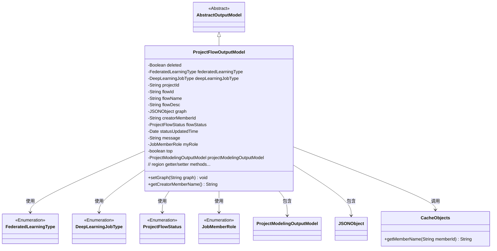

# 基础信息

|      |      |
|------|------|
| 名称 | ProjectFlowOutputModel |
| 编码语言 | .java |
| 代码路径 | WeFe/board/board-service/src/main/java/com/welab/wefe/board/service/dto/entity/project/ProjectFlowOutputModel.java |
| 包名 | com.welab.wefe.board.service.dto.entity.project |
| 依赖项 | ['com.alibaba.fastjson.JSON', 'com.alibaba.fastjson.JSONObject', 'com.welab.wefe.board.service.dto.entity.AbstractOutputModel', 'com.welab.wefe.board.service.service.CacheObjects', 'com.welab.wefe.common.fieldvalidate.annotation.Check', 'com.welab.wefe.common.wefe.enums.DeepLearningJobType', 'com.welab.wefe.common.wefe.enums.FederatedLearningType', 'com.welab.wefe.common.wefe.enums.JobMemberRole', 'com.welab.wefe.common.wefe.enums.ProjectFlowStatus', 'java.util.Date'] |
| 概述说明 | ProjectFlowOutputModel类继承AbstractOutputModel，包含流程ID、名称、状态、类型、创建者等属性，用于管理项目流程数据。 |

# 说明

ProjectFlowOutputModel类继承自AbstractOutputModel，用于表示项目流程的输出模型。该类包含多个属性，如删除状态、联邦学习类型、深度学习任务类型、项目ID、流程ID、流程名称、流程描述、画布编辑图、创建者成员ID等。每个属性都带有@Check注解，用于描述其用途。此外，类中还包含流程状态、状态更新时间、消息、我方角色、是否置顶等属性，以及一个ProjectModelingOutputModel类型的属性。类中提供了所有属性的getter和setter方法，以及一个将字符串序列化为JSON对象的方法。

# 类列表 Class Summary

| 名称   | 类型  | 说明 |
|-------|------|-------------|
| ProjectFlowOutputModel | class | ProjectFlowOutputModel类包含项目流程的详细信息，如ID、名称、状态、类型、创建者等，并提供了相关属性的getter和setter方法。 |

## 类 ProjectFlowOutputModel

|      |      |
|------|------|
| 访问范围 | public |
| 类型 | class |
| 名称 | ProjectFlowOutputModel |
| 说明 | ProjectFlowOutputModel类包含项目流程的详细信息，如ID、名称、状态、类型、创建者等，并提供了相关属性的getter和setter方法。 |

### UML类图

这段代码定义了一个项目流程输出模型类`ProjectFlowOutputModel`，继承自抽象基类`AbstractOutputModel`。该类包含多个属性字段，用于描述联邦学习项目的流程信息，包括流程ID、名称、状态、类型等。其中使用了多个枚举类型（如`FederatedLearningType`）和辅助类（如`JSONObject`）。特别值得注意的是`graph`字段通过`setGraph`方法实现了字符串到JSON对象的转换，以及通过`CacheObjects`获取创建者名称的方法。这个类主要用于封装项目流程的完整输出数据，包含状态跟踪和权限控制等业务逻辑所需的各种属性。

### 内部方法调用关系图

```mermaid
graph TD
    A["类ProjectFlowOutputModel"]
    B["继承自: AbstractOutputModel"]
    C["属性: Boolean deleted"]
    D["属性: FederatedLearningType federatedLearningType"]
    E["属性: DeepLearningJobType deepLearningJobType"]
    F["属性: String projectId"]
    G["属性: String flowId"]
    H["属性: String flowName"]
    I["属性: String flowDesc"]
    J["属性: JSONObject graph"]
    K["属性: String creatorMemberId"]
    L["属性: ProjectFlowStatus flowStatus"]
    M["属性: Date statusUpdatedTime"]
    N["属性: String message"]
    O["属性: JobMemberRole myRole"]
    P["属性: boolean top"]
    Q["属性: ProjectModelingOutputModel projectModelingOutputModel"]
    R["方法: setGraph(String graph)"]
    S["方法: getCreatorMemberName()"]
    T["Getter/Setter方法区"]

    A --> B
    A --> C
    A --> D
    A --> E
    A --> F
    A --> G
    A --> H
    A --> I
    A --> J
    A --> K
    A --> L
    A --> M
    A --> N
    A --> O
    A --> P
    A --> Q
    A --> R
    A --> S
    A --> T
    R --> J
    S --> K
    T --> C
    T --> D
    T --> E
    T --> F
    T --> G
    T --> H
    T --> I
    T --> J
    T --> K
    T --> L
    T --> M
    T --> N
    T --> O
    T --> P
    T --> Q
```

这段代码定义了一个名为ProjectFlowOutputModel的类，继承自AbstractOutputModel，主要用于管理联邦学习项目的流程输出数据。类中包含多个带@Check注解的属性，用于验证字段有效性，以及对应的getter/setter方法。核心功能包括处理JSON格式的流程图数据(setGraph方法)和通过成员ID获取成员名称(getCreatorMemberName方法)。类结构清晰，通过属性分组和注释区分了不同功能模块，适合用于联邦学习项目中流程数据的封装和传递。

### 字段列表 Field List

| 名称  | 类型  | 说明 |
|-------|-------|------|
| message | String | 私有字符串变量message |
| flowName | String | 代码定义了一个私有字符串变量flowName，使用@Check注解标记流程名称。 |
| top | boolean | 私有布尔变量top，用于检查是否置顶，注解@Check标记其名称为"是否置顶"。 |
| creatorMemberId | String | 检查创建流程的成员ID字段 |
| deepLearningJobType | DeepLearningJobType | 深度学习任务类型字段，用于标识目标检测或图像分类。 |
| projectId | String | 代码定义了一个私有字符串变量projectId，并用@Check注解标记其名称为"项目ID"。 |
| federatedLearningType | FederatedLearningType | 检查联邦任务类型（横向/纵向）的私有变量federatedLearningType。 |
| graph | JSONObject | 代码定义了一个私有JSONObject变量graph，用于存储画布中编辑的图数据，并通过@Check注解进行校验。 |
| projectModelingOutputModel | ProjectModelingOutputModel | 私有项目建模输出模型实例。 |
| flowStatus | ProjectFlowStatus | 检查流程状态的私有变量flowStatus，类型为ProjectFlowStatus。 |
| deleted | Boolean | 字段deleted标记删除状态，使用@Check注解验证。 |
| flowDesc | String | 类私有字段flowDesc，用于流程描述，带@Check注解。 |
| statusUpdatedTime | Date | 私有日期类型变量statusUpdatedTime，记录状态更新时间。 |
| flowId | String | 定义私有字符串变量flowId，使用Check注解标记为流程ID。 |
| myRole | JobMemberRole | 定义私有变量myRole，使用@Check注解标记属性名为"我方角色"，类型为JobMemberRole。 |

### 方法列表

| 名称  | 类型  | 说明 |
|-------|-------|------|
| setCreatorMemberId | void | 这是一个Java方法，用于设置创建者成员ID，将传入的字符串参数赋值给类的成员变量creatorMemberId。 |
| getProjectId | String | 获取项目ID的方法，返回字符串类型的projectId。 |
| setMyRole | void | 这是一个Java方法，用于设置对象的myRole属性，参数为JobMemberRole类型。方法将传入的值赋给当前对象的myRole字段。 |
| getStatusUpdatedTime | Date | 获取状态更新时间的方法，返回statusUpdatedTime变量值。 |
| getFlowStatus | ProjectFlowStatus | 获取当前项目流程状态的方法，返回flowStatus值。 |
| getFlowId | String | 获取flowId的方法，直接返回成员变量flowId的值。 |
| getCreatorMemberId | String | 这是一个Java方法，返回创建者成员ID字符串。方法名为getCreatorMemberId，返回类型为String，直接返回成员变量creatorMemberId的值。 |
| setFederatedLearningType | void | 设置联邦学习类型的方法，参数为FederatedLearningType类型，赋值给成员变量federatedLearningType。 |
| setProjectModelingOutputModel | void | 设置项目建模输出模型的方法，将输入参数赋值给类的成员变量。 |
| getProjectModelingOutputModel | ProjectModelingOutputModel | 获取项目建模输出模型的方法。 |
| setFlowId | void | 设置流程ID的方法，将参数flowId赋值给当前对象的flowId属性。 |
| getDeleted | Boolean | 获取对象删除状态的布尔值方法。 |
| getFederatedLearningType | FederatedLearningType | 方法返回联邦学习类型对象。 |
| setDeleted | void | 设置对象删除状态的公共方法，参数为布尔值deleted。 |
| setFlowDesc | void | 这是一个Java方法，用于设置流程描述属性flowDesc的值。方法接收一个字符串参数flowDesc，并将其赋值给类的同名成员变量。 |
| getMyRole | JobMemberRole | 方法getMyRole返回当前对象的myRole属性，类型为JobMemberRole。 |
| setStatusUpdatedTime | void | 设置状态更新时间的方法，将参数赋值给对象的statusUpdatedTime属性。 |
| setProjectId | void | 这是一个Java方法，用于设置类的projectId属性值。方法接收一个字符串参数projectId，并将其赋值给类的同名成员变量。 |
| setFlowName | void | 设置流程名称的方法，将输入参数赋值给类变量flowName。 |
| getCreatorMemberName | String | 获取创建者成员名称的方法，通过缓存对象根据成员ID返回名称。 |
| getDeepLearningJobType | DeepLearningJobType | 获取当前深度学习任务类型的方法，返回值为DeepLearningJobType对象。 |
| setGraph | void | 方法setGraph接收字符串参数graph，非空时将其解析为JSON对象并赋值给成员变量graph。 |
| getFlowDesc | String | 方法getFlowDesc返回字符串flowDesc的值。 |
| getMessage | String | 获取message字符串的方法。 |
| setDeepLearningJobType | void | 设置深度学习任务类型的方法，参数为DeepLearningJobType对象。 |
| getFlowName | String | 获取流程名称的方法，返回字符串flowName。 |
| setMessage | void | 设置消息内容的方法，将输入字符串赋值给类成员变量message。 |
| getGraph | JSONObject | 方法getGraph返回JSONObject类型的graph对象。 |
| setFlowStatus | void | 设置项目流程状态的方法，将传入参数赋值给成员变量flowStatus。 |
| isTop | boolean | 这是一个Java方法，返回布尔值top，表示对象是否处于顶部状态。 |
| setTop | void | 设置对象置顶状态的公共方法，参数为布尔值top，用于更新当前对象的top属性。 |

