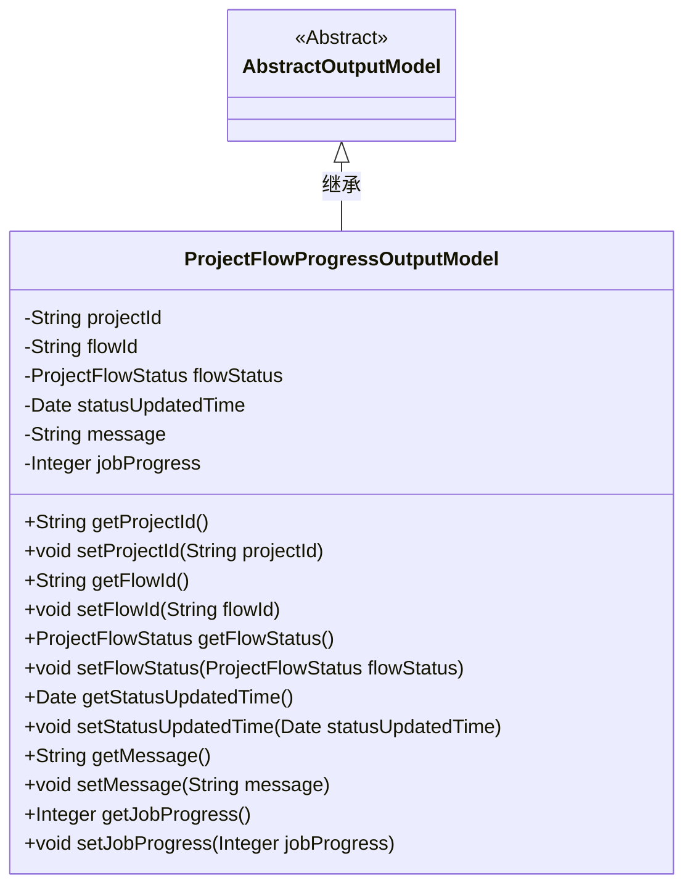

# 基础信息

|      |      |
|------|------|
| 名称 | ProjectFlowProgressOutputModel |
| 编码语言 | .java |
| 代码路径 | WeFe/board/board-service/src/main/java/com/welab/wefe/board/service/dto/entity/project/ProjectFlowProgressOutputModel.java |
| 包名 | com.welab.wefe.board.service.dto.entity.project |
| 依赖项 | ['com.welab.wefe.board.service.dto.entity.AbstractOutputModel', 'com.welab.wefe.common.fieldvalidate.annotation.Check', 'com.welab.wefe.common.wefe.enums.ProjectFlowStatus', 'java.util.Date'] |
| 概述说明 | 项目流程进度输出模型，包含项目ID、流程ID、状态、更新时间、消息和任务进度字段及对应getter/setter方法。 |

# 说明

ProjectFlowProgressOutputModel类继承自AbstractOutputModel，用于表示项目流程进度输出模型。包含项目ID、流程ID、流程状态、状态更新时间、消息和任务进度等字段，均提供getter和setter方法。流程状态使用ProjectFlowStatus枚举类型，部分字段通过@Check注解进行校验。

# 类列表 Class Summary

| 名称   | 类型  | 说明 |
|-------|------|-------------|
| ProjectFlowProgressOutputModel | class | ProjectFlowProgressOutputModel类继承AbstractOutputModel，包含项目ID、流程ID、状态、更新时间、消息和任务进度等字段及其getter/setter方法。 |

## 类 ProjectFlowProgressOutputModel

|      |      |
|------|------|
| 访问范围 | public |
| 类型 | class |
| 名称 | ProjectFlowProgressOutputModel |
| 说明 | ProjectFlowProgressOutputModel类继承AbstractOutputModel，包含项目ID、流程ID、状态、更新时间、消息和任务进度等字段及其getter/setter方法。 |

### UML类图

该类图展示了ProjectFlowProgressOutputModel继承自抽象类AbstractOutputModel的结构。ProjectFlowProgressOutputModel包含项目ID、流程ID、流程状态、状态更新时间、消息和任务进度等私有字段，并为每个字段提供了公共的getter和setter方法。这些字段通过@Check注解进行校验，表明这是一个用于输出项目流程进度信息的模型类，主要用于封装和传递项目流程的状态数据。

### 内部方法调用关系图

```mermaid
graph TD
    A["类ProjectFlowProgressOutputModel"]
    B["继承: AbstractOutputModel"]
    C["属性: String projectId '@Check'"]
    D["属性: String flowId '@Check'"]
    E["属性: ProjectFlowStatus flowStatus '@Check'"]
    F["属性: Date statusUpdatedTime"]
    G["属性: String message"]
    H["属性: Integer jobProgress '@Check'"]
    I["方法: getProjectId()"]
    J["方法: setProjectId()"]
    K["方法: getFlowId()"]
    L["方法: setFlowId()"]
    M["方法: getFlowStatus()"]
    N["方法: setFlowStatus()"]
    O["方法: getStatusUpdatedTime()"]
    P["方法: setStatusUpdatedTime()"]
    Q["方法: getMessage()"]
    R["方法: setMessage()"]
    S["方法: getJobProgress()"]
    T["方法: setJobProgress()"]

    A --> B
    A --> C
    A --> D
    A --> E
    A --> F
    A --> G
    A --> H
    A --> I
    A --> J
    A --> K
    A --> L
    A --> M
    A --> N
    A --> O
    A --> P
    A --> Q
    A --> R
    A --> S
    A --> T
```

这段代码定义了一个名为ProjectFlowProgressOutputModel的类，继承自AbstractOutputModel，用于表示项目流程进度输出模型。类中包含多个属性，包括项目ID、流程ID、流程状态、状态更新时间、消息和任务进度，其中部分属性带有@Check注解。每个属性都有对应的getter和setter方法，用于获取和设置属性值。该类主要用于封装项目流程进度的相关信息，便于在系统中传递和处理这些数据。

### 字段列表 Field List

| 名称  | 类型  | 说明 |
|-------|-------|------|
| flowId | String | 定义私有字符串变量flowId，使用@Check注解校验流程ID。 |
| flowStatus | ProjectFlowStatus | 检查流程状态的私有变量flowStatus，类型为ProjectFlowStatus。 |
| statusUpdatedTime | Date | 私有日期类型变量statusUpdatedTime，记录状态更新时间。 |
| projectId | String | 代码定义了一个私有字符串变量projectId，并添加了项目ID的检查注解。 |
| jobProgress | Integer | 类成员变量jobProgress，用于标记任务进度，带@Check注解。 |
| message | String | 私有字符串变量message。 |

### 方法列表

| 名称  | 类型  | 说明 |
|-------|-------|------|
| getStatusUpdatedTime | Date | 获取状态更新时间的方法，返回statusUpdatedTime变量。 |
| getFlowId | String | 获取flowId的公共方法，返回字符串类型的flowId。 |
| getProjectId | String | 获取项目ID的方法，返回字符串类型的projectId。 |
| setFlowId | void | 设置流程ID的方法，将参数flowId赋值给当前对象的flowId属性。 |
| getFlowStatus | ProjectFlowStatus | 获取项目流程状态的方法，返回flowStatus值。 |
| setStatusUpdatedTime | void | 设置状态更新时间的方法，将参数赋值给对象的statusUpdatedTime属性。 |
| setFlowStatus | void | 设置项目流程状态的方法，将传入的flowStatus赋值给当前对象的flowStatus属性。 |
| setProjectId | void | 设置项目ID的方法，将输入参数projectId赋值给当前对象的projectId属性。 |
| getMessage | String | 方法返回字符串message的值。 |
| setMessage | void | 设置message属性的方法，将参数值赋给当前对象的message字段。 |
| getJobProgress | Integer | 获取任务进度的方法，返回整型数值。 |
| setJobProgress | void | 设置任务进度的方法，参数为整数类型jobProgress，用于更新当前任务进度值。 |

