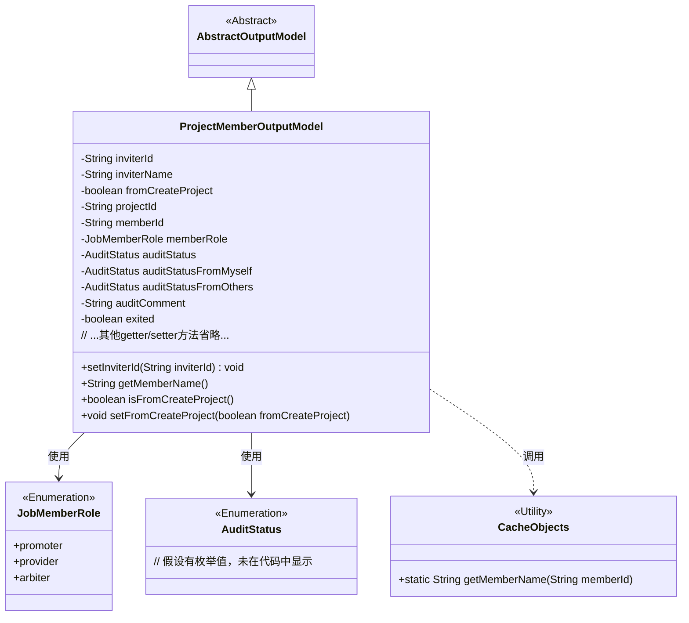

# 基础信息

|      |      |
|------|------|
| 名称 | ProjectMemberOutputModel |
| 编码语言 | .java |
| 代码路径 | WeFe/board/board-service/src/main/java/com/welab/wefe/board/service/dto/entity/project/ProjectMemberOutputModel.java |
| 包名 | com.welab.wefe.board.service.dto.entity.project |
| 依赖项 | ['com.welab.wefe.board.service.dto.entity.AbstractOutputModel', 'com.welab.wefe.board.service.service.CacheObjects', 'com.welab.wefe.common.exception.StatusCodeWithException', 'com.welab.wefe.common.fieldvalidate.annotation.Check', 'com.welab.wefe.common.wefe.enums.AuditStatus', 'com.welab.wefe.common.wefe.enums.JobMemberRole'] |
| 概述说明 | 项目成员输出模型类，包含成员ID、角色、审核状态、意见及是否退出等属性，提供相关getter/setter方法。 |

# 说明

ProjectMemberOutputModel类用于描述项目成员信息，包含成员ID、角色、审核状态等属性。主要字段包括邀请方成员ID和名称、是否来自项目创建、所属项目ID、成员ID、任务角色（promoter/provider/arbiter）、综合审核状态、自身审核状态、他人审核状态、审核意见以及是否已退出。类中提供了各属性的getter和setter方法，其中setInviterId方法会同步设置邀请方名称。该类继承自AbstractOutputModel，用于输出项目成员相关数据。

# 类列表 Class Summary

| 名称   | 类型  | 说明 |
|-------|------|-------------|
| ProjectMemberOutputModel | class | ProjectMemberOutputModel类包含项目成员信息，如邀请人ID、名称、成员角色、审核状态及意见，以及是否退出等属性。 |

## 类 ProjectMemberOutputModel

|      |      |
|------|------|
| 访问范围 | public |
| 类型 | class |
| 名称 | ProjectMemberOutputModel |
| 说明 | ProjectMemberOutputModel类包含项目成员信息，如邀请人ID、名称、成员角色、审核状态及意见，以及是否退出等属性。 |

### UML类图

类图描述：ProjectMemberOutputModel继承自AbstractOutputModel，用于表示项目成员输出数据模型。包含成员ID、角色、审核状态等核心属性，通过枚举类型JobMemberRole定义成员角色，AuditStatus管理审核状态。模型通过CacheObjects工具类获取成员名称，体现了项目成员管理中的邀请关系、审核流程和状态跟踪功能。类中大量使用@Check注解进行参数校验，确保数据完整性。

### 内部方法调用关系图

```mermaid
graph TD
    A["类ProjectMemberOutputModel"]
    B["继承: AbstractOutputModel"]
    C["属性: String inviterId"]
    D["属性: String inviterName"]
    E["属性: boolean fromCreateProject"]
    F["属性: String projectId"]
    G["属性: String memberId"]
    H["属性: JobMemberRole memberRole"]
    I["属性: AuditStatus auditStatus"]
    J["属性: AuditStatus auditStatusFromMyself"]
    K["属性: AuditStatus auditStatusFromOthers"]
    L["属性: String auditComment"]
    M["属性: boolean exited"]
    N["方法: setInviterId(String inviterId)"]
    O["方法: getMemberName()"]
    P["方法: isFromCreateProject()"]
    Q["方法: setFromCreateProject(boolean)"]
    R["方法: setMemberId(String)"]
    S["方法: getAuditStatus()"]
    T["方法: setAuditStatus(AuditStatus)"]
    U["方法: getAuditStatusFromMyself()"]
    V["方法: setAuditStatusFromMyself(AuditStatus)"]
    W["方法: getAuditStatusFromOthers()"]
    X["方法: setAuditStatusFromOthers(AuditStatus)"]
    Y["方法: getAuditComment()"]
    Z["方法: setAuditComment(String)"]
    AA["方法: getInviterName()"]
    AB["方法: setInviterName(String)"]
    AC["方法: getInviterId()"]
    AD["方法: getProjectId()"]
    AE["方法: setProjectId(String)"]
    AF["方法: getMemberId()"]
    AG["方法: getMemberRole()"]
    AH["方法: setMemberRole(JobMemberRole)"]
    AI["方法: isExited()"]
    AJ["方法: setExited(boolean)"]

    A --> B
    A --> C
    A --> D
    A --> E
    A --> F
    A --> G
    A --> H
    A --> I
    A --> J
    A --> K
    A --> L
    A --> M
    A --> N
    A --> O
    A --> P
    A --> Q
    A --> R
    A --> S
    A --> T
    A --> U
    A --> V
    A --> W
    A --> X
    A --> Y
    A --> Z
    A --> AA
    A --> AB
    A --> AC
    A --> AD
    A --> AE
    A --> AF
    A --> AG
    A --> AH
    A --> AI
    A --> AJ
    N -->|调用| D
    O -->|调用| G
```

这段代码定义了一个项目成员输出模型类，继承自抽象输出模型类。它包含多个属性，如邀请方成员ID、名称、项目ID、成员ID、成员角色、审核状态等，并提供了相应的getter和setter方法。其中setInviterId方法在设置邀请方ID的同时会设置对应的名称，getMemberName方法通过成员ID获取成员名称。流程图展示了类的继承关系、属性和方法之间的调用关系。

### 字段列表 Field List

| 名称  | 类型  | 说明 |
|-------|-------|------|
| auditComment | String | 私有字符串变量auditComment，用于存储审核意见，标注为@Check。 |
| auditStatus | AuditStatus | 类成员变量auditStatus，标注为综合审核结果，类型为AuditStatus。 |
| fromCreateProject | boolean | 字段fromCreateProject标记项目是否初始化时添加，影响审核流程。 |
| memberId | String | 成员ID校验注解 |
| auditStatusFromOthers | AuditStatus | 私有变量auditStatusFromOthers，用于检查他人是否同意，类型为AuditStatus。 |
| inviterName | String | 字段inviterName用于存储邀请方成员名称，通过@Check注解进行校验。 |
| projectId | String | 字段projectId标注为所属项目主键，用于校验项目ID。 |
| exited = false | boolean | 私有布尔变量exited标记退出状态，默认false，带检查注解。 |
| inviterId | String | 字段inviterId用于标识邀请方成员，需校验非空。 |
| auditStatusFromMyself | AuditStatus | 字段auditStatusFromMyself用于记录本人审核状态，通过@Check注解校验是否同意。 |
| memberRole | JobMemberRole | 检查任务角色，枚举类型：promoter/provider/arbiter。 |

### 方法列表

| 名称  | 类型  | 说明 |
|-------|-------|------|
| getAuditStatusFromMyself | AuditStatus | 获取当前对象的审核状态。 |
| setInviterId | void | 设置邀请人ID并更新其名称，若失败则抛出异常。 |
| setFromCreateProject | void | 方法设置是否来自创建项目的布尔值。 |
| setAuditComment | void | 设置审核评语的方法，将输入参数赋值给类的auditComment属性。 |
| setInviterName | void | 设置邀请人姓名的方法，将参数值赋给类的成员变量inviterName。 |
| getMemberName | String | 获取成员名称的方法，通过成员ID从缓存中查询并返回名称。 |
| getAuditStatusFromOthers | AuditStatus | 方法getAuditStatusFromOthers返回auditStatusFromOthers的值。 |
| getInviterName | String | 获取邀请人姓名的方法，返回字符串类型变量inviterName。 |
| getAuditStatus | AuditStatus | 获取审核状态的方法，返回auditStatus属性值。 |
| setAuditStatusFromOthers | void | 设置来自其他方的审核状态，将传入参数赋值给成员变量auditStatusFromOthers。 |
| setMemberId | void | 设置成员ID的方法，将传入的字符串参数赋值给类的成员变量memberId。 |
| isFromCreateProject | boolean | 这是一个Java方法，返回布尔值，表示是否来自创建项目。 |
| setAuditStatus | void | 方法setAuditStatus用于设置auditStatus属性的值。 |
| setAuditStatusFromMyself | void | 设置自身审核状态的方法，参数为AuditStatus类型。 |
| getInviterId | String | 获取邀请人ID的方法，返回字符串类型的inviterId。 |
| getProjectId | String | 获取项目ID的方法，返回字符串类型的projectId。 |
| setProjectId | void | 设置项目ID的方法，将输入参数projectId赋值给类的成员变量projectId。 |
| getMemberId | String | 获取成员ID的方法，返回字符串类型的memberId。 |
| getMemberRole | JobMemberRole | 获取成员角色方法，返回成员角色对象。 |
| setMemberRole | void | 这是一个Java方法，用于设置成员角色属性。方法名为setMemberRole，接受一个JobMemberRole类型的参数memberRole，并将其赋值给当前对象的成员变量memberRole。 |
| isExited | boolean | 方法isExited返回布尔值exited的状态。 |
| setExited | void | 设置退出状态的布尔值方法。 |
| getAuditComment | String | 获取审计评语的方法，返回auditComment字符串。 |

