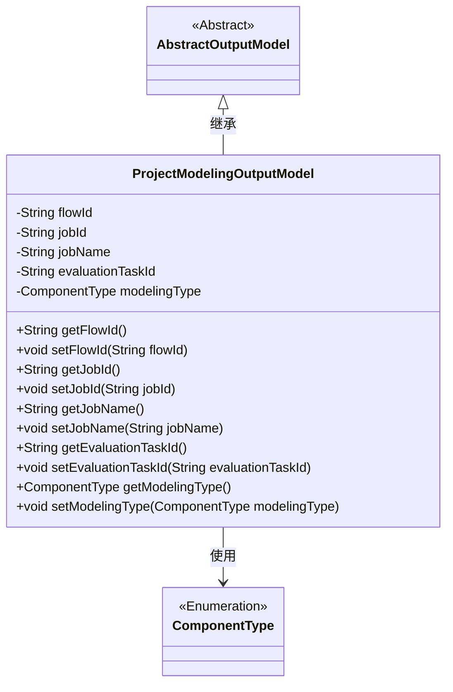
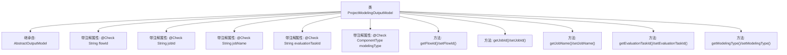

# 基础信息

|      |      |
|------|------|
| 名称 | ProjectModelingOutputModel |
| 编码语言 | .java |
| 代码路径 | WeFe/board/board-service/src/main/java/com/welab/wefe/board/service/dto/entity/project/ProjectModelingOutputModel.java |
| 包名 | com.welab.wefe.board.service.dto.entity.project |
| 依赖项 | ['com.welab.wefe.board.service.dto.entity.AbstractOutputModel', 'com.welab.wefe.common.fieldvalidate.annotation.Check', 'com.welab.wefe.common.wefe.enums.ComponentType'] |
| 概述说明 | ProjectModelingOutputModel类继承AbstractOutputModel，包含流程id、job_id、job名字、模型评估任务id和模型类型字段及其getter/setter方法。 |

# 说明

ProjectModelingOutputModel类继承自AbstractOutputModel，包含五个主要属性：流程id（flowId）、任务id（jobId）、任务名称（jobName）、模型评估任务id（evaluationTaskId）和模型类型（modelingType）。每个属性都有对应的getter和setter方法，并通过@Check注解进行校验标记。该类用于封装项目建模输出相关的数据。

# 类列表 Class Summary

| 名称   | 类型  | 说明 |
|-------|------|-------------|
| ProjectModelingOutputModel | class | ProjectModelingOutputModel类继承AbstractOutputModel，包含流程id、job_id、job名字、模型评估任务id和模型类型字段及其getter/setter方法。 |

## 类 ProjectModelingOutputModel

|      |      |
|------|------|
| 访问范围 | public |
| 类型 | class |
| 名称 | ProjectModelingOutputModel |
| 说明 | ProjectModelingOutputModel类继承AbstractOutputModel，包含流程id、job_id、job名字、模型评估任务id和模型类型字段及其getter/setter方法。 |

### UML类图

该类图展示了ProjectModelingOutputModel继承自AbstractOutputModel，并包含五个私有字段及其对应的getter/setter方法。其中modelingType字段使用了ComponentType枚举类型，体现了模型类型的选择约束。所有字段都标注了@Check注解，表明在业务逻辑中需要进行校验。整体结构清晰地反映了项目建模输出数据的封装和校验需求。

### 内部方法调用关系图

该流程图展示了ProjectModelingOutputModel类的完整结构，包含5个带@Check注解的属性和对应的getter/setter方法。该类继承自AbstractOutputModel，主要用于存储建模流程相关的输出数据，包括流程ID、任务ID、任务名称、评估任务ID和模型类型等核心字段。每个属性都通过注解进行了校验标注，并通过标准JavaBean规范提供了访问方法。

### 字段列表 Field List

| 名称  | 类型  | 说明 |
|-------|-------|------|
| jobName | String | 代码定义了一个私有字符串变量jobName，并用@Check注解标记，注解参数name值为"job名字"。 |
| evaluationTaskId | String | 模型评估任务ID字段，用于标识评估任务。 |
| modelingType | ComponentType | 定义私有变量modelingType，使用@Check注解校验模型类型。 |
| jobId | String | 定义私有字符串jobId，使用@Check注解校验字段名为job_id。 |
| flowId | String | 定义私有字符串变量flowId，使用Check注解标记为流程id。 |

### 方法列表

| 名称  | 类型  | 说明 |
|-------|-------|------|
| setModelingType | void | 方法setModelingType用于设置组件的建模类型，参数为ComponentType类型，赋值给成员变量modelingType。 |
| setEvaluationTaskId | void | 设置评估任务ID的方法，将参数evaluationTaskId赋值给当前对象的同名属性。 |
| setJobId | void | 设置任务ID的方法，将参数jobId赋值给当前对象的jobId属性。 |
| getModelingType | ComponentType | 获取当前组件的建模类型。 |
| getJobName | String | 方法返回jobName字符串。 |
| getFlowId | String | 获取当前流程ID的方法，返回字符串类型的flowId。 |
| getEvaluationTaskId | String | 获取评估任务ID的方法，返回字符串类型的evaluationTaskId。 |
| setFlowId | void | 设置流程ID的方法，将输入参数flowId赋值给当前对象的flowId属性。 |
| setJobName | void | 定义方法setJobName，用于设置jobName属性的值。参数为String类型。 |
| getJobId | String | 获取当前任务的唯一标识符jobId。 |

