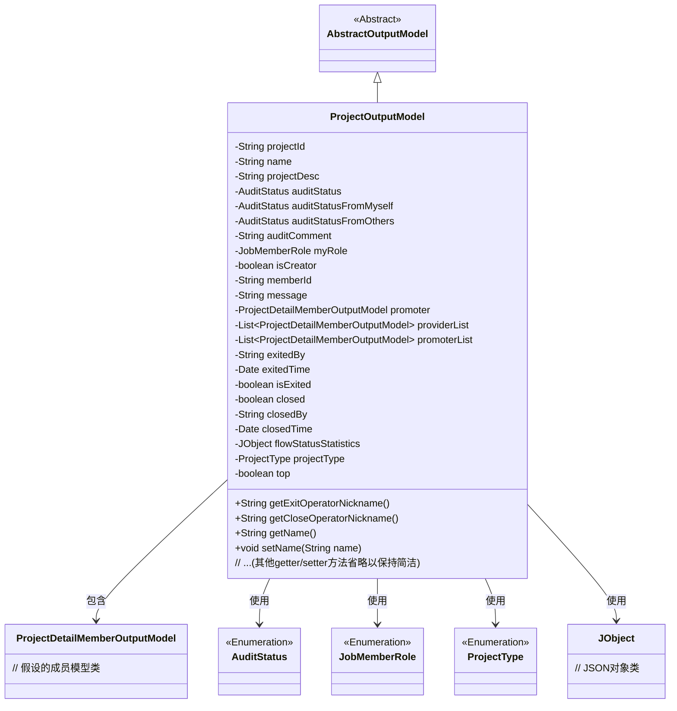

# 基础信息

|      |      |
|------|------|
| 名称 | ProjectOutputModel |
| 编码语言 | .java |
| 代码路径 | WeFe/board/board-service/src/main/java/com/welab/wefe/board/service/dto/entity/project/ProjectOutputModel.java |
| 包名 | com.welab.wefe.board.service.dto.entity.project |
| 依赖项 | ['com.welab.wefe.board.service.dto.entity.AbstractOutputModel', 'com.welab.wefe.board.service.service.CacheObjects', 'com.welab.wefe.common.fieldvalidate.annotation.Check', 'com.welab.wefe.common.util.JObject', 'com.welab.wefe.common.wefe.enums.AuditStatus', 'com.welab.wefe.common.wefe.enums.JobMemberRole', 'com.welab.wefe.common.wefe.enums.ProjectType', 'java.util.Date', 'java.util.List'] |
| 概述说明 | ProjectOutputModel类包含项目ID、名称、描述、审核状态、成员角色、创建者标识、退出和关闭状态等属性，用于管理项目信息和操作记录。 |

# 说明

ProjectOutputModel类是一个项目输出模型，继承自AbstractOutputModel。它包含项目ID、名称、描述、审核状态（包括自身和他人审核状态）、审核意见、成员角色、创建者标识、成员ID、消息备注等属性。此外，还包含发起人、供应商列表、发起人列表等成员信息。类中提供了项目退出和关闭的相关属性，如操作者、时间、状态标识。还包括项目类型、置顶标识等扩展属性。所有属性均配有getter和setter方法，部分属性通过注解进行校验。

# 类列表 Class Summary

| 名称   | 类型  | 说明 |
|-------|------|-------------|
| ProjectOutputModel | class | 项目输出模型类，包含项目ID、名称、描述、审核状态、成员角色、创建者标识、退出关闭信息、项目类型及置顶标识等字段和对应方法。 |

## 类 ProjectOutputModel

|      |      |
|------|------|
| 访问范围 | public |
| 类型 | class |
| 名称 | ProjectOutputModel |
| 说明 | 项目输出模型类，包含项目ID、名称、描述、审核状态、成员角色、创建者标识、退出关闭信息、项目类型及置顶标识等字段和对应方法。 |

### UML类图

类图描述：ProjectOutputModel继承自AbstractOutputModel，包含项目基本信息、审核状态、成员角色、操作记录等属性。通过枚举类管理状态类型，关联ProjectDetailMemberOutputModel表示成员信息，使用JObject处理流程统计。整体结构展示了项目输出模型的数据组织方式和关联关系，体现了项目管理的核心字段和状态控制机制。

### 内部方法调用关系图

这段代码定义了一个名为ProjectOutputModel的类，继承自AbstractOutputModel，主要用于管理项目相关的输出数据。该类包含多个属性，如项目ID、名称、描述、审核状态、成员角色等，并提供了相应的getter和setter方法。此外，还包含一些特殊方法，如获取退出操作者和关闭操作者的昵称。流程图展示了类的继承关系、属性和方法的组织结构。

### 字段列表 Field List

| 名称  | 类型  | 说明 |
|-------|-------|------|
| projectId | String | 定义私有字符串变量projectId，使用@Check注解校验项目ID。 |
| promoter | ProjectDetailMemberOutputModel | 项目详情成员输出模型中的发起人字段。 |
| memberId | String | 代码定义了一个私有字符串变量memberId，并标注了检查注解，参数name为"我方成员ID"。 |
| closed = false | boolean | 私有布尔变量closed初始为false，用于检查是否已关闭。 |
| projectDesc | String | 类成员变量projectDesc，使用@Check注解标记为"项目描述"。 |
| closedBy | String | 字段closedBy标记为检查项，用于记录关闭项目的操作者名称。 |
| isCreator | boolean | 私有布尔变量isCreator，用于检查是否为创建者，带有@Check注解。 |
| auditComment | String | 定义私有字符串变量auditComment，用于存储审核意见，标注为@Check。 |
| name | String | 代码定义了一个私有字符串变量name，并用@Check注解标记其名称为"名称"。 |
| top | boolean | 类成员变量top，布尔类型，用于检查是否置顶，注解@Check标记其名称为"是否置顶"。 |
| myRole | JobMemberRole | 注解@Check验证myRole字段，限定为我方身份枚举值（promoter/provider）。 |
| isExited | boolean | 检查成员是否退出项目的布尔变量isExited。 |
| auditStatus | AuditStatus | 私有审计状态变量auditStatus。 |
| exitedTime | Date | 字段exitedTime标注为退出时间检查项，类型为Date。 |
| projectType | ProjectType | 代码定义了一个私有变量projectType，带有@Check注解检查项目类型。 |
| providerList | List<ProjectDetailMemberOutputModel> | 私有成员变量providerList，类型为ProjectDetailMemberOutputModel的列表。 |
| auditStatusFromMyself | AuditStatus | 字段auditStatusFromMyself用于记录本人审核状态，通过@Check注解标记需验证是否同意。 |
| promoterList | List<ProjectDetailMemberOutputModel> | 私有成员变量promoterList，类型为ProjectDetailMemberOutputModel的列表。 |
| auditStatusFromOthers | AuditStatus | 字段auditStatusFromOthers用于记录其他人是否同意，使用@Check注解标记。 |
| exitedBy | String | 退出项目的操作者字段，使用@Check注解标记。 |
| closedTime | Date | 字段closedTime用@Check注解标记，检查项名为"关闭时间"。 |
| flowStatusStatistics | JObject | 私有变量flowStatusStatistics，类型为JObject。 |
| message | String | 消息备注字段，存储失败原因或备注信息。 |

### 方法列表

| 名称  | 类型  | 说明 |
|-------|-------|------|
| getPromoter | ProjectDetailMemberOutputModel | 获取项目发起人信息的公开方法，返回ProjectDetailMemberOutputModel类型对象。 |
| setAuditStatus | void | 方法setAuditStatus用于设置auditStatus属性的值，参数为AuditStatus类型。 |
| getExitOperatorNickname | String | 获取退出操作者昵称的方法，通过缓存对象返回exitedBy对应的昵称。 |
| getProjectId | String | 获取项目ID的方法，返回字符串类型的projectId。 |
| getClosedTime | Date | 获取关闭时间的方法，返回closedTime值。 |
| setClosed | void | 设置对象关闭状态的方法，参数closed决定状态。 |
| getMessage | String | 这是一个Java方法，返回字符串类型的message变量值。 |
| getClosedBy | String | 获取closedBy属性的字符串值。 |
| getAuditStatus | AuditStatus | 获取审核状态的方法，返回auditStatus变量值。 |
| setPromoter | void | 方法setPromoter用于设置项目发起人，参数为ProjectDetailMemberOutputModel类型对象promoter。 |
| setName | void | 设置对象名称的方法，将参数name赋值给对象的name属性。 |
| setProviderList | void | 设置提供者列表，参数为ProjectDetailMemberOutputModel类型的列表，赋值给成员变量providerList。 |
| setMemberId | void | 设置成员ID的方法，将输入参数memberId赋值给当前对象的memberId属性。 |
| getAuditStatusFromMyself | AuditStatus | 获取当前对象的审核状态。 |
| setExitedTime | void | 设置退出时间的方法，将传入的日期参数赋值给对象的exitedTime属性。 |
| setAuditStatusFromOthers | void | 设置来自其他方的审核状态，将传入的auditStatusFromOthers赋值给当前对象的对应属性。 |
| setMessage | void | 设置消息内容的方法，将输入字符串赋值给类成员变量message。 |
| setMyRole | void | 这是一个Java方法，用于设置当前对象的myRole属性，参数为JobMemberRole类型。方法将传入的myRole赋值给对象的同名属性。 |
| getIsExited | boolean | 这是一个Java方法，返回布尔值isExited，表示是否已退出。 |
| setIsExited | void | 设置退出状态的布尔值方法。 |
| getProjectType | ProjectType | 获取当前项目类型的方法，返回projectType字段值。 |
| setProjectType | void | 设置项目类型的方法，将输入参数赋值给类的projectType属性。 |
| isTop | boolean | 这是一个Java方法，返回布尔值top，表示对象是否处于顶部状态。 |
| setTop | void | 设置对象置顶状态的布尔值方法。 |
| setProjectId | void | 定义了一个公共方法setProjectId，用于设置类成员变量projectId的值。参数为字符串类型projectId。 |
| setAuditComment | void | 这是一个Java方法，用于设置auditComment属性的值。方法接收一个字符串参数auditComment，并将其赋值给类的同名成员变量。 |
| setAuditStatusFromMyself | void | 设置自身审核状态的方法，参数为AuditStatus类型。 |
| getExitedTime | Date | 获取退出时间的方法，返回exitedTime变量。 |
| setIsCreator | void | 设置是否为创建者的方法，参数为布尔值isCreator。 |
| getIsCreator | boolean | 这是一个Java方法，返回布尔值isCreator，用于判断是否为创建者。 |
| getProviderList | List<ProjectDetailMemberOutputModel> | 获取供应商列表的方法，返回类型为ProjectDetailMemberOutputModel的列表。 |
| setPromoterList | void | 这是一个Java方法，用于设置项目成员列表。方法接收一个项目成员列表参数，并将其赋值给类的成员变量promoterList。 |
| setFlowStatusStatistics | void | 方法将字符串参数转换为JObject对象并赋值给flowStatusStatistics变量。 |
| setClosedTime | void | 这是一个Java方法，用于设置对象的closedTime属性，接收Date类型参数closedTime并赋值给成员变量this.closedTime。 |
| getAuditStatusFromOthers | AuditStatus | 获取外部审计状态的方法，返回auditStatusFromOthers值。 |
| getExitedBy | String | 获取退出者信息的方法，返回exitedBy变量值。 |
| getPromoterList | List<ProjectDetailMemberOutputModel> | 获取推广员列表的方法，返回ProjectDetailMemberOutputModel类型的列表promoterList。 |
| setClosedBy | void | 设置关闭者方法，将输入参数closedBy赋值给当前对象的closedBy属性。 |
| getMyRole | JobMemberRole | 获取当前用户的角色信息。 |
| getAuditComment | String | 获取审计评语的方法，返回auditComment字符串。 |
| getName | String | 这是一个Java方法，返回字符串类型的name变量值。 |
| getFlowStatusStatistics | JObject | 获取流程状态统计数据的公共方法，返回JObject类型对象flowStatusStatistics。 |
| getMemberId | String | 方法返回成员ID字符串。 |
| setProjectDesc | void | 这是一个Java方法，用于设置项目描述。方法名为setProjectDesc，接收一个字符串参数projectDesc，并将其赋值给类的成员变量projectDesc。 |
| getCloseOperatorNickname | String | 方法返回由closedBy参数对应的用户昵称，通过CacheObjects.getNickname获取。 |
| setExitedBy | void | 设置退出者标识的方法，将参数exitedBy赋值给类成员变量exitedBy。 |
| isClosed | boolean | 方法isClosed返回布尔值closed，表示对象是否关闭。 |
| getProjectDesc | String | 获取项目描述的方法，返回字符串类型变量projectDesc。 |

