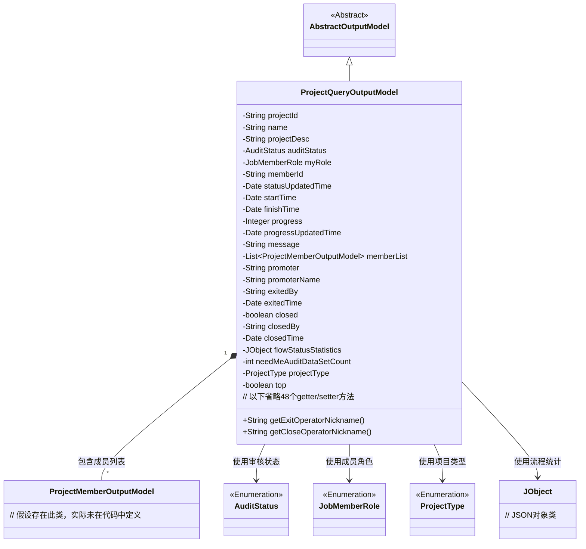

# 基础信息

|      |      |
|------|------|
| 名称 | ProjectQueryOutputModel |
| 编码语言 | .java |
| 代码路径 | WeFe/board/board-service/src/main/java/com/welab/wefe/board/service/dto/entity/project/ProjectQueryOutputModel.java |
| 包名 | com.welab.wefe.board.service.dto.entity.project |
| 依赖项 | ['com.welab.wefe.board.service.dto.entity.AbstractOutputModel', 'com.welab.wefe.board.service.service.CacheObjects', 'com.welab.wefe.common.fieldvalidate.annotation.Check', 'com.welab.wefe.common.util.JObject', 'com.welab.wefe.common.wefe.enums.AuditStatus', 'com.welab.wefe.common.wefe.enums.JobMemberRole', 'com.welab.wefe.common.wefe.enums.ProjectType', 'java.util.Date', 'java.util.List'] |
| 概述说明 | 项目查询输出模型类，包含项目ID、名称、描述、状态、角色、时间、进度、成员列表、发起方、关闭退出信息及统计等字段及其getter/setter方法。 |

# 说明

ProjectQueryOutputModel是一个项目查询输出模型类，继承自AbstractOutputModel。它包含项目ID、名称、描述、审核状态、我方身份、成员ID、状态更新时间、开始和结束时间、进度及更新时间、消息备注等字段。还包含成员列表、发起方信息、退出和关闭操作者及时间、流程状态统计、待审核数据集数量、项目类型和置顶状态等属性。提供了所有字段的getter和setter方法，以及获取退出和关闭操作者昵称的方法。

# 类列表 Class Summary

| 名称   | 类型  | 说明 |
|-------|------|-------------|
| ProjectQueryOutputModel | class | ProjectQueryOutputModel类包含项目ID、名称、描述、状态、角色、时间、进度、成员列表、发起方、关闭退出信息及统计等字段，用于项目查询输出。 |

## 类 ProjectQueryOutputModel

|      |      |
|------|------|
| 访问范围 | public |
| 类型 | class |
| 名称 | ProjectQueryOutputModel |
| 说明 | ProjectQueryOutputModel类包含项目ID、名称、描述、状态、角色、时间、进度、成员列表、发起方、关闭退出信息及统计等字段，用于项目查询输出。 |

### UML类图

该图展示了ProjectQueryOutputModel继承自AbstractOutputModel，包含项目查询相关的详细字段（如项目ID、名称、时间信息等）和枚举类型依赖关系。作为项目查询响应模型，它通过聚合关系管理成员列表，并使用JObject处理流程统计数据，体现了项目管理的核心数据结构。类中包含50+个字段和对应访问方法，主要用于项目信息的完整封装和传输。

### 内部方法调用关系图

```mermaid
graph TD
    A["类ProjectQueryOutputModel"]
    B["继承自: AbstractOutputModel"]
    C["属性: String projectId"]
    D["属性: String name"]
    E["属性: String projectDesc"]
    F["属性: AuditStatus auditStatus"]
    G["属性: JobMemberRole myRole"]
    H["属性: String memberId"]
    I["属性: Date statusUpdatedTime"]
    J["属性: Date startTime"]
    K["属性: Date finishTime"]
    L["属性: Integer progress"]
    M["属性: Date progressUpdatedTime"]
    N["属性: String message"]
    O["属性: List<ProjectMemberOutputModel> memberList"]
    P["属性: String promoter"]
    Q["属性: String promoterName"]
    R["属性: String exitedBy"]
    S["属性: Date exitedTime"]
    T["属性: boolean closed"]
    U["属性: String closedBy"]
    V["属性: Date closedTime"]
    W["属性: JObject flowStatusStatistics"]
    X["属性: int needMeAuditDataSetCount"]
    Y["属性: ProjectType projectType"]
    Z["属性: boolean top"]
    AA["方法: getExitOperatorNickname()"]
    AB["方法: getCloseOperatorNickname()"]
    AC["方法: getter/setter 方法组"]

    A --> B
    A --> C
    A --> D
    A --> E
    A --> F
    A --> G
    A --> H
    A --> I
    A --> J
    A --> K
    A --> L
    A --> M
    A --> N
    A --> O
    A --> P
    A --> Q
    A --> R
    A --> S
    A --> T
    A --> U
    A --> V
    A --> W
    A --> X
    A --> Y
    A --> Z
    A --> AA
    A --> AB
    A --> AC
```

该流程图展示了ProjectQueryOutputModel类的完整结构，包含其继承关系、23个属性字段（含基本类型、枚举和复杂对象）以及核心方法。类通过@Check注解实现字段校验，封装了项目管理的核心数据模型，包括项目基础信息、时间状态、成员列表和操作记录等，并通过getter/setter方法提供标准访问接口。两个特殊方法通过CacheObjects获取操作者昵称。

### 字段列表 Field List

| 名称  | 类型  | 说明 |
|-------|-------|------|
| memberList | List<ProjectMemberOutputModel> | 项目成员列表，存储ProjectMemberOutputModel对象。 |
| projectType | ProjectType | 代码定义了一个私有变量projectType，使用@Check注解校验项目类型。 |
| flowStatusStatistics | JObject | 检查流程状态统计的JSON对象变量。 |
| exitedTime | Date | 字段exitedTime标记为退出时间检查项，类型为Date。 |
| auditStatus | AuditStatus | 私有审计状态变量auditStatus。 |
| promoter | String | 代码定义了一个私有字符串变量promoter，并添加了检查注解@Check(name = "发起方ID")，用于标识或验证发起方ID。 |
| closedTime | Date | 字段closedTime用于记录关闭时间，使用@Check注解进行校验。 |
| promoterName | String | 代码定义了一个私有字符串变量promoterName，并标注了@Check注解，参数name值为"发起方name"。 |
| exitedBy | String | 定义私有字符串变量exitedBy，用于标注退出项目的操作者，通过@Check注解进行校验。 |
| closedBy | String | 字段closedBy标记为检查项，用于记录关闭项目的操作者名称。 |
| finishTime | Date | 字段finishTime用@Check注解标记为"结束时间"，类型为Date。 |
| progress | Integer | 进度检查字段，类型为整数。 |
| projectId | String | 代码定义了一个私有字符串变量projectId，并添加了@Check注解，注解参数name为"项目ID"，用于校验项目ID。 |
| closed = false | boolean | Java代码：定义私有布尔变量closed，默认值false，带@Check注解检查是否关闭。 |
| progressUpdatedTime | Date | 进度更新时间字段，类型为Date。 |
| top | boolean | 类成员变量top，布尔类型，用于标记是否置顶，通过@Check注解进行校验。 |
| statusUpdatedTime | Date | 字段statusUpdatedTime用于记录状态更新时间，标注为必检项。 |
| startTime | Date | 定义私有日期类型变量startTime，使用@Check注解标记为"开始时间"。 |
| name | String | 代码定义了一个私有字符串变量name，并用@Check注解标记其名称为"名称"。 |
| projectDesc | String | 类私有字段projectDesc，使用@Check注解标记为"项目描述"。 |
| myRole | JobMemberRole | 字段myRole标注@Check校验，枚举值为promoter或provider，标识我方身份。 |
| memberId | String | 代码定义了一个私有字符串变量memberId，使用@Check注解标记为"我方成员ID"的校验字段。 |
| needMeAuditDataSetCount | int | 待审核数据集数量的私有整型变量，用于存储需要审核的数据集数目。 |
| message | String | 类字段message用于存储消息备注或失败原因，标注为@Check。 |

### 方法列表

| 名称  | 类型  | 说明 |
|-------|-------|------|
| getFinishTime | Date | 方法getFinishTime返回finishTime日期对象。 |
| getExitedBy | String | 方法返回exitedBy字符串值。 |
| getStartTime | Date | 获取开始时间的方法，返回Date类型的startTime变量。 |
| setExitedTime | void | 设置退出时间的方法，参数为Date类型，赋值给成员变量exitedTime。 |
| setFinishTime | void | 设置完成时间的方法，将参数finishTime赋值给对象的finishTime属性。 |
| getAuditStatus | AuditStatus | 获取审核状态的方法，返回auditStatus变量值。 |
| getPromoter | String | 获取promoter字符串值的方法。 |
| setPromoter | void | 设置推广人属性的方法。 |
| setStartTime | void | 设置开始时间的方法，将参数startTime赋值给类的成员变量startTime。 |
| getExitedTime | Date | 获取退出时间的方法，返回exitedTime变量。 |
| setProjectId | void | 设置项目ID的方法，将输入参数赋值给类的projectId成员变量。 |
| setPromoterName | void | 设置推广人名称的方法，将输入参数赋值给类的成员变量promoterName。 |
| setName | void | 设置对象名称的方法，将输入参数name赋值给对象的name属性。 |
| getProgress | Integer | 获取进度值的方法，返回整数类型的progress变量。 |
| setFlowStatusStatistics | void | 方法设置流程状态统计信息，将输入字符串转换为JObject对象并赋值给成员变量flowStatusStatistics。 |
| setProgress | void | 设置进度值的方法，将输入参数progress赋值给类的成员变量progress。 |
| setClosedBy | void | 这是一个Java方法，用于设置closedBy属性的值。方法接受一个字符串参数closedBy，并将其赋值给类的成员变量this.closedBy。 |
| getClosedTime | Date | 获取closedTime属性的方法，返回Date类型值。 |
| setClosedTime | void | 设置关闭时间的方法，参数为Date类型，赋值给成员变量closedTime。 |
| getNeedMeAuditDataSetCount | int | 获取待审核数据集数量方法，返回整型变量needMeAuditDataSetCount的值。 |
| setNeedMeAuditDataSetCount | void | 设置待审核数据集数量的方法，将参数值赋给类成员变量needMeAuditDataSetCount。 |
| getProjectType | ProjectType | 获取项目类型的方法，返回projectType属性值。 |
| setProjectType | void | 设置项目类型的方法，将传入参数赋值给类成员变量projectType。 |
| isTop | boolean | 方法isTop返回布尔值top，表示是否为顶部状态。 |
| setTop | void | 设置对象置顶状态的公开方法，参数为布尔值top，用于更新对象的top属性。 |
| setClosed | void | 设置对象关闭状态的布尔值方法。 |
| getFlowStatusStatistics | JObject | 获取流程状态统计数据的公共方法，返回JObject类型结果。 |
| setMessage | void | 设置消息内容的方法，将输入字符串赋值给类内部变量。 |
| getMemberId | String | 获取成员ID的方法，返回字符串类型的memberId。 |
| setMemberId | void | 设置成员ID的方法，将输入字符串赋值给成员变量memberId。 |
| getCloseOperatorNickname | String | 获取关闭操作者昵称的方法，通过CacheObjects从closedBy获取昵称并返回。 |
| getMyRole | JobMemberRole | 获取当前用户的角色信息。 |
| setExitedBy | void | 设置退出者方法，用于更新exitedBy字段的值。 |
| getProgressUpdatedTime | Date | 获取进度更新时间的方法，返回progressUpdatedTime变量值。 |
| getProjectDesc | String | 获取项目描述的方法，返回字符串类型变量projectDesc。 |
| setAuditStatus | void | 设置审计状态的方法，将传入的auditStatus赋值给当前对象的auditStatus属性。 |
| getStatusUpdatedTime | Date | 获取状态更新时间的方法，返回statusUpdatedTime变量值。 |
| setMyRole | void | 这是一个Java方法，用于设置当前对象的角色属性。方法接受一个JobMemberRole类型的参数myRole，并将其赋值给对象的同名成员变量。 |
| getMemberList | List<ProjectMemberOutputModel> | 获取项目成员列表的方法，返回成员列表数据。 |
| getExitOperatorNickname | String | 获取退出操作者昵称的方法，通过CacheObjects从exitedBy获取昵称并返回。 |
| setProjectDesc | void | 这是一个Java方法，用于设置项目描述属性。方法接收字符串参数projectDesc，并将其赋值给类的同名成员变量。 |
| getMessage | String | 获取message字符串的方法。 |
| getProjectId | String | 获取项目ID的方法，返回字符串类型的projectId。 |
| getPromoterName | String | 获取推广人名称的方法，返回字符串类型的推广人名称。 |
| setProgressUpdatedTime | void | 设置进度更新时间的方法，将参数progressUpdatedTime赋值给类的同名成员变量。 |
| getName | String | 获取名称的方法，返回字符串类型的name变量值。 |
| getClosedBy | String | 获取closedBy字段值的公共方法。 |
| setStatusUpdatedTime | void | 这是一个Java方法，用于设置状态更新时间，将传入的Date对象赋值给类的statusUpdatedTime成员变量。 |
| setMemberList | void | 设置项目成员列表的方法，参数为成员列表对象。 |
| isClosed | boolean | 方法isClosed返回布尔值closed，表示对象是否关闭。 |

