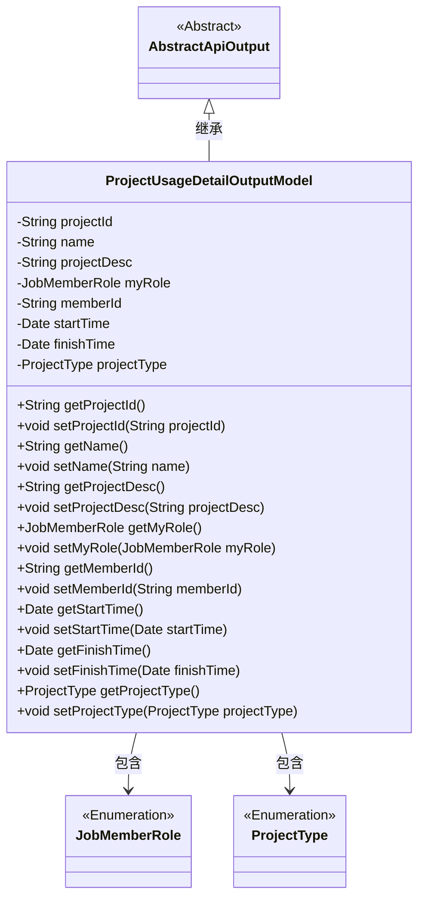
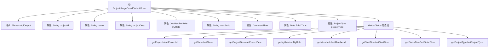

# 基础信息

|      |      |
|------|------|
| 名称 | ProjectUsageDetailOutputModel |
| 编码语言 | .java |
| 代码路径 | WeFe/board/board-service/src/main/java/com/welab/wefe/board/service/dto/entity/project/ProjectUsageDetailOutputModel.java |
| 包名 | com.welab.wefe.board.service.dto.entity.project |
| 依赖项 | ['com.welab.wefe.common.fieldvalidate.annotation.Check', 'com.welab.wefe.common.web.dto.AbstractApiOutput', 'com.welab.wefe.common.wefe.enums.JobMemberRole', 'com.welab.wefe.common.wefe.enums.ProjectType', 'java.util.Date'] |
| 概述说明 | 项目详情输出模型，包含项目ID、名称、描述、角色、创建者ID、起止时间和类型等字段及其getter/setter方法。 |

# 说明

该内容定义了一个名为ProjectUsageDetailOutputModel的Java类，继承自AbstractApiOutput。类中包含多个带注解的私有字段，包括项目ID、名称、描述、我方角色、创建者ID、开始时间、结束时间和项目类型。每个字段都有对应的getter和setter方法，用于访问和修改字段值。这些字段通过注解进行了校验标注，如项目ID、名称等。整体结构是一个典型的数据传输对象，用于封装项目使用详情信息。

# 类列表 Class Summary

| 名称   | 类型  | 说明 |
|-------|------|-------------|
| ProjectUsageDetailOutputModel | class | ProjectUsageDetailOutputModel类包含项目ID、名称、描述、角色、创建者ID、起止时间和类型等字段及其getter/setter方法。 |

## 类 ProjectUsageDetailOutputModel

|      |      |
|------|------|
| 访问范围 | public |
| 类型 | class |
| 名称 | ProjectUsageDetailOutputModel |
| 说明 | ProjectUsageDetailOutputModel类包含项目ID、名称、描述、角色、创建者ID、起止时间和类型等字段及其getter/setter方法。 |

### UML类图

这段类图展示了ProjectUsageDetailOutputModel继承自AbstractApiOutput，并包含多个私有字段及其对应的getter/setter方法。该类通过组合关系引用了JobMemberRole和ProjectType两个枚举类型，用于表示项目中的角色和类型信息。所有字段都带有@Check注解，表明需要进行校验。该模型主要用于封装项目使用详情的数据输出，包含项目基本信息、时间范围、参与角色等核心属性。

### 内部方法调用关系图

该流程图展示了ProjectUsageDetailOutputModel类的完整结构，该类继承自AbstractApiOutput基类。图中清晰呈现了8个核心属性及其对应的Getter/Setter方法组，所有属性均带有@Check注解标注的字段说明。每个属性都严格映射到对应的访问方法，形成完整的对象封装结构，这种设计模式典型用于DTO(数据传输对象)场景，确保数据字段的可控访问和验证。

### 字段列表 Field List

| 名称  | 类型  | 说明 |
|-------|-------|------|
| startTime | Date | 代码定义了一个私有日期类型变量startTime，并用@Check注解标记为"开始时间"。 |
| myRole | JobMemberRole | 定义私有变量myRole，使用@Check注解校验其值为"我方角色"，类型为JobMemberRole。 |
| name | String | 代码定义了一个私有字符串变量name，并使用@Check注解标记其名称为"名称"。 |
| memberId | String | 项目创建者ID的成员变量，使用@Check注解进行校验。 |
| projectDesc | String | 类成员变量projectDesc，使用@Check注解标记为"项目描述"。 |
| projectId | String | 定义私有字符串变量projectId，并添加项目ID的检查注解。 |
| finishTime | Date | 结束时间检查字段，类型为Date。 |
| projectType | ProjectType | 代码定义了一个私有变量projectType，使用@Check注解标记其名称为"项目类型"，类型为ProjectType。 |

### 方法列表

| 名称  | 类型  | 说明 |
|-------|-------|------|
| setProjectId | void | 设置项目ID的方法，将输入参数projectId赋值给当前对象的projectId属性。 |
| setMyRole | void | 这是一个Java方法，用于设置当前对象的myRole属性，参数为JobMemberRole类型。 |
| setStartTime | void | 设置起始时间的方法，将参数startTime赋值给对象的startTime属性。 |
| getName | String | 获取名称的方法，返回字符串类型的name变量值。 |
| getStartTime | Date | 方法getStartTime返回startTime日期对象。 |
| getMemberId | String | 获取成员ID的方法，返回成员ID字符串。 |
| getProjectDesc | String | 获取项目描述的方法，返回字符串类型的projectDesc。 |
| setProjectDesc | void | 这是一个Java方法，用于设置项目描述属性。方法接收字符串参数projectDesc，并将其赋值给类的成员变量projectDesc。 |
| setMemberId | void | 设置成员ID的方法，将输入字符串赋值给类的成员变量memberId。 |
| setName | void | 设置对象名称的方法，将参数name赋值给对象的name属性。 |
| getProjectId | String | 获取项目ID的方法，返回字符串类型的projectId。 |
| getMyRole | JobMemberRole | 获取当前用户的角色信息。 |
| getFinishTime | Date | 方法getFinishTime返回finishTime日期对象。 |
| setFinishTime | void | 设置完成时间的方法，将参数finishTime赋值给类的成员变量finishTime。 |
| getProjectType | ProjectType | 获取项目类型的方法，返回projectType字段值。 |
| setProjectType | void | 方法setProjectType用于设置项目类型，参数为ProjectType对象。 |

