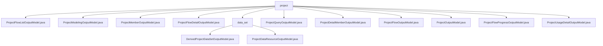

# 基础信息

|      |      |
|------|------|
| 名称 | project |
| 编码语言 | .java |
| 代码路径 | WeFe/board/board-service/src/main/java/com/welab/wefe/board/service/dto/entity/project |
| 包名 | docs.board.board-service.src.main.java.com.welab.wefe.board.service.dto.entity.project |
| 概述说明 | ProjectFlowListOutputModel类封装项目流程列表信息，包含状态、类型、ID等属性。ProjectModelingOutputModel类用于建模输出数据，含流程ID、任务ID等。ProjectMemberOutputModel类描述成员信息，含ID、角色、审核状态等。ProjectFlowDetailOutputModel类扩展流程详情，含项目信息、空参数节点等。ProjectQueryOutputModel类包含项目查询结果，含ID、名称、状态等。ProjectDetailMemberOutputModel类扩展成员信息，增加数据资源列表。ProjectFlowOutputModel类表示流程输出，含状态、类型、ID等。ProjectOutputModel类封装项目输出，含ID、名称、审核状态等。ProjectFlowProgressOutputModel类表示流程进度，含状态、更新时间等。ProjectUsageDetailOutputModel类封装项目使用详情，含ID、名称、时间等。 |

# 说明

## 概述  
该模块核心职责是管理联邦学习项目的全生命周期数据，包括项目基础信息、流程管理、成员协作及资源状态跟踪。接口规范统一采用Getter/Setter模式，例如`getFlowStatus()`和`setModelingType()`，关键校验通过`@Check`注解实现。关键数据结构包含四层模型：1）基础类如`ProjectOutputModel`；2）流程类如`ProjectFlowListOutputModel`；3）成员类如`ProjectDetailMemberOutputModel`；4）衍生类如`ProjectUsageDetailOutputModel`。外部依赖仅为父类`AbstractOutputModel`，例如流程进度模型通过继承实现状态枚举校验。

## 主要业务场景  
模块支持联邦学习项目协同工作流，类似多租户SaaS系统。典型场景包括：1）项目看板（通过`ProjectQueryOutputModel`聚合流程状态、成员角色及数据集统计）；2）流程编排（如`ProjectFlowOutputModel`管理画布编辑图与建模任务）；3）成员协作（例如`ProjectMemberOutputModel`处理角色审核与数据资源授权）。集成案例表现为模型嵌套，如流程详情通过`ProjectFlowDetailOutputModel`组合OOT任务ID与空参数节点列表。

### 包内部结构视图

该流程图展示了WeFe项目中board-service模块下project实体DTO的层级结构。根节点"project"包含11个子节点，其中10个是输出模型类文件，1个是"data_set"子目录。data_set目录下又包含两个数据集合相关的输出模型类。整体结构清晰展现了项目流程、成员、数据集等不同维度的输出模型组织方式。

# 文件列表

| 名称   | 类型  | 说明 |
|-------|------|-------------|
| [ProjectFlowListOutputModel.java](ProjectFlowListOutputModel.md) | file | ProjectFlowListOutputModel类包含项目流程的详细信息，如ID、名称、状态、进度、创建者、角色、类型等属性及其getter/setter方法。 |
| [ProjectModelingOutputModel.java](ProjectModelingOutputModel.md) | file | ProjectModelingOutputModel类继承AbstractOutputModel，包含流程id、job_id、job名字、模型评估任务id和模型类型字段及其getter/setter方法。 |
| [ProjectMemberOutputModel.java](ProjectMemberOutputModel.md) | file | 项目成员输出模型类，包含成员ID、角色、审核状态、意见及是否退出等属性，提供相关getter/setter方法。 |
| [ProjectFlowDetailOutputModel.java](ProjectFlowDetailOutputModel.md) | file | ProjectFlowDetailOutputModel扩展ProjectFlowOutputModel，包含项目信息、空参数节点列表、创建者标识及OOT任务和模型节点ID。提供各字段的getter和setter方法。 |
| [ProjectQueryOutputModel.java](ProjectQueryOutputModel.md) | file | 项目查询输出模型类，包含项目ID、名称、描述、状态、角色、时间、进度、成员列表、发起方、关闭退出信息及统计等字段及其getter/setter方法。 |
| [ProjectDetailMemberOutputModel.java](ProjectDetailMemberOutputModel.md) | file | ProjectDetailMemberOutputModel继承ProjectMemberOutputModel，包含数据资源列表的getter和setter方法。 |
| [ProjectFlowOutputModel.java](ProjectFlowOutputModel.md) | file | ProjectFlowOutputModel类继承AbstractOutputModel，包含流程ID、名称、状态、类型、创建者等属性，用于管理项目流程数据。 |
| [ProjectOutputModel.java](ProjectOutputModel.md) | file | ProjectOutputModel类包含项目ID、名称、描述、审核状态、成员角色、创建者标识、退出和关闭状态等属性，用于管理项目信息和操作记录。 |
| [ProjectFlowProgressOutputModel.java](ProjectFlowProgressOutputModel.md) | file | 项目流程进度输出模型，包含项目ID、流程ID、状态、更新时间、消息和任务进度字段及对应getter/setter方法。 |
| [ProjectUsageDetailOutputModel.java](ProjectUsageDetailOutputModel.md) | file | 项目详情输出模型，包含项目ID、名称、描述、角色、创建者ID、起止时间和类型等字段及其getter/setter方法。 |
| [data_set](data_set/_module.md) | package | DerivedProjectDataSetOutputModel继承ProjectDataResourceOutputModel，包含JobMemberWithDataSetOutputModel列表成员变量及访问方法。ProjectDataResourceOutputModel继承AbstractOutputModel，包含项目数据资源相关属性和枚举类型字段。 |

