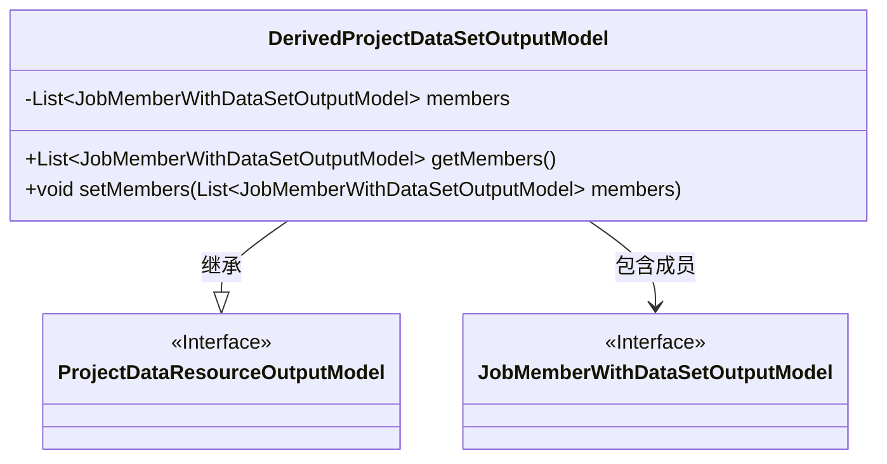
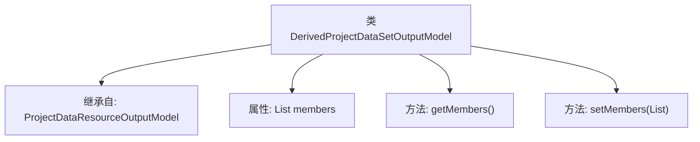

# 基础信息

|      |      |
|------|------|
| 名称 | DerivedProjectDataSetOutputModel |
| 编码语言 | .java |
| 代码路径 | WeFe/board/board-service/src/main/java/com/welab/wefe/board/service/dto/entity/project/data_set/DerivedProjectDataSetOutputModel.java |
| 包名 | com.welab.wefe.board.service.dto.entity.project.data_set |
| 依赖项 | ['com.welab.wefe.board.service.dto.vo.JobMemberWithDataSetOutputModel', 'java.util.List'] |
| 概述说明 | 派生项目数据集输出模型继承自项目数据资源输出模型，包含成员列表及其getter/setter方法。 |

# 说明

DerivedProjectDataSetOutputModel类继承自ProjectDataResourceOutputModel，包含一个私有成员变量members，类型为JobMemberWithDataSetOutputModel的列表。提供了getMembers和setMembers方法用于获取和设置该列表的值。该类主要用于处理派生项目数据集相关的输出模型。

# 类列表 Class Summary

| 名称   | 类型  | 说明 |
|-------|------|-------------|
| DerivedProjectDataSetOutputModel | class | 派生项目数据集输出模型继承自项目数据资源输出模型，包含成员列表及其getter/setter方法。 |

## 类 DerivedProjectDataSetOutputModel

|      |      |
|------|------|
| 访问范围 | public |
| 类型 | class |
| 名称 | DerivedProjectDataSetOutputModel |
| 说明 | 派生项目数据集输出模型继承自项目数据资源输出模型，包含成员列表及其getter/setter方法。 |

### UML类图

这段类图展示了DerivedProjectDataSetOutputModel继承自ProjectDataResourceOutputModel接口，并包含一个JobMemberWithDataSetOutputModel类型的列表成员。DerivedProjectDataSetOutputModel提供了对成员列表的获取和设置方法，体现了对项目数据集输出模型的扩展和具体实现。通过继承和组合关系，形成了清晰的类层次结构。

### 内部方法调用关系图

该流程图展示了DerivedProjectDataSetOutputModel类的结构，它是一个继承自ProjectDataResourceOutputModel的子类。类中包含一个成员变量members，类型为JobMemberWithDataSetOutputModel的列表，以及对应的getter和setter方法。通过继承关系，该类扩展了父类的功能，专注于处理项目数据集相关的输出模型。

### 字段列表 Field List

| 名称  | 类型  | 说明 |
|-------|-------|------|
| members | List<JobMemberWithDataSetOutputModel> | 私有成员变量，类型为JobMemberWithDataSetOutputModel的列表。 |

### 方法列表

| 名称  | 类型  | 说明 |
|-------|-------|------|
| getMembers | List<JobMemberWithDataSetOutputModel> | 方法返回成员列表，类型为JobMemberWithDataSetOutputModel。 |
| setMembers | void | 这是一个Java方法，用于设置成员列表，参数为JobMemberWithDataSetOutputModel类型的列表。 |

