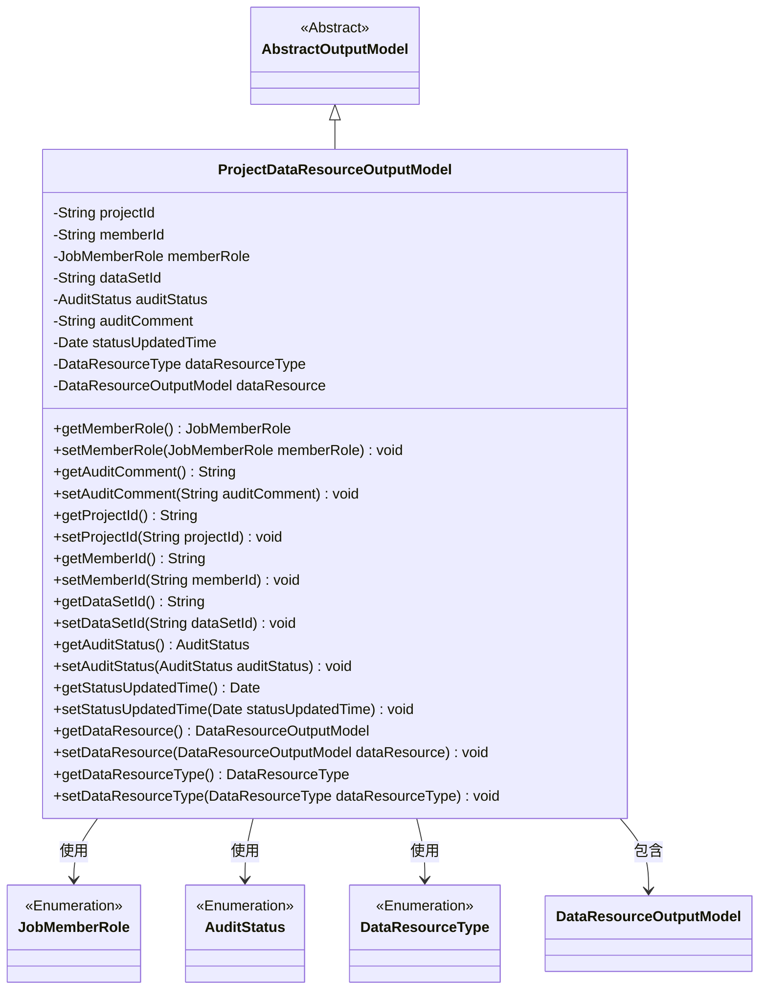

# 基础信息

|      |      |
|------|------|
| 名称 | ProjectDataResourceOutputModel |
| 编码语言 | .java |
| 代码路径 | WeFe/board/board-service/src/main/java/com/welab/wefe/board/service/dto/entity/project/data_set/ProjectDataResourceOutputModel.java |
| 包名 | com.welab.wefe.board.service.dto.entity.project.data_set |
| 依赖项 | ['com.welab.wefe.board.service.dto.entity.AbstractOutputModel', 'com.welab.wefe.board.service.dto.entity.data_resource.output.DataResourceOutputModel', 'com.welab.wefe.common.fieldvalidate.annotation.Check', 'com.welab.wefe.common.wefe.enums.AuditStatus', 'com.welab.wefe.common.wefe.enums.DataResourceType', 'com.welab.wefe.common.wefe.enums.JobMemberRole', 'java.util.Date'] |
| 概述说明 | 项目数据资源输出模型类，包含项目ID、成员ID、角色、数据集ID、审核状态、意见、更新时间、类型及详情等字段及其getter/setter方法。 |

# 说明

ProjectDataResourceOutputModel类继承自AbstractOutputModel，包含项目数据资源相关属性：项目ID、成员ID、成员角色（区分数据集归属）、数据集ID、审核状态、审核意见、状态更新时间、数据集类型及数据集详情。每个属性均有对应的getter和setter方法，用于获取和设置属性值。成员角色和数据集类型分别使用JobMemberRole和DataResourceType枚举类型。数据集详情通过DataResourceOutputModel对象表示。

# 类列表 Class Summary

| 名称   | 类型  | 说明 |
|-------|------|-------------|
| ProjectDataResourceOutputModel | class | ProjectDataResourceOutputModel类包含项目ID、成员ID、数据集ID、审核状态、数据集类型等字段，用于管理项目数据资源信息。 |

## 类 ProjectDataResourceOutputModel

|      |      |
|------|------|
| 访问范围 | public |
| 类型 | class |
| 名称 | ProjectDataResourceOutputModel |
| 说明 | ProjectDataResourceOutputModel类包含项目ID、成员ID、数据集ID、审核状态、数据集类型等字段，用于管理项目数据资源信息。 |

### UML类图

该代码定义了一个项目数据资源输出模型类，继承自抽象输出模型类，包含项目ID、成员ID、成员角色、数据集ID等字段，以及对应的getter和setter方法。该类通过注解进行字段校验，并引用了多个枚举类型和另一个数据资源输出模型类，用于描述项目数据资源的相关信息和状态。类图清晰地展示了继承关系和类之间的依赖关系。

### 内部方法调用关系图

```mermaid
graph TD
    A["类ProjectDataResourceOutputModel"]
    B["继承: AbstractOutputModel"]
    C["属性: String projectId"]
    D["属性: String memberId"]
    E["属性: JobMemberRole memberRole"]
    F["属性: String dataSetId"]
    G["属性: AuditStatus auditStatus"]
    H["属性: String auditComment"]
    I["属性: Date statusUpdatedTime"]
    J["属性: DataResourceType dataResourceType"]
    K["属性: DataResourceOutputModel dataResource"]
    L["Getter/Setter: projectId"]
    M["Getter/Setter: memberId"]
    N["Getter/Setter: memberRole"]
    O["Getter/Setter: dataSetId"]
    P["Getter/Setter: auditStatus"]
    Q["Getter/Setter: auditComment"]
    R["Getter/Setter: statusUpdatedTime"]
    S["Getter/Setter: dataResourceType"]
    T["Getter/Setter: dataResource"]

    A --> B
    A --> C
    A --> D
    A --> E
    A --> F
    A --> G
    A --> H
    A --> I
    A --> J
    A --> K
    A --> L
    A --> M
    A --> N
    A --> O
    A --> P
    A --> Q
    A --> R
    A --> S
    A --> T
```

这段代码定义了一个名为ProjectDataResourceOutputModel的类，继承自AbstractOutputModel。该类包含多个属性，如projectId、memberId、memberRole等，每个属性都有对应的Getter和Setter方法。这些属性用于存储项目数据资源的相关信息，包括项目ID、成员ID、成员角色、数据集ID、审核状态等。类中的属性通过注解@Check进行校验，确保数据的有效性。整体结构清晰，属性与方法的对应关系明确，便于管理和操作项目数据资源的相关信息。

### 字段列表 Field List

| 名称  | 类型  | 说明 |
|-------|-------|------|
| dataSetId | String | 代码定义了一个私有字符串变量dataSetId，并用@Check注解标记其名称为"数据集 Id"。 |
| memberId | String | 成员ID字段，使用@Check注解进行校验。 |
| projectId | String | 字段projectId标注为项目主键，使用@Check校验。 |
| dataResource | DataResourceOutputModel | 类成员变量dataResource，标注为数据集详情检查，类型为DataResourceOutputModel。 |
| dataResourceType | DataResourceType | 定义私有变量dataResourceType，使用@Check注解标注数据集类型检查。 |
| statusUpdatedTime | Date | 字段statusUpdatedTime用于记录状态更新时间，标注为必填检查项。 |
| auditComment | String | 定义私有字符串变量auditComment，用于存储审核意见，标注为@Check。 |
| memberRole | JobMemberRole | 成员角色区分数据集归属，用于处理自己和自己建模的情况。 |
| auditStatus | AuditStatus | 实体类字段auditStatus，使用@Check注解校验状态，类型为AuditStatus。 |

### 方法列表

| 名称  | 类型  | 说明 |
|-------|-------|------|
| getMemberRole | JobMemberRole | 获取成员角色方法，返回成员角色对象。 |
| getStatusUpdatedTime | Date | 获取状态更新时间的方法，返回statusUpdatedTime变量值。 |
| setStatusUpdatedTime | void | 这是一个Java方法，用于设置状态更新时间，将传入的Date对象赋值给类的成员变量statusUpdatedTime。 |
| getDataSetId | String | 获取数据集ID的方法，返回字符串类型的数据集ID。 |
| setAuditStatus | void | 方法setAuditStatus用于设置auditStatus属性值。 |
| getMemberId | String | 获取成员ID的方法，返回字符串类型的memberId。 |
| setAuditComment | void | 设置审计评注的方法，将输入参数赋值给类成员变量auditComment。 |
| getAuditStatus | AuditStatus | 方法返回审计状态auditStatus的值。 |
| getProjectId | String | 获取项目ID的方法，返回字符串类型的projectId。 |
| getDataResource | DataResourceOutputModel | 该方法返回DataResourceOutputModel类型的dataResource对象。 |
| setDataResource | void | 该方法用于设置数据资源，接收一个DataResourceOutputModel类型的参数，并将其赋值给当前对象的dataResource属性。 |
| setProjectId | void | 方法setProjectId用于设置类成员变量projectId的值，参数为字符串类型。 |
| setMemberRole | void | 设置成员角色方法，将传入的成员角色参数赋值给当前对象的成员角色属性。 |
| setDataSetId | void | 设置数据集ID的方法，将输入参数赋值给类的dataSetId成员变量。 |
| setMemberId | void | 设置成员ID的方法，将输入参数赋值给类的成员变量memberId。 |
| getDataResourceType | DataResourceType | 获取数据资源类型的方法，返回dataResourceType。 |
| getAuditComment | String | 获取审计评语的方法，返回auditComment字符串。 |
| setDataResourceType | void | 设置数据资源类型的方法，将输入参数赋值给类的成员变量。 |

