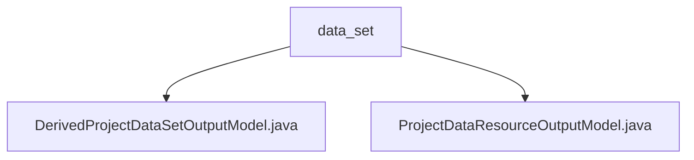

# 基础信息

|      |      |
|------|------|
| 名称 | data_set |
| 编码语言 | .java |
| 代码路径 | WeFe/board/board-service/src/main/java/com/welab/wefe/board/service/dto/entity/project/data_set |
| 包名 | docs.board.board-service.src.main.java.com.welab.wefe.board.service.dto.entity.project.data_set |
| 概述说明 | DerivedProjectDataSetOutputModel继承ProjectDataResourceOutputModel，包含JobMemberWithDataSetOutputModel列表成员变量及访问方法。ProjectDataResourceOutputModel继承AbstractOutputModel，包含项目数据资源相关属性和枚举类型字段。 |

# 说明

## 概述  
该模块核心职责是管理联邦学习项目中与数据集相关的输出模型，包括基础数据资源模型和派生数据集模型。接口规范统一采用Getter/Setter模式，例如`getMembers()`和`setMembers()`用于操作成员列表。关键数据结构包含`JobMemberWithDataSetOutputModel`（成员数据集）、`DataResourceOutputModel`（数据集详情）及枚举类型`JobMemberRole`/`DataResourceType`。外部依赖仅涉及基础模型类`AbstractOutputModel`。例如派生模型通过`members`列表扩展基础数据资源属性。

## 主要业务场景  
主要用于联邦学习项目中的数据资源状态跟踪，类似数据溯源系统。完整业务流程包括：1）通过`ProjectDataResourceOutputModel`记录数据集归属（如成员角色）、审核状态等元数据；2）`DerivedProjectDataSetOutputModel`扩展处理派生数据集与成员的关联关系。典型应用如审核意见更新时，通过`setAuditComment()`同步更新时间戳。集成案例表现为多层级模型嵌套，例如数据集详情通过`DataResourceOutputModel`对象动态装载。

### 包内部结构视图

该流程图展示了项目数据集目录下的两个输出模型文件结构。data_set作为父节点，包含DerivedProjectDataSetOutputModel和ProjectDataResourceOutputModel两个Java类文件，反映了DTO层中项目数据集相关输出模型的组织方式。整个结构简洁清晰地呈现了文件间的层级关系。

# 文件列表

| 名称   | 类型  | 说明 |
|-------|------|-------------|
| [DerivedProjectDataSetOutputModel.java](DerivedProjectDataSetOutputModel.md) | file | 派生项目数据集输出模型继承自项目数据资源输出模型，包含成员列表及其getter/setter方法。 |
| [ProjectDataResourceOutputModel.java](ProjectDataResourceOutputModel.md) | file | 项目数据资源输出模型类，包含项目ID、成员ID、角色、数据集ID、审核状态、意见、更新时间、类型及详情等字段及其getter/setter方法。 |

