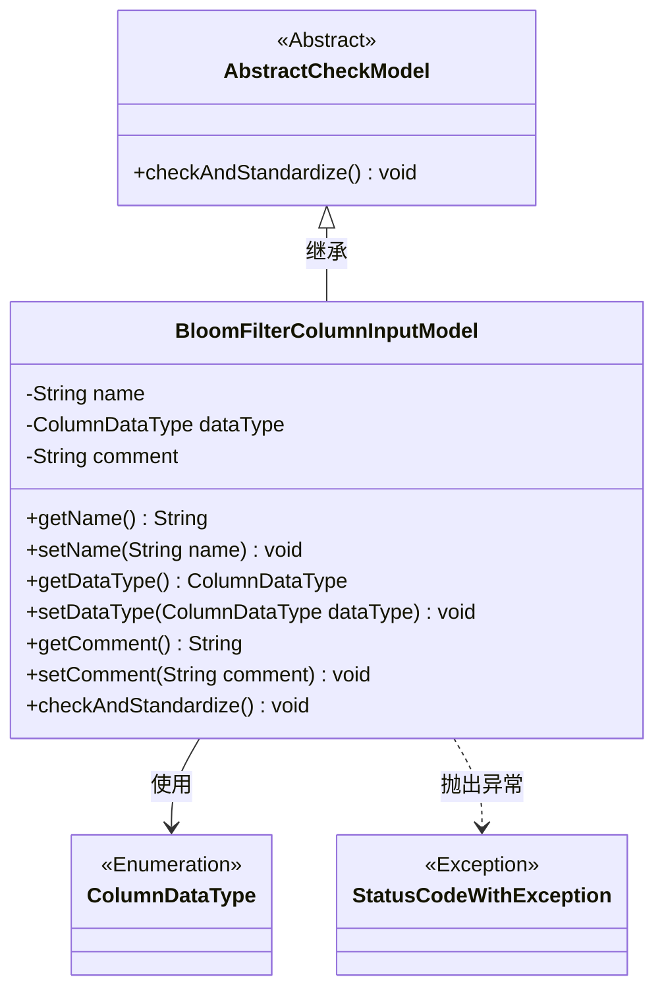
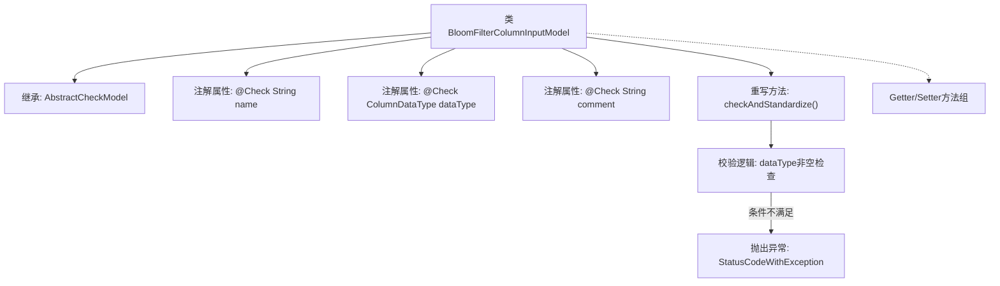

# 基础信息

|      |      |
|------|------|
| 名称 | BloomFilterColumnInputModel |
| 编码语言 | .java |
| 代码路径 | WeFe/board/board-service/src/main/java/com/welab/wefe/board/service/dto/fusion/BloomFilterColumnInputModel.java |
| 包名 | com.welab.wefe.board.service.dto.fusion |
| 依赖项 | ['com.welab.wefe.common.StatusCode', 'com.welab.wefe.common.exception.StatusCodeWithException', 'com.welab.wefe.common.fieldvalidate.AbstractCheckModel', 'com.welab.wefe.common.fieldvalidate.annotation.Check', 'com.welab.wefe.common.wefe.enums.ColumnDataType'] |
| 概述说明 | BloomFilterColumnInputModel类继承AbstractCheckModel，包含字段名称、数据类型和注释属性，注释长度限制250字符，数据类型必填校验。 |

# 说明

BloomFilterColumnInputModel类继承自AbstractCheckModel，包含三个字段：name（字段名称）、dataType（数据类型）和comment（注释）。comment字段通过正则表达式限制长度不超过250字符。类中实现了checkAndStandardize方法，检查dataType是否为空，若为空则抛出异常。提供了各字段的getter和setter方法。

# 类列表 Class Summary

| 名称   | 类型  | 说明 |
|-------|------|-------------|
| BloomFilterColumnInputModel | class | BloomFilterColumnInputModel类继承AbstractCheckModel，包含字段名称、数据类型和注释的校验逻辑，注释长度限制250字符，数据类型不可为空。 |

## 类 BloomFilterColumnInputModel

|      |      |
|------|------|
| 访问范围 | public |
| 类型 | class |
| 名称 | BloomFilterColumnInputModel |
| 说明 | BloomFilterColumnInputModel类继承AbstractCheckModel，包含字段名称、数据类型和注释的校验逻辑，注释长度限制250字符，数据类型不可为空。 |

### UML类图

这段类图展示了BloomFilterColumnInputModel继承自AbstractCheckModel，包含三个私有字段(name/dataType/comment)及其getter/setter方法。该类通过@Check注解实现参数校验，重写了checkAndStandardize()方法进行数据标准化检查，当dataType为null时会抛出StatusCodeWithException异常。ColumnDataType作为枚举类型被该类使用，整体结构体现了参数校验和异常处理机制。

### 内部方法调用关系图

该流程图展示了BloomFilterColumnInputModel类的核心结构，该类继承自AbstractCheckModel并包含三个带校验注解的属性。重点描述了重写的checkAndStandardize()方法执行流程，包括数据类型非空校验和异常抛出机制，同时标注了标准的Getter/Setter方法组。类通过注解实现了参数校验功能，体现了参数验证与业务逻辑分离的设计思想。

### 字段列表 Field List

| 名称  | 类型  | 说明 |
|-------|-------|------|
| comment | String | 代码定义了一个字符串字段comment，使用@Check注解限制其长度不超过250字符，否则提示"注释太长~"。 |
| name | String | 代码定义了一个私有字符串字段"name"，并使用了@Check注解标注该字段，注解参数指定字段名称为"字段名称"。 |
| dataType | ColumnDataType | 定义私有字段dataType，使用@Check注解校验数据类型，注解参数name为"数据类型"。 |

### 方法列表

| 名称  | 类型  | 说明 |
|-------|-------|------|
| checkAndStandardize | void | 检查并标准化字段，若数据类型未设置则抛出异常。 |
| getDataType | ColumnDataType | 方法返回列的数据类型。 |
| setName | void | 设置对象名称的方法，将参数name赋值给对象的name属性。 |
| getComment | String | 方法返回字符串类型的comment变量值。 |
| getName | String | 获取名称的方法，返回变量name的值。 |
| setDataType | void | 方法setDataType设置列数据类型，参数为ColumnDataType类型，赋值给成员变量dataType。 |
| setComment | void | 设置对象评论属性的方法，将输入字符串赋值给内部变量comment。 |

