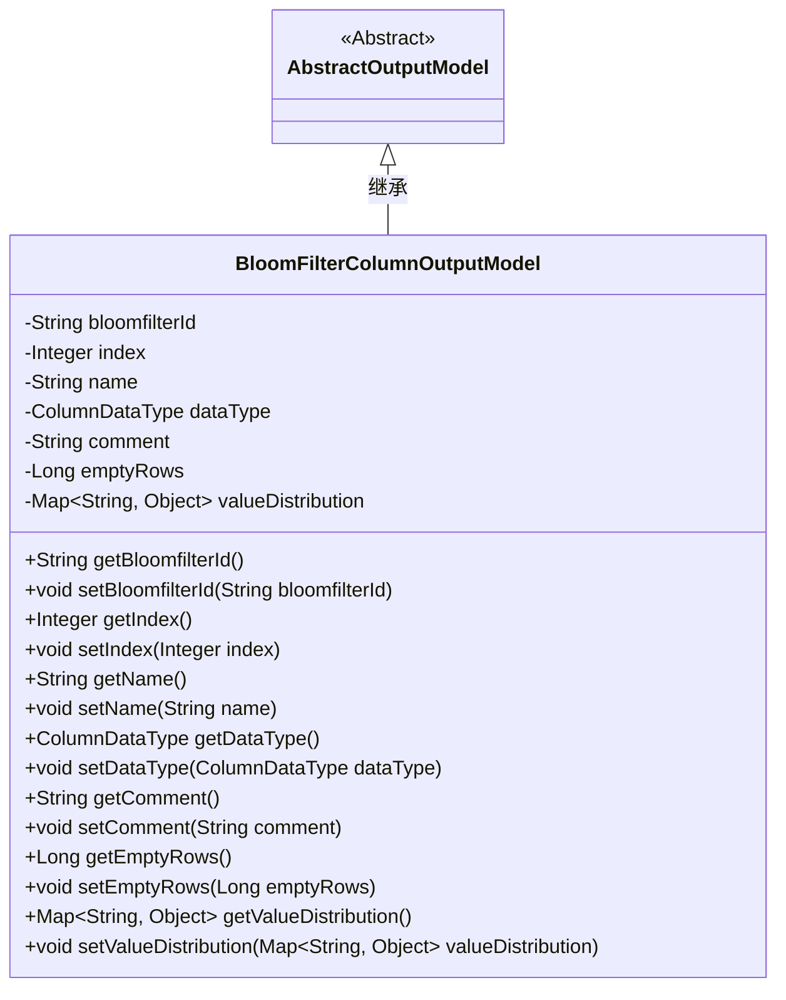

# 基础信息

|      |      |
|------|------|
| 名称 | BloomFilterColumnOutputModel |
| 编码语言 | .java |
| 代码路径 | WeFe/board/board-service/src/main/java/com/welab/wefe/board/service/dto/fusion/BloomFilterColumnOutputModel.java |
| 包名 | com.welab.wefe.board.service.dto.fusion |
| 依赖项 | ['com.welab.wefe.board.service.dto.entity.AbstractOutputModel', 'com.welab.wefe.common.fieldvalidate.annotation.Check', 'com.welab.wefe.common.wefe.enums.ColumnDataType', 'java.util.Map'] |
| 概述说明 | BloomFilterColumnOutputModel类继承AbstractOutputModel，包含过滤器ID、字段序号、名称、数据类型、注释、空值行数和数值分布等属性及其getter/setter方法。 |

# 说明

BloomFilterColumnOutputModel类继承自AbstractOutputModel，包含多个带注解的字段：bloomfilterId表示过滤器ID，index表示字段序号，name表示字段名称，dataType表示数据类型，comment表示注释，emptyRows表示空值数据行数。此外还包含一个未加注解的valueDistribution字段，用于存储数值分布信息。类中为所有字段提供了对应的getter和setter方法。

# 类列表 Class Summary

| 名称   | 类型  | 说明 |
|-------|------|-------------|
| BloomFilterColumnOutputModel | class | BloomFilterColumnOutputModel类继承AbstractOutputModel，包含过滤器ID、字段序号、名称、数据类型、注释、空值行数和数值分布等属性及其getter/setter方法。 |

## 类 BloomFilterColumnOutputModel

|      |      |
|------|------|
| 访问范围 | public |
| 类型 | class |
| 名称 | BloomFilterColumnOutputModel |
| 说明 | BloomFilterColumnOutputModel类继承AbstractOutputModel，包含过滤器ID、字段序号、名称、数据类型、注释、空值行数和数值分布等属性及其getter/setter方法。 |

### UML类图

该类图展示了BloomFilterColumnOutputModel继承自AbstractOutputModel的结构，包含8个私有字段和对应的getter/setter方法。这是一个典型的Java Bean类，用于存储布隆过滤器列的输出模型数据，包含字段ID、序号、名称、数据类型等元信息，以及空值行数和值分布统计信息。类通过@Check注解实现字段校验，并通过泛型Map存储动态分布数据。

### 内部方法调用关系图

```mermaid
graph TD
    A["类BloomFilterColumnOutputModel"]
    B["继承: AbstractOutputModel"]
    C["属性: String bloomfilterId"]
    D["属性: Integer index"]
    E["属性: String name"]
    F["属性: ColumnDataType dataType"]
    G["属性: String comment"]
    H["属性: Long emptyRows"]
    I["属性: Map<String, Object> valueDistribution"]
    J["方法: getBloomfilterId()"]
    K["方法: setBloomfilterId(String)"]
    L["方法: getIndex()"]
    M["方法: setIndex(Integer)"]
    N["方法: getName()"]
    O["方法: setName(String)"]
    P["方法: getDataType()"]
    Q["方法: setDataType(ColumnDataType)"]
    R["方法: getComment()"]
    S["方法: setComment(String)"]
    T["方法: getEmptyRows()"]
    U["方法: setEmptyRows(Long)"]
    V["方法: getValueDistribution()"]
    W["方法: setValueDistribution(Map<String, Object>)"]

    A --> B
    A --> C
    A --> D
    A --> E
    A --> F
    A --> G
    A --> H
    A --> I
    A --> J
    A --> K
    A --> L
    A --> M
    A --> N
    A --> O
    A --> P
    A --> Q
    A --> R
    A --> S
    A --> T
    A --> U
    A --> V
    A --> W
```

该流程图展示了BloomFilterColumnOutputModel类的结构，包括其继承关系、属性和方法。该类继承自AbstractOutputModel，包含多个带有@Check注解的属性，如bloomfilterId、index等，以及对应的getter和setter方法。valueDistribution属性用于存储数值分布数据，但没有@Check注解。所有方法均围绕属性访问和修改展开，形成标准的JavaBean结构。

### 字段列表 Field List

| 名称  | 类型  | 说明 |
|-------|-------|------|
| index | Integer | 字段序号检查，私有整型变量index。 |
| dataType | ColumnDataType | 定义私有字段dataType，使用@Check注解校验数据类型，注解参数name为"数据类型"。 |
| valueDistribution | Map<String, Object> | 定义了一个私有Map变量valueDistribution，键为String类型，值为Object类型。 |
| comment | String | 代码片段定义了一个私有字符串变量comment，带有名为"注释"的检查注解。 |
| name | String | 字段名称校验注解 |
| bloomfilterId | String | 定义私有字符串变量bloomfilterId，使用@Check注解校验过滤器Id。 |
| emptyRows | Long | 检查空值数据行数的字段emptyRows。 |

### 方法列表

| 名称  | 类型  | 说明 |
|-------|-------|------|
| getDataType | ColumnDataType | 方法返回列的数据类型。 |
| setBloomfilterId | void | 设置布隆过滤器ID的方法，将输入参数赋值给成员变量bloomfilterId。 |
| getIndex | Integer | 获取当前索引值的方法，返回整数类型。 |
| setComment | void | 设置对象评论属性的方法，将输入字符串赋值给成员变量comment。 |
| setName | void | 设置对象名称的方法，将参数name赋值给对象的name属性。 |
| getComment | String | 获取comment字符串的方法。 |
| setEmptyRows | void | 设置空行数的方法，参数为Long类型emptyRows。 |
| setIndex | void | 这是一个Java方法，用于设置类成员变量index的值。方法接受一个Integer参数，并将其赋值给当前对象的index属性。 |
| getValueDistribution | Map<String, Object> | 获取值分布的Map对象，键为字符串，值为任意类型。 |
| setDataType | void | 方法setDataType用于设置列数据类型，参数为ColumnDataType类型，赋值给成员变量dataType。 |
| getEmptyRows | Long | 方法返回空行数。 |
| getBloomfilterId | String | 方法返回字符串类型的bloomfilterId值。 |
| getName | String | 方法返回字符串类型的name变量值。 |
| setValueDistribution | void | Java方法：设置键值对映射到valueDistribution属性。 |

