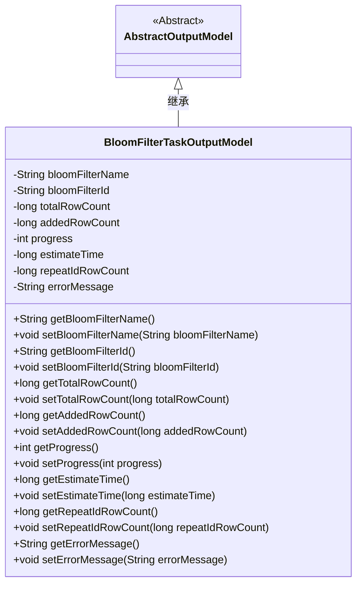

# 基础信息

|      |      |
|------|------|
| 名称 | BloomFilterTaskOutputModel |
| 编码语言 | .java |
| 代码路径 | WeFe/board/board-service/src/main/java/com/welab/wefe/board/service/dto/fusion/BloomFilterTaskOutputModel.java |
| 包名 | com.welab.wefe.board.service.dto.fusion |
| 依赖项 | ['com.welab.wefe.board.service.dto.entity.AbstractOutputModel', 'com.welab.wefe.common.fieldvalidate.annotation.Check'] |
| 概述说明 | BloomFilter任务输出模型类，包含过滤器名、ID、数据行数、进度、剩余耗时、重复主键数和错误信息等字段及其getter/setter方法。 |

# 说明

BloomFilterTaskOutputModel类继承自AbstractOutputModel，包含布隆过滤器任务输出的关键信息。该类定义了八个字段：过滤器名称、过滤器ID、总数据行数、已写入行数、任务进度百分比、预计剩余耗时、主键重复条数和错误消息。每个字段都有对应的getter和setter方法，用于获取和设置字段值。字段通过@Check注解进行校验，确保数据的有效性。

# 类列表 Class Summary

| 名称   | 类型  | 说明 |
|-------|------|-------------|
| BloomFilterTaskOutputModel | class | BloomFilterTaskOutputModel类包含布隆过滤器任务输出信息，如名称、ID、数据行数、进度、剩余时间和错误消息等字段及其getter/setter方法。 |

## 类 BloomFilterTaskOutputModel

|      |      |
|------|------|
| 访问范围 | public |
| 类型 | class |
| 名称 | BloomFilterTaskOutputModel |
| 说明 | BloomFilterTaskOutputModel类包含布隆过滤器任务输出信息，如名称、ID、数据行数、进度、剩余时间和错误消息等字段及其getter/setter方法。 |

### UML类图

类图描述：BloomFilterTaskOutputModel继承自抽象类AbstractOutputModel，包含布隆过滤器任务相关的输出属性，如过滤器名称、ID、数据行数统计、进度百分比、预计剩余耗时、主键重复数和错误消息等。所有属性均为私有，通过公有getter和setter方法进行访问和修改，符合JavaBean规范。

### 内部方法调用关系图

```mermaid
graph TD
    A["类BloomFilterTaskOutputModel"]
    B["继承: AbstractOutputModel"]
    C["注解属性: @Check '过滤器名'"]
    D["属性: String bloomFilterName"]
    E["注解属性: @Check '过滤器id'"]
    F["属性: String bloomFilterId"]
    G["注解属性: @Check '总数据行数'"]
    H["属性: long totalRowCount"]
    I["注解属性: @Check '已写入数据行数'"]
    J["属性: long addedRowCount"]
    K["注解属性: @Check '任务进度百分比'"]
    L["属性: int progress"]
    M["注解属性: @Check '预计剩余耗时'"]
    N["属性: long estimateTime"]
    O["注解属性: @Check '主键重复条数'"]
    P["属性: long repeatIdRowCount"]
    Q["注解属性: @Check '错误消息'"]
    R["属性: String errorMessage"]
    S["方法: get/setBloomFilterName"]
    T["方法: get/setBloomFilterId"]
    U["方法: get/setTotalRowCount"]
    V["方法: get/setAddedRowCount"]
    W["方法: get/setProgress"]
    X["方法: get/setEstimateTime"]
    Y["方法: get/setRepeatIdRowCount"]
    Z["方法: get/setErrorMessage"]

    A --> B
    A --> C
    C --> D
    A --> E
    E --> F
    A --> G
    G --> H
    A --> I
    I --> J
    A --> K
    K --> L
    A --> M
    M --> N
    A --> O
    O --> P
    A --> Q
    Q --> R
    A --> S
    A --> T
    A --> U
    A --> V
    A --> W
    A --> X
    A --> Y
    A --> Z
```

这段代码定义了一个BloomFilterTaskOutputModel类，继承自AbstractOutputModel，用于表示布隆过滤器任务的输出模型。类中包含多个带有@Check注解的属性，分别表示过滤器名称、ID、数据行数统计、任务进度、剩余时间估计、重复主键数和错误信息等。每个属性都有对应的getter和setter方法，用于封装属性的访问和修改。该模型主要用于跟踪和报告布隆过滤器任务的状态和结果。

### 字段列表 Field List

| 名称  | 类型  | 说明 |
|-------|-------|------|
| progress | int | 类私有整型变量progress，用于表示任务进度百分比，通过@Check注解标记。 |
| estimateTime | long | 定义长整型私有变量estimateTime，用于存储预计剩余耗时，通过@Check注解标记。 |
| totalRowCount | long | 定义了一个私有长整型变量totalRowCount，用于存储总数据行数，并通过@Check注解进行校验。 |
| bloomFilterId | String | 定义私有字符串变量bloomFilterId，使用@Check注解标记过滤器id。 |
| bloomFilterName | String | 代码定义了一个私有字符串变量bloomFilterName，并用@Check注解标记其名称为"过滤器名"。 |
| addedRowCount | long | 已写入数据行数的统计变量。 |
| errorMessage | String | Java字段定义：私有字符串errorMessage，使用@Check注解标记错误消息。 |
| repeatIdRowCount | long | 主键重复条数统计字段。 |

### 方法列表

| 名称  | 类型  | 说明 |
|-------|-------|------|
| getAddedRowCount | long | 获取新增行数的方法，返回长整型变量addedRowCount的值。 |
| getBloomFilterName | String | 方法返回布隆过滤器名称字符串。 |
| getProgress | int | 方法getProgress返回整型变量progress的值。 |
| getTotalRowCount | long | 获取总行数的方法，返回长整型数值totalRowCount。 |
| setEstimateTime | void | 设置预估时间的方法，参数为长整型estimateTime，将其赋值给类的同名成员变量。 |
| getBloomFilterId | String | 获取布隆过滤器ID的方法，直接返回成员变量bloomFilterId的值。 |
| getEstimateTime | long | 获取预估时间的方法，返回长整型数值estimateTime。 |
| getRepeatIdRowCount | long | 方法返回重复ID的行数。 |
| setRepeatIdRowCount | void | 设置重复ID的行数。 |
| getErrorMessage | String | 获取错误信息的方法，返回字符串类型的errorMessage。 |
| setErrorMessage | void | 设置错误信息的方法，将输入字符串赋值给类的errorMessage变量。 |
| setTotalRowCount | void | 设置总行数的方法，将参数totalRowCount赋值给类的同名成员变量。 |
| setAddedRowCount | void | 这是一个Java方法，用于设置新增行数的值。方法接收一个长整型参数addedRowCount，并将其赋值给类的同名成员变量。 |
| setProgress | void | 设置进度值的方法，将参数progress赋值给成员变量progress。 |
| setBloomFilterId | void | 设置布隆过滤器ID的方法，将输入参数赋值给类成员变量bloomFilterId。 |
| setBloomFilterName | void | 设置布隆过滤器名称的方法，将输入参数赋值给成员变量。 |

