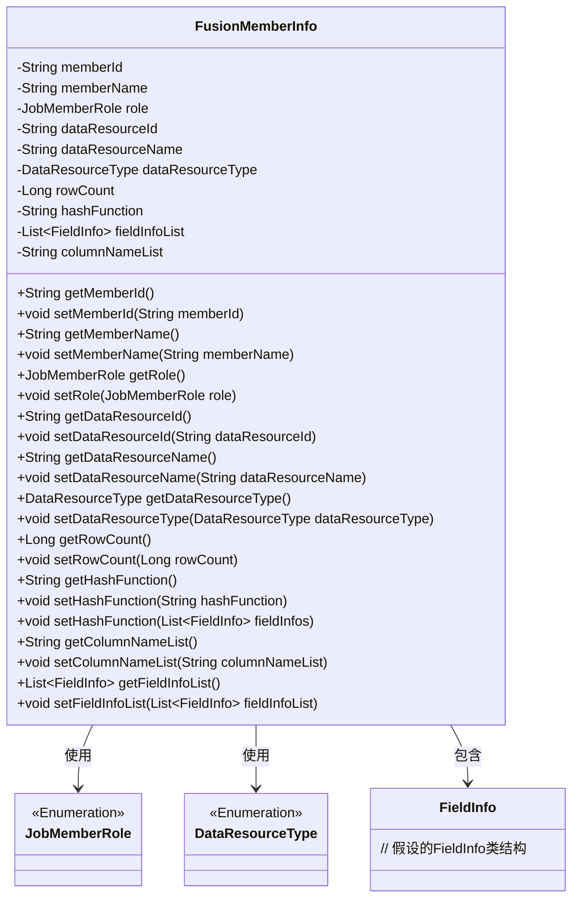

# 基础信息

|      |      |
|------|------|
| 名称 | FusionMemberInfo |
| 编码语言 | .java |
| 代码路径 | WeFe/board/board-service/src/main/java/com/welab/wefe/board/service/dto/fusion/FusionMemberInfo.java |
| 包名 | com.welab.wefe.board.service.dto.fusion |
| 依赖项 | ['com.welab.wefe.board.service.util.primarykey.FieldInfo', 'com.welab.wefe.board.service.util.primarykey.PrimaryKeyUtils', 'com.welab.wefe.common.wefe.enums.DataResourceType', 'com.welab.wefe.common.wefe.enums.JobMemberRole', 'java.util.List'] |
| 概述说明 | FusionMemberInfo类包含成员ID、名称、角色、数据资源信息、行数、哈希函数、字段列表和列名列表等属性，提供getter和setter方法。 |

# 说明

FusionMemberInfo类定义了成员信息的数据结构，包含成员ID、名称和角色。涉及数据资源ID、名称、类型、行数和哈希函数。包含字段信息列表和列名列表。提供各属性的getter和setter方法，支持通过字段列表设置哈希函数。

# 类列表 Class Summary

| 名称   | 类型  | 说明 |
|-------|------|-------------|
| FusionMemberInfo | class | FusionMemberInfo类包含成员ID、名称、角色，数据资源ID、名称、类型、行数、哈希函数、字段信息列表和列名列表，提供相关getter和setter方法。 |

## 类 FusionMemberInfo

|      |      |
|------|------|
| 访问范围 | public |
| 类型 | class |
| 名称 | FusionMemberInfo |
| 说明 | FusionMemberInfo类包含成员ID、名称、角色，数据资源ID、名称、类型、行数、哈希函数、字段信息列表和列名列表，提供相关getter和setter方法。 |

### UML类图

这段代码定义了一个`FusionMemberInfo`类，用于存储成员信息、数据资源信息和字段信息。该类包含多个私有字段和对应的getter/setter方法，用于管理成员ID、名称、角色、数据资源ID、名称、类型、行数、哈希函数、字段信息列表和列名列表。该类依赖于`JobMemberRole`和`DataResourceType`枚举类型，并包含`FieldInfo`类的列表。整体设计用于封装和管理数据融合过程中的成员相关信息。

### 内部方法调用关系图

这段代码定义了一个名为FusionMemberInfo的类，用于存储和管理成员信息及其相关数据资源信息。该类包含多个属性，如memberId、memberName、role等，以及对应的getter和setter方法。特别值得注意的是，hashFunction属性有两个setter方法，一个接受String参数，另一个接受List<FieldInfo>参数并调用PrimaryKeyUtils.hashFunction()方法生成哈希值。该类主要用于封装成员信息及其关联的数据资源信息，便于在程序中进行统一管理和操作。

### 字段列表 Field List

| 名称  | 类型  | 说明 |
|-------|-------|------|
| columnNameList | String | 字符串类型的列名列表变量。 |
| memberId | String | 成员ID字符串变量 |
| rowCount | Long | 声明长整型变量rowCount。 |
| dataResourceId | String | 字符串类型的数据资源ID。 |
| dataResourceName | String | 字符串数据资源名称。 |
| hashFunction | String | 字符串哈希函数 |
| fieldInfoList | List<FieldInfo> | 字段信息列表，存储多个FieldInfo对象。 |
| memberName | String | 声明字符串变量memberName |
| role | JobMemberRole | 定义了一个名为role的JobMemberRole类型变量。 |
| dataResourceType | DataResourceType | 定义了一个名为dataResourceType的变量，类型为DataResourceType。 |

### 方法列表

| 名称  | 类型  | 说明 |
|-------|-------|------|
| getMemberId | String | 获取成员ID的方法，返回成员ID字符串。 |
| setRole | void | 方法setRole用于设置成员角色，参数为JobMemberRole类型，直接赋值给当前对象的role属性。 |
| getDataResourceType | DataResourceType | 获取数据资源类型的方法，返回dataResourceType。 |
| getRole | JobMemberRole | 方法getRole返回JobMemberRole类型的成员变量role的值。 |
| getMemberName | String | 这是一个Java方法，返回成员变量memberName的值。 |
| setMemberName | void | 设置成员变量memberName的值。 |
| getHashFunction | String | 获取哈希函数名称的方法。 |
| setDataResourceType | void | 设置数据资源类型的方法，参数为DataResourceType类型，赋值给类的成员变量dataResourceType。 |
| setDataResourceId | void | 设置数据资源ID的方法，将输入参数赋值给类的成员变量dataResourceId。 |
| setMemberId | void | 设置成员ID的方法，将输入字符串赋值给类的成员变量memberId。 |
| setRowCount | void | 设置行数的方法，将参数rowCount赋值给类的成员变量rowCount。 |
| getDataResourceId | String | 获取数据资源ID的方法，返回字符串类型。 |
| getRowCount | Long | 获取行数的方法，返回rowCount值。 |
| setDataResourceName | void | 这是一个Java方法，用于设置类的数据资源名称属性。方法接收一个字符串参数，并将其赋值给类的成员变量dataResourceName。 |
| setHashFunction | void | 方法setHashFunction接收字段信息列表，调用PrimaryKeyUtils的hashFunction生成哈希函数并赋值给当前对象。 |
| getDataResourceName | String | 获取数据资源名称的方法，返回字符串类型值dataResourceName。 |
| setHashFunction | void | 这是一个Java方法，用于设置对象的hashFunction属性值。方法接受一个字符串参数，并将其赋值给当前对象的hashFunction字段。 |
| getColumnNameList | String | 获取列名列表的方法，返回字符串类型变量columnNameList。 |
| setColumnNameList | void | 设置列名列表的方法，将输入字符串赋值给类的列名列表变量。 |
| getFieldInfoList | List<FieldInfo> | 该方法返回一个FieldInfo类型的列表，即fieldInfoList。 |
| setFieldInfoList | void | 设置字段信息列表的方法，将输入参数赋值给类的成员变量fieldInfoList。 |

