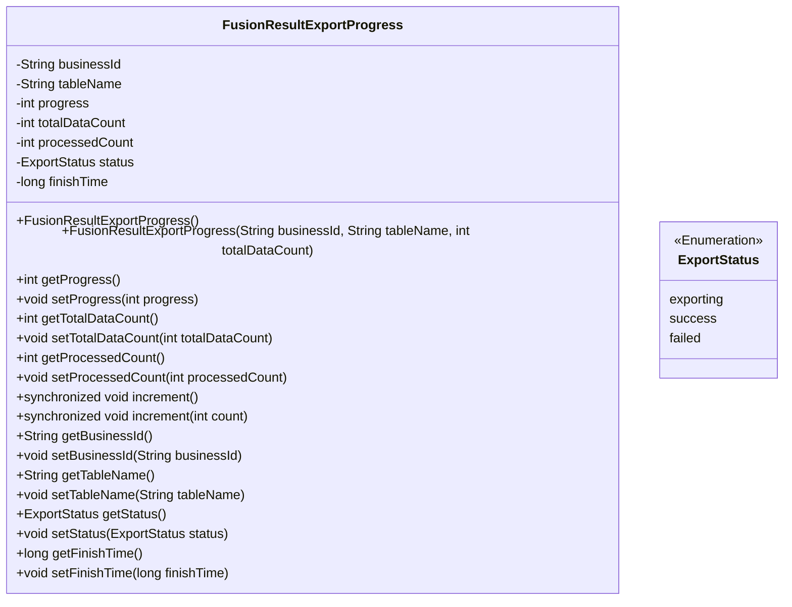

# 基础信息

|      |      |
|------|------|
| 名称 | FusionResultExportProgress |
| 编码语言 | .java |
| 代码路径 | WeFe/board/board-service/src/main/java/com/welab/wefe/board/service/dto/fusion/FusionResultExportProgress.java |
| 包名 | com.welab.wefe.board.service.dto.fusion |
| 依赖项 | ['com.welab.wefe.board.service.fusion.enums.ExportStatus'] |
| 概述说明 | FusionResultExportProgress类用于跟踪导出进度，包含业务ID、表名、进度、总数、已处理数、状态和完成时间，提供进度计算和增量更新方法。 |

# 说明

FusionResultExportProgress类用于跟踪数据导出进度，包含业务ID、表名、总数据量、已处理数量、进度百分比、状态和完成时间等属性。提供构造方法初始化导出任务，支持通过increment方法更新处理数量并自动计算进度，当处理完成时更新状态和完成时间。包含各属性的getter和setter方法。

# 类列表 Class Summary

| 名称   | 类型  | 说明 |
|-------|------|-------------|
| FusionResultExportProgress | class | FusionResultExportProgress类用于跟踪数据导出进度，包含业务ID、表名、总数、已处理数、状态和完成时间，提供进度计算和增量更新方法。 |

## 类 FusionResultExportProgress

|      |      |
|------|------|
| 访问范围 | public |
| 类型 | class |
| 名称 | FusionResultExportProgress |
| 说明 | FusionResultExportProgress类用于跟踪数据导出进度，包含业务ID、表名、总数、已处理数、状态和完成时间，提供进度计算和增量更新方法。 |

### UML类图

该类图展示了FusionResultExportProgress类的结构，该类用于跟踪数据导出任务的进度。包含核心字段如业务ID、表名、进度百分比、总数据量、已处理数量等，通过synchronized方法实现线程安全的进度更新，当处理完成时自动更新状态和时间戳。ExportStatus枚举定义了导出任务的三种状态。该类通过计算已处理数量与总量的比例自动生成进度值，并提供了完整的getter/setter方法。

### 内部方法调用关系图

```mermaid
graph TD
    A["类FusionResultExportProgress"]
    B["属性: String businessId"]
    C["属性: String tableName"]
    D["属性: int progress"]
    E["属性: int totalDataCount"]
    F["属性: int processedCount"]
    G["属性: ExportStatus status"]
    H["属性: long finishTime"]
    I["构造方法: FusionResultExportProgress()"]
    J["构造方法: FusionResultExportProgress(String businessId, String tableName, int totalDataCount)"]
    K["方法: int getProgress()"]
    L["方法: void setProgress(int progress)"]
    M["方法: int getTotalDataCount()"]
    N["方法: void setTotalDataCount(int totalDataCount)"]
    O["方法: int getProcessedCount()"]
    P["方法: void setProcessedCount(int processedCount)"]
    Q["同步方法: void increment()"]
    R["同步方法: void increment(int count)"]
    S["方法: String getBusinessId()"]
    T["方法: void setBusinessId(String businessId)"]
    U["方法: String getTableName()"]
    V["方法: void setTableName(String tableName)"]
    W["方法: ExportStatus getStatus()"]
    X["方法: void setStatus(ExportStatus status)"]
    Y["方法: long getFinishTime()"]
    Z["方法: void setFinishTime(long finishTime)"]

    A --> B
    A --> C
    A --> D
    A --> E
    A --> F
    A --> G
    A --> H
    A --> I
    A --> J
    A --> K
    A --> L
    A --> M
    A --> N
    A --> O
    A --> P
    A --> Q
    A --> R
    A --> S
    A --> T
    A --> U
    A --> V
    A --> W
    A --> X
    A --> Y
    A --> Z
```

该流程图展示了FusionResultExportProgress类的完整结构，包含8个属性字段、2个构造方法和16个成员方法。核心功能包括：通过increment()方法同步更新处理进度，自动计算导出百分比(getProgress)，当处理完成时自动标记状态为success并记录完成时间。所有属性均配有getter/setter方法，其中progress字段的计算逻辑涉及浮点数转换和百分比计算。

### 字段列表 Field List

| 名称  | 类型  | 说明 |
|-------|-------|------|
| progress | int | 整型变量progress，用于记录进度。 |
| tableName | String | 定义字符串变量tableName，用于存储表名。 |
| finishTime | long | 长整型完成时间变量 |
| totalDataCount | int | 变量totalDataCount用于存储数据总数。 |
| status | ExportStatus | 变量status表示导出状态。 |
| businessId | String | 业务标识字符串 |
| processedCount | int | 已处理的计数变量。 |

### 方法列表

| 名称  | 类型  | 说明 |
|-------|-------|------|
| setProgress | void | 设置进度值的方法，将参数progress赋值给成员变量progress。 |
| increment | void | 同步方法increment用于增加计数，若count为负则直接返回。处理计数累加后，若达到总量则标记完成时间和状态为成功。 |
| setTableName | void | 这是一个Java方法，用于设置类的tableName属性值。方法接收一个字符串参数tableName，并将其赋值给类的同名成员变量。 |
| getTableName | String | 方法返回表名变量tableName的值。 |
| setBusinessId | void | 方法setBusinessId用于设置businessId字段的值，参数为String类型。 |
| getProgress | int | 该方法计算并返回处理进度百分比，将已处理数量除以总数乘以100后取整。 |
| getBusinessId | String | 这是一个Java方法，返回字符串类型的businessId。 |
| setProcessedCount | void | 设置已处理数量方法，将参数processedCount赋值给类的成员变量processedCount。 |
| getTotalDataCount | int | 这是一个Java方法，返回整型变量totalDataCount的值。 |
| getStatus | ExportStatus | 获取当前导出状态的方法，返回ExportStatus对象。 |
| getProcessedCount | int | 获取已处理数量的方法，返回整型值processedCount。 |
| increment | void | 同步方法increment()用于增加计数，当处理数达到总数时记录完成时间并更新状态为成功。 |
| setTotalDataCount | void | 设置总数据量的方法，将输入参数赋值给类的成员变量totalDataCount。 |
| setStatus | void | 设置导出状态的方法，将传入的状态参数赋值给类的status属性。 |
| getFinishTime | long | 获取完成时间的方法，返回finishTime值。 |
| setFinishTime | void | 设置完成时间的方法，参数为长整型finishTime。 |

