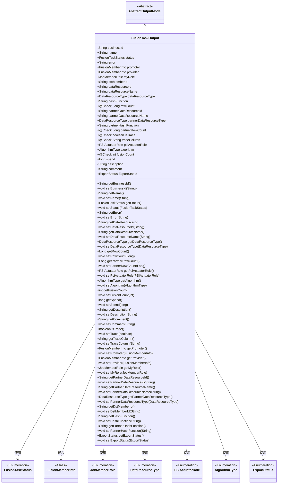

# 基础信息

|      |      |
|------|------|
| 名称 | FusionTaskOutput |
| 编码语言 | .java |
| 代码路径 | WeFe/board/board-service/src/main/java/com/welab/wefe/board/service/dto/fusion/FusionTaskOutput.java |
| 包名 | com.welab.wefe.board.service.dto.fusion |
| 依赖项 | ['com.welab.wefe.board.service.dto.entity.AbstractOutputModel', 'com.welab.wefe.board.service.dto.entity.data_resource.output.BloomFilterOutputModel', 'com.welab.wefe.board.service.dto.entity.data_resource.output.TableDataSetOutputModel', 'com.welab.wefe.board.service.fusion.enums.ExportStatus', 'com.welab.wefe.common.fieldvalidate.annotation.Check', 'com.welab.wefe.common.wefe.enums.DataResourceType', 'com.welab.wefe.common.wefe.enums.JobMemberRole', 'com.welab.wefe.fusion.core.enums.AlgorithmType', 'com.welab.wefe.fusion.core.enums.FusionTaskStatus', 'com.welab.wefe.fusion.core.enums.PSIActuatorRole', 'javax.persistence.Column', 'javax.persistence.EnumType', 'javax.persistence.Enumerated', 'java.util.List'] |
| 概述说明 | FusionTaskOutput类包含任务ID、名称、状态、错误信息、成员角色、数据资源信息、算法类型、追踪字段、耗时等属性，用于描述融合任务的输出结果。 |

# 说明

FusionTaskOutput类是一个继承自AbstractOutputModel的模型类，用于表示融合任务的输出信息。它包含多个字段，如业务ID、任务名称、状态、错误信息、发起者和提供者信息、成员角色、数据资源ID和名称、数据类型、哈希函数、行数、跟踪字段、算法类型、融合次数、耗时、描述、评论和导出状态等。每个字段都有对应的getter和setter方法，用于获取和设置字段值。该类还包含一些带有@Check注解的字段，用于验证数据的有效性。整体上，该类提供了对融合任务输出信息的全面封装和管理。

# 类列表 Class Summary

| 名称   | 类型  | 说明 |
|-------|------|-------------|
| FusionTaskOutput | class | FusionTaskOutput类用于描述数据融合任务输出，包含任务ID、状态、参与者信息、数据资源详情、算法类型、行数统计及追踪字段等属性。 |

## 类 FusionTaskOutput

|      |      |
|------|------|
| 访问范围 | public |
| 类型 | class |
| 名称 | FusionTaskOutput |
| 说明 | FusionTaskOutput类用于描述数据融合任务输出，包含任务ID、状态、参与者信息、数据资源详情、算法类型、行数统计及追踪字段等属性。 |

### UML类图

该类图展示了FusionTaskOutput类继承自AbstractOutputModel，包含多个枚举类型和自定义类型的属性，主要用于描述融合任务的输出结果。该类具有丰富的字段和方法，用于跟踪任务状态、数据资源信息、参与者角色以及各种统计指标，并通过注解进行校验标记。与多个枚举类关联，体现了任务的多维度状态管理和类型控制能力。

### 内部方法调用关系图

该流程图展示了FusionTaskOutput类的完整结构，该类继承自AbstractOutputModel，包含25个属性和对应的getter/setter方法。属性涵盖业务ID、任务状态、错误信息、成员角色、数据资源信息、哈希函数、行数统计、跟踪标记、算法类型等核心字段，其中多个属性带有@Check注解。类结构清晰地反映了数据融合任务输出模型的完整数据结构，适用于复杂的数据处理场景。

### 字段列表 Field List

| 名称  | 类型  | 说明 |
|-------|-------|------|
| partnerDataResourceId | String | partnerDataResourceId是存储合作伙伴数据资源ID的字符串变量。 |
| psiActuatorRole | PSIActuatorRole | 定义变量psiActuatorRole，类型为PSIActuatorRole。 |
| spend | long | 变量spend为长整型，表示花费金额。 |
| partnerHashFunction | String | 字符串类型的合作伙伴哈希函数变量。 |
| status | FusionTaskStatus | FusionTaskStatus变量status用于表示任务状态。 |
| rowCount | Long | 检查数据资源行数的字段，类型为长整型。 |
| businessId | String | 私有字符串类型变量businessId，用于存储业务标识。 |
| traceColumn | String | 代码定义了一个公共字符串变量traceColumn，使用@Check注解标记为追踪字段。 |
| algorithm | AlgorithmType | 声明一个名为algorithm的AlgorithmType类型变量。 |
| dstMemberId | String | 定义字符串类型变量dstMemberId。 |
| dataResourceName | String | 字符串类型的数据资源名称变量。 |
| description | String | 私有字符串类型变量description，用于存储描述信息。 |
| fusionCount | int | 公共整型变量fusionCount，用于记录融合数量，带有数量检查注解。 |
| provider | FusionMemberInfo | FusionMemberInfo提供者，用于管理成员信息。 |
| comment | String | 声明一个公共字符串变量comment。 |
| hashFunction | String | 字符串哈希函数变量声明。 |
| promoter | FusionMemberInfo | 融合成员信息发起者。 |
| ExportStatus | ExportStatus | 定义了一个名为ExportStatus的公共变量，类型为ExportStatus。 |
| partnerDataResourceType | DataResourceType | 定义了一个名为partnerDataResourceType的变量，类型为DataResourceType。 |
| name | String | 声明一个字符串变量name。 |
| isTrace | boolean | 检查是否为追踪的布尔变量isTrace。 |
| dataResourceType | DataResourceType | 声明一个名为dataResourceType的变量，类型为DataResourceType。 |
| myRole | JobMemberRole | 声明一个名为myRole的JobMemberRole类型变量。 |
| dataResourceId | String | 字符串类型的数据资源标识符。 |
| error | String | 字符串错误变量 |
| partnerRowCount | Long | 检查数据资源行数的字段，类型为长整型。 |
| partnerDataResourceName | String | 字符串类型变量，用于存储合作伙伴数据资源名称。 |

### 方法列表

| 名称  | 类型  | 说明 |
|-------|-------|------|
| setComment | void | 这是一个Java方法，用于设置对象的comment属性值。方法接收一个字符串参数comment，并将其赋值给当前对象的comment成员变量。 |
| setDescription | void | 这是一个Java方法，用于设置对象的描述属性。方法接收一个字符串参数description，并将其赋值给对象的description成员变量。 |
| getPromoter | FusionMemberInfo | 获取推广者信息的公开方法，返回FusionMemberInfo类型的promoter对象。 |
| setDataResourceName | void | 设置数据资源名称的方法，将输入参数赋值给类的成员变量。 |
| setBusinessId | void | 设置业务ID的方法，将输入字符串赋值给类的businessId成员变量。 |
| getDataResourceType | DataResourceType | 获取数据资源类型的方法，返回dataResourceType。 |
| getProvider | FusionMemberInfo | 获取当前提供者的FusionMemberInfo对象。 |
| getFusionCount | int | 获取当前融合计数的方法，返回整型变量fusionCount的值。 |
| getDataResourceId | String | 获取数据资源ID的方法，返回字符串类型的数据资源ID。 |
| setDataResourceType | void | 设置数据资源类型的方法，将传入的dataResourceType赋值给当前对象的同名属性。 |
| setTrace | void | 设置跟踪状态的方法，将布尔参数trace赋值给isTrace变量。 |
| setFusionCount | void | 设置融合计数方法，将输入参数赋值给类成员变量fusionCount。 |
| setPartnerDataResourceName | void | 设置合作伙伴数据资源名称的方法，将输入参数赋值给类成员变量。 |
| getPsiActuatorRole | PSIActuatorRole | 获取PSI执行器角色。 |
| setStatus | void | 这是一个Java方法，用于设置任务状态。方法名为setStatus，接受一个FusionTaskStatus类型的参数status，并将其赋值给当前对象的status属性。 |
| setTraceColumn | void | 设置跟踪列字段的值。 |
| getDescription | String | 获取描述信息的方法，返回字符串类型的描述内容。 |
| setDstMemberId | void | 设置目标成员ID的方法，将参数值赋给类的成员变量dstMemberId。 |
| setHashFunction | void | 这是一个Java方法，用于设置对象的hashFunction属性值。方法接收一个字符串参数并将其赋值给成员变量。 |
| setPartnerDataResourceId | void | 设置合作伙伴数据资源ID的方法，将参数值赋给类的成员变量partnerDataResourceId。 |
| setAlgorithm | void | 设置算法类型的方法，将参数赋值给成员变量algorithm。 |
| getName | String | 获取名称的方法，返回字符串类型的name变量值。 |
| setMyRole | void | Java方法：设置当前角色，参数为JobMemberRole类型。 |
| getPartnerRowCount | Long | 获取partnerRowCount的数值。 |
| setPsiActuatorRole | void | 设置PSI执行器角色，将输入参数赋值给类成员变量psiActuatorRole。 |
| getTraceColumn | String | 获取追踪列字段值的方法。 |
| getPartnerDataResourceName | String | 获取合作伙伴数据资源名称的方法，返回字符串类型变量partnerDataResourceName。 |
| setRowCount | void | 设置行数为指定值。 |
| setSpend | void | 设置花费金额的方法，将参数值赋给类成员变量spend。 |
| getDataResourceName | String | 该方法返回数据资源名称。 |
| getPartnerDataResourceType | DataResourceType | 获取合作伙伴数据资源类型的方法，返回partnerDataResourceType。 |
| setPartnerDataResourceType | void | 设置合作伙伴数据资源类型的方法，将输入参数赋值给成员变量partnerDataResourceType。 |
| setProvider | void | 设置提供者信息，将传入的FusionMemberInfo对象赋值给成员变量provider。 |
| setPartnerRowCount | void | 设置合作伙伴行数的方法，将输入值赋给类变量partnerRowCount。 |
| getError | String | 获取错误信息的字符串方法。 |
| getStatus | FusionTaskStatus | 获取当前任务状态的方法，返回FusionTaskStatus类型的状态值。 |
| setDataResourceId | void | 设置数据资源ID的方法，将输入参数赋值给类的成员变量dataResourceId。 |
| setPromoter | void | 设置推广人信息，参数为FusionMemberInfo类型。 |
| getPartnerHashFunction | String | 获取合作伙伴哈希函数的方法，返回值为partnerHashFunction。 |
| setPartnerHashFunction | void | 设置合作伙伴哈希函数的方法。 |
| getExportStatus | com.welab.wefe.board.service.fusion.enums.ExportStatus | Java方法：获取导出状态，返回枚举类型ExportStatus。 |
| setExportStatus | void | 设置导出状态方法，参数为枚举类型ExportStatus，将传入值赋给类变量ExportStatus。 |
| getRowCount | Long | 获取行数的方法，返回长整型数值rowCount。 |
| setError | void | 设置错误信息的方法，将传入的字符串赋值给类的error属性。 |
| isTrace | boolean | 方法isTrace返回布尔值isTrace，用于检查跟踪状态。 |
| getPartnerDataResourceId | String | 获取合作伙伴数据资源ID的方法，返回字符串类型的partnerDataResourceId。 |
| getSpend | long | 获取spend变量值的公有方法，返回long类型。 |
| getHashFunction | String | 获取哈希函数名称的方法。 |
| getDstMemberId | String | 获取目标成员ID的方法，返回字符串类型的dstMemberId。 |
| getMyRole | JobMemberRole | 获取当前用户的角色信息。 |
| getComment | String | 获取comment字符串的方法。 |
| getBusinessId | String | 获取业务ID的方法，返回字符串类型的businessId。 |
| setName | void | 设置对象名称的方法，将参数name赋值给对象的name属性。 |
| getAlgorithm | AlgorithmType | 获取当前算法类型的方法。 |

