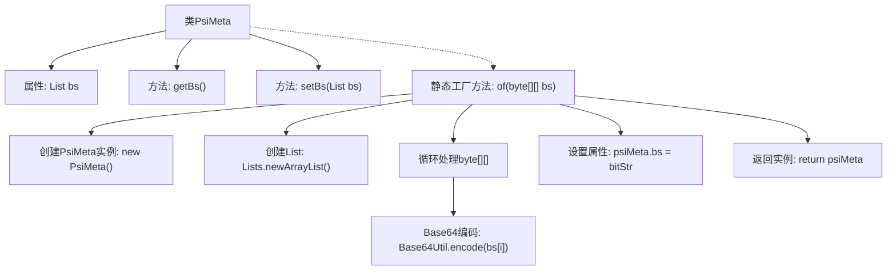

# 基础信息

|      |      |
|------|------|
| 名称 | PsiMeta |
| 编码语言 | .java |
| 代码路径 | WeFe/board/board-service/src/main/java/com/welab/wefe/board/service/dto/fusion/PsiMeta.java |
| 包名 | com.welab.wefe.board.service.dto.fusion |
| 依赖项 | ['com.welab.wefe.common.util.Base64Util', 'org.apache.commons.compress.utils.Lists', 'java.util.List'] |
| 概述说明 | PsiMeta类包含字符串列表bs，提供getter和setter方法。静态方法of将字节数组转换为Base64编码字符串列表并创建PsiMeta实例。 |

# 说明

PsiMeta类是一个包含字符串列表bs的简单数据结构。它提供了获取和设置bs列表的方法getBs和setBs。类中还定义了一个静态工厂方法of，该方法接受二维字节数组bs作为参数，将每个字节数组元素使用Base64编码转换为字符串，并存入新创建的PsiMeta对象的bs列表中，最后返回该对象。整个过程不涉及复杂逻辑，主要用于封装和处理Base64编码后的字符串列表。

# 类列表 Class Summary

| 名称   | 类型  | 说明 |
|-------|------|-------------|
| PsiMeta | class | PsiMeta类包含字符串列表bs，提供get/set方法，静态方法of将字节数组转为Base64编码字符串列表并返回PsiMeta实例。 |


## 类 PsiMeta

|      |      |
|------|------|
| 访问范围 | public |
| 类型 | class |
| 名称 | PsiMeta |
| 说明 | PsiMeta类包含字符串列表bs，提供get/set方法，静态方法of将字节数组转为Base64编码字符串列表并返回PsiMeta实例。 |


### UML类图

```mermaid
classDiagram
    class PsiMeta {
        -List~String~ bs
        +List~String~ getBs()
        +void setBs(List~String~ bs)
        +static PsiMeta of(byte[][] bs)
    }
    // PsiMeta 类包含一个私有成员bs，类型为List<String>，提供getter和setter方法
    // of静态方法接收二维字节数组，将其元素Base64编码后存入List，创建并返回PsiMeta实例
```

这段代码定义了一个名为PsiMeta的简单Java类，主要用于封装和处理Base64编码的字节数组列表。类中包含一个私有成员bs（字符串列表），通过getter和setter方法进行访问和修改。核心功能是通过静态工厂方法of()，将输入的二维字节数组逐个进行Base64编码后存储到列表中，最终返回包含编码结果的PsiMeta对象。这种设计模式常用于对象创建和初始化分离的场景，特别适合需要预处理输入数据的场景。


### 内部方法调用关系图



这段代码展示了一个PsiMeta类，主要用于处理字节数组的Base64编码转换。流程图清晰地呈现了类结构，包括属性bs、getter/setter方法，以及关键的静态工厂方法of()。of()方法通过创建空列表、循环处理输入字节数组、进行Base64编码、最终填充列表并返回实例，实现了字节数组到Base64字符串列表的转换过程。各步骤通过箭头连接，完整展现了对象创建和数据处理的逻辑链条。

### 字段列表 Field List

| 名称  | 类型  | 说明 |
|-------|-------|------|
| bs | List<String> | 声明一个名为bs的字符串列表变量。 |

### 方法列表

| 名称  | 类型  | 说明 |
|-------|-------|------|
| getBs | List<String> | 方法getBs返回字符串列表bs。 |
| setBs | void | 这是一个Java方法，用于设置类成员变量bs的值，参数为字符串列表。 |
| of | PsiMeta | 静态方法`of`接收二维字节数组，将每项Base64编码后存入列表，封装为PsiMeta对象返回。 |


