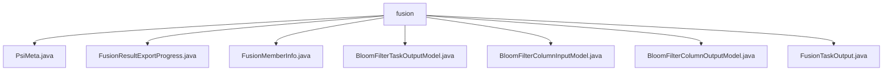

# 基础信息

|      |      |
|------|------|
| 名称 | fusion |
| 编码语言 | .java |
| 代码路径 | WeFe/board/board-service/src/main/java/com/welab/wefe/board/service/dto/fusion |
| 包名 | docs.board.board-service.src.main.java.com.welab.wefe.board.service.dto.fusion |
| 概述说明 | PsiMeta类封装Base64字符串列表。FusionResultExportProgress跟踪导出进度。FusionMemberInfo存储成员信息。BloomFilterTaskOutputModel记录布隆过滤器任务状态。BloomFilterColumnInputModel校验字段输入。BloomFilterColumnOutputModel描述字段输出。FusionTaskOutput封装融合任务信息。 |

# 说明

## 概述  
该模块核心职责是管理数据融合过程中的元信息、进度跟踪和任务输出，类似数据流水线控制器。接口规范包含基础CRUD操作和状态更新方法，例如PsiMeta的Base64编码转换和FusionResultExportProgress的进度计算。关键数据结构包括PsiMeta（字符串列表）、FusionMemberInfo（成员元数据）、BloomFilter系列模型（字段级控制）和FusionTaskOutput（全链路任务封装）。外部依赖涉及Base64编码、正则校验（如长度限制）和AbstractOutputModel基类。

## 主要业务场景  
模块支持数据融合全生命周期管理，典型流程为：初始化布隆过滤器字段（BloomFilterColumnInputModel）→执行融合任务（FusionTaskOutput）→跟踪导出进度（FusionResultExportProgress）。交互模式采用状态驱动，例如通过increment方法自动更新进度百分比。完整功能涵盖元数据封装（如FusionMemberInfo的角色管理）、数据校验（@Check注解）和结果导出（如BloomFilterTaskOutputModel的主键去重统计）。典型应用包括多源数据融合、成员协作任务分发等。

### 包内部结构视图

该流程图展示了WeFe项目中board-service模块下fusion数据目录的结构关系。fusion作为父节点，直接包含7个DTO类文件，包括PsiMeta、FusionResultExportProgress等，这些文件都位于同一层级且没有子目录。所有文件均用于处理数据融合相关的业务逻辑，体现了该模块在数据融合功能实现上的完整性和模块化设计。

# 文件列表

| 名称   | 类型  | 说明 |
|-------|------|-------------|
| [PsiMeta.java](PsiMeta.md) | file | PsiMeta类包含字符串列表bs，提供getter和setter方法。静态方法of将字节数组转换为Base64编码字符串列表并创建PsiMeta实例。 |
| [FusionResultExportProgress.java](FusionResultExportProgress.md) | file | FusionResultExportProgress类用于跟踪导出进度，包含业务ID、表名、进度、总数、已处理数、状态和完成时间，提供进度计算和增量更新方法。 |
| [FusionMemberInfo.java](FusionMemberInfo.md) | file | FusionMemberInfo类包含成员ID、名称、角色、数据资源信息、行数、哈希函数、字段列表和列名列表等属性，提供getter和setter方法。 |
| [BloomFilterTaskOutputModel.java](BloomFilterTaskOutputModel.md) | file | BloomFilter任务输出模型类，包含过滤器名、ID、数据行数、进度、剩余耗时、重复主键数和错误信息等字段及其getter/setter方法。 |
| [BloomFilterColumnInputModel.java](BloomFilterColumnInputModel.md) | file | BloomFilterColumnInputModel类继承AbstractCheckModel，包含字段名称、数据类型和注释属性，注释长度限制250字符，数据类型必填校验。 |
| [BloomFilterColumnOutputModel.java](BloomFilterColumnOutputModel.md) | file | BloomFilterColumnOutputModel类继承AbstractOutputModel，包含过滤器ID、字段序号、名称、数据类型、注释、空值行数和数值分布等属性及其getter/setter方法。 |
| [FusionTaskOutput.java](FusionTaskOutput.md) | file | FusionTaskOutput类包含任务ID、名称、状态、错误信息、成员角色、数据资源信息、算法类型、追踪字段、耗时等属性，用于描述融合任务的输出结果。 |

