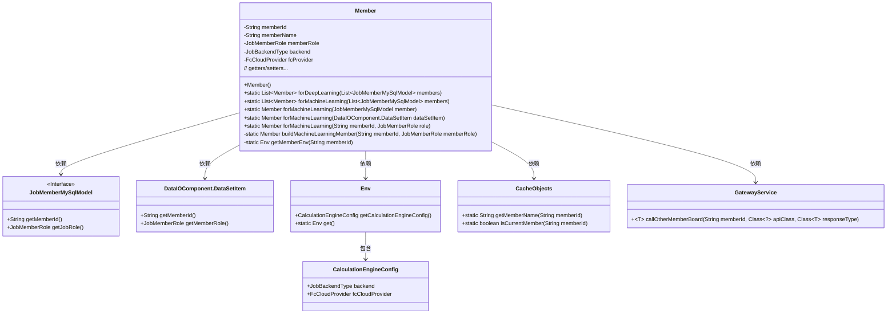

# 基础信息

|      |      |
|------|------|
| 名称 | Member |
| 编码语言 | .java |
| 代码路径 | WeFe/board/board-service/src/main/java/com/welab/wefe/board/service/dto/kernel/Member.java |
| 包名 | com.welab.wefe.board.service.dto.kernel |
| 依赖项 | ['com.welab.wefe.board.service.api.member.GetMemberMachineLearningEnvApi', 'com.welab.wefe.board.service.component.DataIOComponent', 'com.welab.wefe.board.service.database.entity.job.JobMemberMySqlModel', 'com.welab.wefe.board.service.dto.kernel.machine_learning.Env', 'com.welab.wefe.board.service.service.CacheObjects', 'com.welab.wefe.board.service.service.GatewayService', 'com.welab.wefe.common.exception.StatusCodeWithException', 'com.welab.wefe.common.web.Launcher', 'com.welab.wefe.common.wefe.enums.FcCloudProvider', 'com.welab.wefe.common.wefe.enums.JobBackendType', 'com.welab.wefe.common.wefe.enums.JobMemberRole', 'java.util.ArrayList', 'java.util.List'] |
| 概述说明 | Member类表示成员信息，包含ID、名称、角色、后端类型和云提供商。提供深度学习与机器学习的成员列表构建方法，支持从不同数据源创建成员对象，并设置相关环境配置。 |

# 说明

该代码定义了一个Member类，用于表示成员信息，包含成员ID、名称、角色、后端类型和云服务提供商等属性。提供了两种静态工厂方法：forDeepLearning和forMachineLearning，分别用于创建深度学习与机器学习的成员对象列表。其中forMachineLearning有多个重载版本，支持从不同数据源构建成员对象，并会通过getMemberEnv方法获取成员环境配置，设置后端类型和云服务商。类中还包含了所有属性的getter和setter方法。

# 类列表 Class Summary

| 名称   | 类型  | 说明 |
|-------|------|-------------|
| Member | class | Member类用于创建深度学习或机器学习的成员对象，包含成员ID、名称、角色、后端类型和云提供商信息，提供静态方法构建不同场景的成员列表或单个成员。 |

## 类 Member

|      |      |
|------|------|
| 访问范围 | public |
| 类型 | class |
| 名称 | Member |
| 说明 | Member类用于创建深度学习或机器学习的成员对象，包含成员ID、名称、角色、后端类型和云提供商信息，提供静态方法构建不同场景的成员列表或单个成员。 |

### UML类图

类图描述：该图展示了Member类及其相关依赖关系。Member类包含成员信息和角色等属性，提供静态工厂方法创建深度学习/机器学习场景的实例。通过JobMemberMySqlModel和DataSetItem接口获取数据，依赖CacheObjects获取缓存数据，使用GatewayService远程调用其他成员环境。Env类包含计算引擎配置信息，CalculationEngineConfig存储后端类型和云供应商配置。

### 内部方法调用关系图

该流程图展示了Member类的完整结构，包含5个私有属性、1个构造方法和7个核心业务方法。主要逻辑集中在forMachineLearning系列方法，它们最终都会调用buildMachineLearningMember来构建对象，该方法会通过getMemberEnv获取环境配置，并根据backend类型设置fcProvider。流程图特别突出了方法间的调用链和条件分支，尤其是环境获取时的本地/远程双路径逻辑。

### 字段列表 Field List

| 名称  | 类型  | 说明 |
|-------|-------|------|
| fcProvider | FcCloudProvider | 私有云服务提供者变量fcProvider。 |
| memberName | String | 私有字符串类型变量，存储成员名称。 |
| memberId | String | 声明一个私有字符串类型变量memberId。 |
| backend | JobBackendType | 定义了一个私有变量backend，类型为JobBackendType。 |
| memberRole | JobMemberRole | 私有成员变量，类型为JobMemberRole，表示工作成员角色。 |

### 方法列表

| 名称  | 类型  | 说明 |
|-------|-------|------|
| forMachineLearning | List<Member> | 将JobMemberMySqlModel列表转换为Member列表，若输入为空则返回空列表。逐个调用forMachineLearning方法转换每个元素。 |
| forDeepLearning | List<Member> | 将JobMemberMySqlModel列表转换为Member列表，包含memberId、memberName和memberRole字段。若输入为空返回空列表。 |
| setMemberName | void | 定义了一个公共方法setMemberName，用于设置成员变量memberName的值。 |
| forMachineLearning | Member | 静态方法forMachineLearning根据成员ID和角色构建机器学习成员对象。 |
| getMemberEnv | Env | 方法getMemberEnv根据memberId获取环境信息：若为当前用户则从本地获取，否则通过GatewayService远程调用GetMemberMachineLearningEnvApi接口获取，异常时返回null。 |
| forMachineLearning | Member | 该方法为机器学习场景创建成员对象，接收成员ID和角色参数，调用内部构建方法返回成员实例。 |
| buildMachineLearningMember | Member | 构建机器学习成员对象：设置ID、名称、角色，根据环境配置后端类型，若为FC则添加云提供商信息。 |
| getMemberName | String | 获取成员名称的方法，返回成员名字符串。 |
| forMachineLearning | Member | 静态方法forMachineLearning根据DataSetItem创建机器学习成员，调用buildMachineLearningMember并传入成员ID和角色参数。 |
| getMemberRole | JobMemberRole | 方法返回成员角色对象。 |
| getBackend | JobBackendType | 获取JobBackendType类型的backend属性值的方法。 |
| setMemberId | void | 设置成员ID的方法，将传入的字符串参数赋值给类的成员变量memberId。 |
| setMemberRole | void | 方法setMemberRole用于设置成员角色，参数为JobMemberRole类型，赋值给成员变量memberRole。 |
| getMemberId | String | 获取成员ID的方法，返回字符串类型的memberId。 |
| setBackend | void | 设置任务后端类型的方法，将传入的backend参数赋值给当前对象的backend属性。 |
| getFcProvider | FcCloudProvider | 获取FcCloudProvider实例的方法，返回fcProvider对象。 |
| setFcProvider | void | 设置FcCloudProvider实例的方法，将参数fcProvider赋值给当前对象的fcProvider属性。 |

