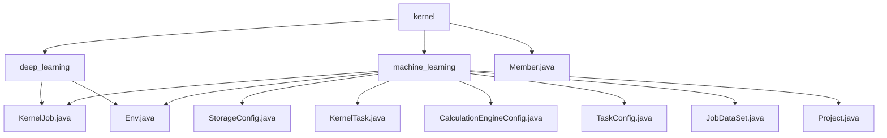

# 基础信息

|      |      |
|------|------|
| 名称 | kernel |
| 编码语言 | .java |
| 代码路径 | WeFe/board/board-service/src/main/java/com/welab/wefe/board/service/dto/kernel |
| 包名 | docs.board.board-service.src.main.java.com.welab.wefe.board.service.dto.kernel |
| 概述说明 | 模块管理联邦学习任务配置与执行，含KernelJob任务结构、Env环境配置。支持多方协作，主从交互，流程包括初始化、资源配置、提交集群。Member类定义成员信息，提供工厂方法创建不同学习类型成员对象。 |

# 说明

## 概述  
该模块核心职责是统一管理联邦学习与深度学习的任务配置、执行环境及成员拓扑，类似任务调度中心与配置中枢的混合体。接口规范遵循JavaBean标准，通过静态方法（如StorageConfig.get()）和注解（@Check/@JSONField）控制序列化行为。关键数据结构包括三层封装：任务元数据（KernelJob）、成员拓扑（KernelTask/Member）和计算配置（CalculationEngineConfig）。外部依赖涉及分布式训练框架（如PaddleFL）、MySQL持久化及GlobalConfigService配置服务。例如Env类通过工作模式开关切换存储策略，Member类则根据任务类型（深度学习/机器学习）动态构建成员列表。

## 主要业务场景  
模块支持跨机构联合建模的全生命周期管理，采用"配置驱动执行"与主从式交互混合模式。典型流程为：初始化Env环境→配置成员拓扑（如Member.forMachineLearning构建混合联盟）→绑定数据集→通过KernelJob派发任务。功能完整性体现在成员管理（角色/云服务商）、多后端切换（如CalculationEngineConfig支持FC云厂商）及可视化监控（useVdl开关）。API集成案例包括环境预检、动态配置加载（get()）和任务序列化（toJson()）。例如Project类通过projectId关联任务实例，而Env类可强制单Worker模式以适配小规模测试。

### 包内部结构视图

该流程图展示了kernel目录下的层级结构，包含deep_learning和machine_learning两个子目录以及一个独立文件Member.java。deep_learning目录下包含KernelJob.java和Env.java两个文件，machine_learning目录下则包含多个配置文件如StorageConfig.java、KernelTask.java等，以及两个与deep_learning目录同名的文件KernelJob.java和Env.java。

# 文件列表

| 名称   | 类型  | 说明 |
|-------|------|-------------|
| [deep_learning](deep_learning/_module.md) | package | KernelJob类定义分布式任务结构，含项目ID、任务类型、成员等属性。Env类管理训练环境配置，包括worker数量、设备信息等，强制单worker且设上限。 |
| [Member.java](Member.md) | file | Member类表示成员信息，包含ID、名称、角色、后端类型和云提供商。提供深度学习与机器学习的成员列表构建方法，支持从不同数据源创建成员对象，并设置相关环境配置。 |
| [machine_learning](machine_learning/_module.md) | package | StorageConfig类获取存储配置，检查类型非空。KernelTask类管理成员列表和提供者信息。CalculationEngineConfig类管理计算引擎配置，检查后端类型。KernelJob类封装联邦学习任务配置。TaskConfig类定义任务结构，含输入输出参数。JobDataSet类描述任务数据集信息。Project类封装项目ID。Env类管理环境配置和工作模式。 |

