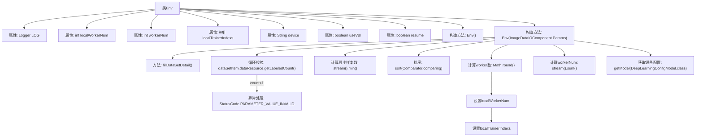

# 基础信息

|      |      |
|------|------|
| 名称 | Env |
| 编码语言 | .java |
| 代码路径 | WeFe/board/board-service/src/main/java/com/welab/wefe/board/service/dto/kernel/deep_learning/Env.java |
| 包名 | com.welab.wefe.board.service.dto.kernel.deep_learning |
| 依赖项 | ['com.welab.wefe.board.service.component.deep_learning.ImageDataIOComponent', 'com.welab.wefe.board.service.service.CacheObjects', 'com.welab.wefe.board.service.service.globalconfig.GlobalConfigService', 'com.welab.wefe.common.Convert', 'com.welab.wefe.common.StatusCode', 'com.welab.wefe.common.exception.StatusCodeWithException', 'com.welab.wefe.common.web.Launcher', 'com.welab.wefe.common.wefe.dto.global_config.DeepLearningConfigModel', 'org.slf4j.Logger', 'org.slf4j.LoggerFactory', 'java.util.Comparator', 'java.util.LinkedHashMap'] |
| 概述说明 | Env类管理分布式训练环境配置，包括worker数量计算（基于最小样本数，上限10）、本地worker索引、设备类型（CPU/GPU）、可视化开关及任务恢复标志。初始化时校验数据集标注量并排序成员，确保worker分配一致。 |

# 说明

Env类是一个环境配置类，主要用于管理分布式训练中的worker配置和设备信息。关键属性包括：localWorkerNum表示本方worker数量，基于最小样本数计算并限制最大值为10；workerNum表示所有参与方的worker总数；localTrainerIndexs存储本方worker的索引范围；device记录使用的计算设备；useVdl控制是否启用可视化；resume决定是否从上次中断处继续执行。构造函数会校验数据集标注量，计算各成员worker数，并初始化相关配置。当前实现强制每个成员使用1个worker，且对worker数量设置了上限限制。

# 类列表 Class Summary

| 名称   | 类型  | 说明 |
|-------|------|-------------|
| Env | class | Env类管理分布式训练环境配置，包括worker数量计算（基于最小样本数，上限10）、设备类型（CPU/GPU）、可视化开关及任务恢复选项。初始化时校验数据集标注量并分配worker索引。 |


## 类 Env

|      |      |
|------|------|
| 访问范围 | public |
| 类型 | class |
| 名称 | Env |
| 说明 | Env类管理分布式训练环境配置，包括worker数量计算（基于最小样本数，上限10）、设备类型（CPU/GPU）、可视化开关及任务恢复选项。初始化时校验数据集标注量并分配worker索引。 |


### UML类图

```mermaid
classDiagram
    class Env {
        -Logger LOG
        +int localWorkerNum
        +int workerNum
        +int[] localTrainerIndexs
        +String device
        +boolean useVdl
        +boolean resume
        +Env()
        +Env(ImageDataIOComponent~Params~ imageDataIoParam) throws StatusCodeWithException
    }

    class ImageDataIOComponent {
        <<Interface>>
    }
    // ImageDataIOComponent 接口包含 Params 和 DataSetItem 内部类
    class "ImageDataIOComponent.Params" {
        +List~DataSetItem~ dataSetList
        +void fillDataSetDetail()
    }
    class "ImageDataIOComponent.DataSetItem" {
        +String memberId
        +DataResource dataResource
        +String getMemberId()
    }

    class DataResource {
        +String name
        +long getLabeledCount()
    }

    class DeepLearningConfigModel {
        +String device
    }

    class GlobalConfigService {
        +DeepLearningConfigModel getModel(Class~DeepLearningConfigModel~)
    }

    Env --> "ImageDataIOComponent.Params" : 依赖\n(构造参数)
    Env --> GlobalConfigService : 依赖\n(获取设备配置)
    "ImageDataIOComponent.Params" --> "ImageDataIOComponent.DataSetItem" : 包含\n(数据集列表)
    "ImageDataIOComponent.DataSetItem" --> DataResource : 关联\n(数据资源)
    GlobalConfigService --> DeepLearningConfigModel : 依赖\n(配置模型)
```

类图描述：Env类是一个环境配置类，主要管理分布式训练中的worker数量、设备类型等参数。它通过ImageDataIOComponent.Params获取数据集信息，计算各成员的worker数量，并通过GlobalConfigService获取深度学习设备配置。包含对数据标注量的校验逻辑，确保训练数据的有效性。核心功能是初始化训练环境并分配worker资源。


### 内部方法调用关系图



该流程图展示了Env类的完整结构，重点描述了带参数的构造方法执行流程。从参数校验开始，先检查数据集标注量，然后计算最小样本数作为基数，排序成员后计算各worker数量，期间处理特殊限制条件（强制1个worker和上限10），最后汇总总worker数并获取设备配置。整个过程包含异常处理和数据转换逻辑，体现了分布式训练环境初始化的核心逻辑。

### 字段列表 Field List

| 名称  | 类型  | 说明 |
|-------|-------|------|
| localWorkerNum | int | 声明一个公共整型变量localWorkerNum。 |
| localTrainerIndexs | int[] | 声明一个公共整型数组变量localTrainerIndexs。 |
| LOG = LoggerFactory.getLogger(this.getClass()) | Logger | 定义当前类的日志记录器实例。 |
| device | String | 声明一个名为device的公共字符串变量。 |
| workerNum | int | 类中定义的整型公共变量，表示工人数量。 |
| useVdl = true | boolean | 代码定义了一个布尔变量useVdl，初始值为true。 |
| resume = false | boolean | 变量resume为布尔类型，初始值为false。 |

### 方法列表

| 名称  | 类型  | 说明 |
|-------|-------|------|


