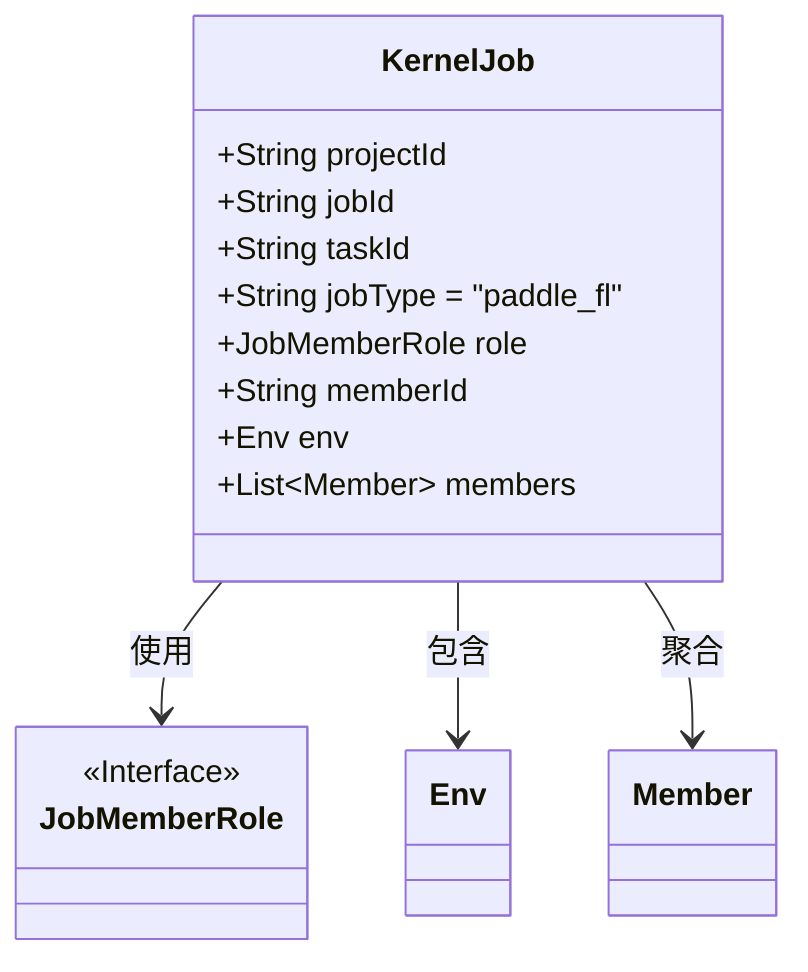
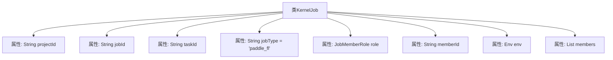

# 基础信息

|      |      |
|------|------|
| 名称 | KernelJob |
| 编码语言 | .java |
| 代码路径 | WeFe/board/board-service/src/main/java/com/welab/wefe/board/service/dto/kernel/deep_learning/KernelJob.java |
| 包名 | com.welab.wefe.board.service.dto.kernel.deep_learning |
| 依赖项 | ['com.welab.wefe.board.service.dto.kernel.Member', 'com.welab.wefe.common.wefe.enums.JobMemberRole', 'java.util.List'] |
| 概述说明 | KernelJob类包含项目ID、任务ID、作业类型、角色、成员ID、环境及成员列表等字段。 |

# 说明

KernelJob类定义了一个核心任务结构，包含项目ID、任务ID、作业类型（默认为paddle_fl）、角色、成员ID、环境配置及成员列表等关键属性。该类用于描述分布式任务的基本信息与参与成员。

# 类列表 Class Summary

| 名称   | 类型  | 说明 |
|-------|------|-------------|
| KernelJob | class | KernelJob类包含项目ID、任务ID、作业类型、角色、成员ID、环境及成员列表等字段。 |

## 类 KernelJob

|      |      |
|------|------|
| 访问范围 | public |
| 类型 | class |
| 名称 | KernelJob |
| 说明 | KernelJob类包含项目ID、任务ID、作业类型、角色、成员ID、环境及成员列表等字段。 |

### UML类图

这段类图展示了KernelJob类的结构及其关联关系。KernelJob是一个核心任务类，包含项目ID、任务ID等基础属性，以及jobType默认为"paddle_fl"。该类聚合了多个Member对象，包含一个Env环境对象，并依赖JobMemberRole接口来定义成员角色。整体结构清晰地反映了联邦学习任务的基本组成要素和相互关系。

### 内部方法调用关系图

这段代码定义了一个名为KernelJob的类，包含8个成员属性，分别用于存储项目ID、任务ID、任务类型（默认值为"paddle_fl"）、角色枚举、成员ID、环境配置对象以及成员列表。该类的结构清晰，主要用于描述分布式计算任务的核心元数据，各属性通过不同类型存储任务的不同维度信息，为后续的任务调度和成员协作提供基础数据结构支持。

### 字段列表 Field List

| 名称  | 类型  | 说明 |
|-------|-------|------|
| jobType = "paddle_fl" | String | 任务类型为paddle_fl |
| taskId | String | 任务ID字符串变量 |
| role | JobMemberRole | 类成员变量role，类型为JobMemberRole，表示工作成员角色。 |
| projectId | String | 项目ID字符串变量 |
| jobId | String | 定义了一个公共字符串类型的变量jobId。 |
| memberId | String | 成员ID字符串变量 |
| env | Env | 声明一个名为env的公共环境变量。 |
| members | List<Member> | 成员列表，存储Member对象。 |

### 方法列表

| 名称  | 类型  | 说明 |
|-------|-------|------|

