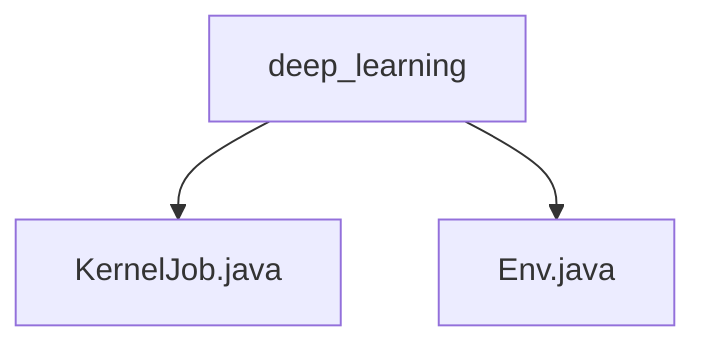

# 基础信息

|      |      |
|------|------|
| 名称 | deep_learning |
| 编码语言 | .java |
| 代码路径 | WeFe/board/board-service/src/main/java/com/welab/wefe/board/service/dto/kernel/deep_learning |
| 包名 | docs.board.board-service.src.main.java.com.welab.wefe.board.service.dto.kernel.deep_learning |
| 概述说明 | KernelJob类定义分布式任务结构，含项目ID、任务类型、成员等属性。Env类管理训练环境配置，包括worker数量、设备信息等，强制单worker且设上限。 |

# 说明

## 概述  
该模块核心职责是管理分布式深度学习任务的配置与执行，类似任务调度中心模式。KernelJob类定义了任务基础结构，包含项目ID、作业类型等元数据；Env类负责环境配置，管理Worker数量与设备分配。关键数据结构包括任务属性集（如角色、成员列表）和训练配置项（如Worker数、设备类型）。外部依赖仅涉及分布式训练框架（如PaddleFL）。例如Env类会校验数据集并强制单Worker模式。

## 主要业务场景  
模块支持多方协作的联邦学习任务，采用主从式交互模式。典型流程为：初始化KernelJob定义任务属性，通过Env配置Worker资源（例如限制最大Worker数为10），最终提交至训练集群。所有API均围绕任务生命周期设计，例如环境预检、资源配置等。应用场景包括跨机构联合建模，其中Env的useVdl开关支持训练过程可视化监控。

### 包内部结构视图

该流程图展示了深度学习模块下的文件结构关系，包含两个Java文件节点：KernelJob.java和Env.java，它们都直接隶属于deep_learning目录。这种层级关系反映了典型的数据传输对象(DTO)在深度学习功能模块中的组织方式，总节点数严格匹配给定的3条路径信息。

# 文件列表

| 名称   | 类型  | 说明 |
|-------|------|-------------|
| [KernelJob.java](KernelJob.md) | file | KernelJob类包含项目ID、任务ID、作业类型、角色、成员ID、环境及成员列表等字段。 |
| [Env.java](Env.md) | file | Env类管理分布式训练环境配置，包括worker数量计算（基于最小样本数，上限10）、本地worker索引、设备类型（CPU/GPU）、可视化开关及任务恢复标志。初始化时校验数据集标注量并排序成员，确保worker分配一致。 |

